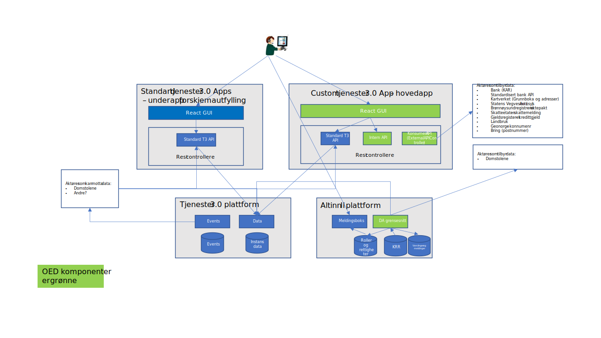
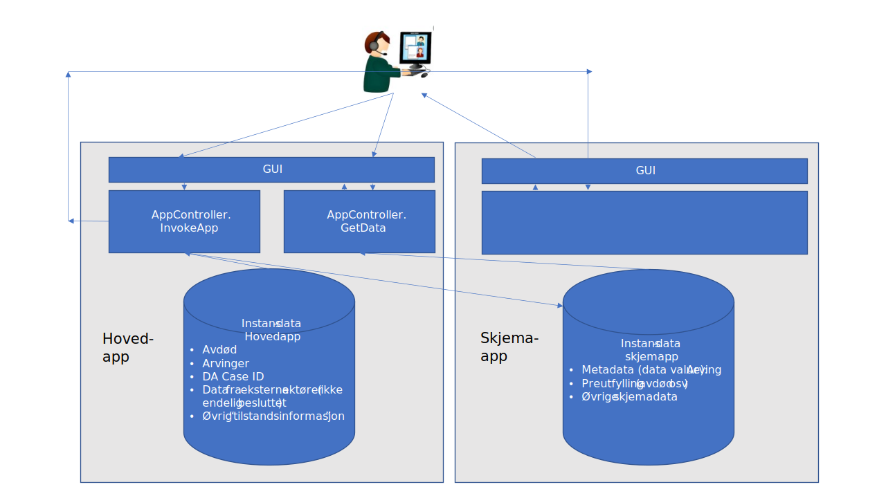
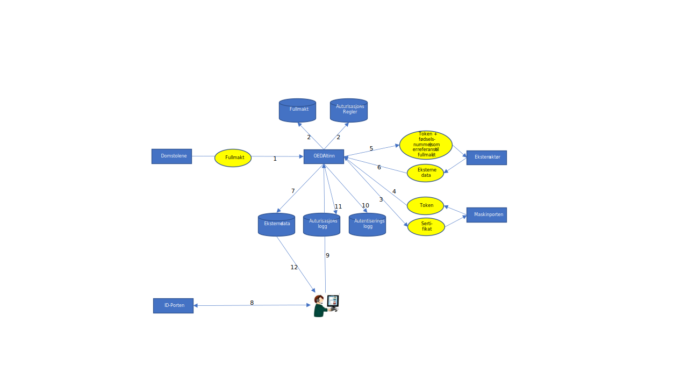

##  Innledning

Figuren under viser de viktigste komponentene i løsningen. OED er
realisert som en serie Tjenester 3.0 app'er med en overordnet app med
skreddersydd GUI og øvrige Tjenester 3.0 apper for spesifikke formål.

App'ene kan ikke instansieres fra tjenestekatalogen. Hovedapp'en
instansieres utelukkende fra Domstol grensesnittet, og «Altinn avgiver»
(process instance owner) er avdøde. Arvinger og evt andre som skal
benytte løsningen får tilgang til instansen via tildelte roller i Altinn
autorisasjon. Brukeren (arvingen) finner app'en fra en melding «Altinn
correspondence» i meldingsboksen i Altinn. Meldingen inneholder en
direktelenke til riktig instans i Tjenester 3.0. Se for øvrig 3
Grensesnitt mot Domstolene.

Løsningens hovedapp har følgende adresse i Altinn Studio:
[designer](https://altinn.studio/designer/digdir/oed) og
[kode](https://altinn.studio/repos/digdir/oed).

##  Oppdeling i Tjenester 3.0 apper

Hovedapp'en har et skreddersydd brukergrensesnitt fordi Tjenester 3.0
p.t. ikke støtter å lage vilkårlige applikasjoner. Løsningen er derfor
splittet opp i flere app'er slik at mest mulig realiseres som standard
tjeneste 3.0 apper. I første omgang gjelder dette skjemautfylling. På
sikt kan det også være aktuelt å flytte «innsynsfunksjonalitet» ut i
Tjenester 3.0 app'er, men p.t. er støtten for GUI design i Tjenester 3.0
såvidt begrenset at det er vanskelig å implementere ønsket
brukeropplevelse.

Skjema app'ene blir instansiert og preutfylt fra hovedapp'en når
brukeren tar initiativ til å starte skjemautfylling. Skjemaet blir
instansiert med avdøde som «Altinn avgiver» (process instance owner), og
fødselsnummer til den arvingen som startet skjemautfylling blir lagt som
en nøkkel på instansdataene med Tjenester 3.0 mekanismen «data value»
med nøkkel «ssn».

Det er lagt opp til at alle arvingene aksesserer de samme
skjemainstansene bortsett fra skjemaet «oed-signature». I sistnevnte
skjema blir det en unik instans per arving.

All innsending av data fra arvingene gjøres via skjema app'er. Signering
ved innsending benytter derfor standard Tjenester 3.0 funksjonalitet.
Hvis gjeldene funksjonalitet for signering ikke tilfredsstiller formelle
krav til løsningen (f.eks. om man ønsker nivå 4 signering), må dette
være utvidelser/forbedringer i Tjenester 3.0 plattformen -- ikke
spesifikt i OED løsningen.

Følgende app'er finnes p.t.:

-   oed (hoved app)
-   oed-register-agri-property
-   oed-register-heirs
-   oed-register-marriage-pact
-   oed-register-testament
-   oed-signature

Mer dokumentasjon knyttet mot applikasjoner vedrørende Tjenester 3.0
finnes her:

OED: https://github.com/Altinn/oed/issues/442\
T3.0: https://github.com/Altinn/altinn-studio/issues/6880

## Grensesnitt mot Domstolene

Grensesnittet for å motta data fra Domstolene er definert av Domstolene
og ligger på [GitHub - Altinn/oed-da](https://github.com/Altinn/oed-da).
Dette er et hendelsesbasert grensesnitt med samme oppbygning som
eksiterende Altinn grensesnitt mot Folkeregisteret. P.t. er det bare
spesifisert overføringer av nye avdøde og arvinger, men det er forventet
at grensesnittet kan utvides til endringer på avdøde og arvinger samt
testamentinformasjon.

Prosjektet har besluttet å implementere grensesnittet som en Altinn II
batch. Bakgrunnen for at grensesnittet ikke ble implementert i Tjenester
3.0 er:

-   Tjenester 3.0 støttet ikke batch jobber da beslutningen ble tat
-   Tjenester 3.0 har ikke et regime for driftsoppfølging av batcher
-   Tjenester 3.0 tilbyr ikke databaser for app'er utover lagring av
    skjemadata og instansdata. Domstol grensesnittet krever at man
    lagrer en tilstand mellom hver kjøring.
-   Altinn II har ikke eksponert eksterne tjenester for å laste inn
    roller/rettigheter. Altinn II batch jobber kan benytte interne
    tjenester.

Batchen kjøres automatisk ved regelmessige intervaller og gjør følgende:

-   Henter nye arvinger fra Domstolene
-   Tildeler roller mellom arving og avdøde i Altinn Autorisasjon
-   Gjør oppslag mot KRR (Altinn kopi) angående reservasjon mot
    elektronisk behandling. Det er p.t. ikke avgjort om Altinn skal ha
    ansvar for dette og hva som eventuelt skal være konsekvensen hvis
    det foreligger en reservasjon.
-   Hente utfyllende informasjon om arving og avdøde fra Folkeregisteret
    (Altinn kopi).
-   Sjekke om det finnes en instans av boet. Opprette instans hvis den
    ikke finnes
-   Legge arving inn blant instansdata
-   Sende melding til arving (Altinn II Correspondence). Meldingen blir
    liggende i Altinn meldingsboks dyplenke inn til avdødes instans
-   Sende varsling til arving på epost/SMS basert på informasjon fra
    KRR. (Gjøres som en integrert del av forrige punkt.)

Batchen ligger i Altinn II repo for batcher og heter
Altinn.SBL.Batch.DA.

## Grensesnitt data fra eksterne aktører

### Autorisasjon

Nedenfor beskrives hva som ligger til grunn for autorisasjonen.

**Implisitt fullmakt fra DA (1-2)**

Altinn mottar en implisitt fullmakt fra DA (dvs at en person er en
arving) ved hjelp av DA grensesnittet (1). Fullmakten lagres i Altinn
(2). Fullmakten lagres logisk to steder:

-   I boets instans i OED appen\
    Det lagres hvem som er avdød og hvilke arvinger som har fullmakt. Se
    for øvrig åpne punkter nederst i dokumentet.

-   Som autorisasjonsregler i Altinn sin standard autorisasjonsløsning\
    Det lages en eller flere autorisasjonsregler per arving.

**Aksess til eksterne ressurser fra OED basert på fullmakt (3-7)**

Basert på fullmakt fra DA kan OED hente data fra eksterne kilder på
vegne av arvinger med fullmakt. OED gjør system-til-system oppslag mot
eksterne kilder. Oppslagene autoriseres ved hjelp av egnet
autorisasjonsinfrastruktur -- primært Maskinporten (3-4). Maskinporten
returnerer et token (4) som sendes med til eksternt system (5). Tokenet
er bevis overfor eksterne parter at forespørselen kommer fra OED.
Oppslagene har nesten alltid avdødes fødselsnummer som
forespørselsnøkkel (5). Eksterne systemer må stole på at OED kun gjøre
forespørsel når det foreligger en fullmakt samt at OED ikke viser
dataene til arvinger uten fullmakt. Avdødes fødselsnummer er nøkkel til
fullmakten i OED (2).

Beskrivelsen i dette dokumentet gjelder uavhengig av om man teknisk gjør
oppslag mot eksterne kilder basert på en arvings aktivitet i portalen
eller om det gjøres asynkront -- uavhengig av brukerinteraksjon. I
figuren over er det antydet at dataene lagres i OED (7), men hvis man
velger å ikke lagre dataene, påvirker ikke dette den øvrige
beskrivelsen.

**Vise data fra eksterne aktører til arvinger (8-12)**\
Det defineres i OED hvilket krav man har til autentisering (8) av
arvingene. Det er naturlig at man definerer et nivå som ID-Porten eller
høyere. Alle innlogginger logges i Altinn (samt i ID-Porten eller annen
ekstern infrastruktur for autentisering) (8-10). OED vet derfor alltid
hvem brukeren er. OED definerer også autorisasjonsregler som gjør at det
ikke er mulig for noen andre enn de som har fått autorisasjonsregler fra
fullmakten å aksessere et gitt dødsbo (11). Når brukeren får tilgang til
eksterne data, er disse hentet ut basert på fullmakten som foreligger
fra DA, og de vises til brukeren (12) basert på autorisasjonsreglene fra
fullmakten.

**Revisjonsspor**

At de ikke blir utlevert opplysninger fra ekstern kilde uten fullmakt
kan dokumenteres ved følgende revisjonsspor:

-   Fullmakten ligger lagret i Altinn (2). Fullmakten inkluderes saks-id
    fra DA. Fullmakten peker tilbake til kilden hos DA (1).

-   Altinn gjør oppslag mot eksterne kilder ved hjelp av
    autorisasjonsinfrastruktur (primært Maskinporten) som beviser at
    oppslaget ble gjort fra OED (3-4). Oppslaget blir gjort med avdødes
    fødselsnummer som nøkkel (5-6), og samme fødselsnummer er nøkkel til
    fullmakten (2).

-   Arvingene må autentisere seg før aksess til OED (8). Alle
    autentiseringsforsøk blir logget i Altinn sin TTP (trusted third
    party) database (9-10).

-   All aksess til OED autoriseres. Alle autorisasjoner logges i altinn
    sin TTP (trusted third party) database (11). Autorisasjonsloggen
    inkluderer aktuell bruker, tidspunkt, hvilken ressurs som ble
    forsøkt aksessert (i dette tilfellet referanse til avdødes instans
    med tilhørende fullmakt i OED) og utfall av autorisasjonen.

**Åpne punkter**

Skal alle arvinger med tilgang til OED ha fullmakt? I motsatt fall må
det gjøres intern autorisasjon i OED som differensierer hva slags
informasjon som skal vises avhengig av hvilken arving som har logget
inn.

Er fullmakt implisitt dekket av eksisterende DA grensesnitt (ny arving
foreligger i boet) eller trenger man en ny hendelse -- fullmakt -- i DA
grensesnittet? Er for øvrig relatert til forrige punkt. Hvorvidt
fullmakt blir en ny hendelse eller ikke påvirker ikke beskrivelsen over
annet enn at DA grensesnittet eventuelt må oppdateres.

### Lagring av innhentede data

Det er gjort konfigurerbart (via felles kode -- se 4.3 Intern
implementasjon) hvorvidt man skal lagre data fra aktørene blant
instansdataene etter at de er framvist for arvingen. P.t. prøver man
først å hente friske data når arvingen åpner app'en. Dataene lagres
samtidig. Hvis man ikke får tak i data og det ligger data på instansen
fra før, vises disse.

### Intern implementasjon

De fleste grensesnittene har Swagger spesifikasjoner. Der dette ikke
finnes lager vi Swagger manuelt. Det benyttes standard mekanismer i
Visual Studio for å importere Swagger definisjonene og generere
klientkode -- «Connected Services».

Motparten til den genererte koden ligger i klasser i katalogen
ExternalApi. I disse klassene kalles Api, og og det blir gjort en
mapping til intern domenemodell.

Hver grensesnitt er tilgjengelig fra GUI via ExternalAPIController.
Kontrolleren har felles kode for alle grensesnittene for å:

-   Kalle grensesnitt
-   Hente instans
-   Lagre respons i instans
-   Benytte lagret respons hvis gjeldende oppslag ikke returnerer data
-   Gjøre evt mapping av fødselsnummer -- se 4.3 Testdata
-   Returnere data til GUI

De genererte klientene konfigureres i startup.cs. Her hentes vertsnavn
fra miljøspesifikke konfigurasjonsfiler.

### Liste over grensesnitt

P.t. benyttes følgende grensesnitt
| Aktør         | Eks\*) | Swagger                                                                                                             |
|---------------|--------|---------------------------------------------------------------------------------------------------------------------------|
| Skatt         |        | [Skatt avregning](https://altinn.studio/repos/digdir/oed/src/branch/master/App/OpenAPIs/SkattAvregning.json)              |
| Skatt         |        | [Skatt 2020](https://altinn.studio/repos/digdir/oed/src/branch/master/App/OpenAPIs/Skatt2020.json)                        |
| Skatt         |        | [Skatt tilgjengelige data](https://altinn.studio/repos/digdir/oed/src/branch/master/App/OpenAPIs/SkattAvailableData.json) |
| Kartverket    | x      | [API docs](https://syntest.grunnbok.no/oed/v2/api-docs)                                                                   |
| SVV           | x      | [Kjøretøy søk](https://vegvesen.github.io/ak-api/filer/api/api_kjoretoysok_46.json)                                       |
| Norsk Pensjon | x      | [API docs](https://webservice.preprod.norskpensjon.no/oed/v3/api-docs)                                                    |
| Bank KAR      | x      | [DSOP KFR API](https://bitsnorge.github.io/dsop-kfr-api/dsop-kfr-api.yaml)                                                |
| Bank konto    | x      | [DSOP Konto API](https://bitsnorge.github.io/dsop-accounts-api-v1p1/dsop-accounts-api-v1p1.yaml)                          |
| Geo Norge     | x      | [Kommune API](https://ws.geonorge.no/kommuneinfo/v1/openapi.json)                                                         |
| Geo Norge     | x      | [Adresse API](https://ws.geonorge.no/adresser/v1/openapi.json)                                                            |
| Landbruk      |        | [API docs](https://altinn.studio/repos/digdir/oed/src/branch/master/App/OpenAPIs/Landbruk.json)                           |
| Ektepakt      | x      | [n/a SOAP grensesnitt](https://ws-test.brreg.no/losore/heftelser/LosoreOnlineService?wsdl)                                |

\*) Betyr at swagger kommer fra aktør og ikke er konstruert av OED

### Testdata

Det mest optimale hadde vært om man kunne definere felles testdata på
tvers av alle aktører i OED. Dette er imidlertid ikke realistisk på kort
sikt. Det er definert en modul for mappe avdødes fødselsnummer, som
benyttes som nøkkel i nesten alle eksterne grensesnitt, til et passende
fødselsnummer hos aktuell aktør.

Mappingen utføres bare når man kjører løsningen i et testmiljø.
Mappingen ligger som kode i metoden MapSsn i ExternalAPIController.

Kode for å autorisere mot Maskinporten og eventuell utveksling av token
fra Maskinporten til Altinn JWT ligger i Util/MaskinportenUtil.

## Grensesnitt for å hente ut data

Eksterne aktører -- i første omgang primært Domstolene -- kan hente ut
data via standardiserte Api fra Tjenester 3.0. Dette er beskrevet i
[Storage API -- Altinn](/api/storage/).

Det anbefales å benytte en hendelsesbasert innfallsvinkel til å hente ut
data. Dette er beskrevet i [Integration & Data Transport Capabilties --Altinn](/technology/architecture/capabilities/runtime/integration/).

Det finnes tilgjengelige data fra hver app. Det antas at Domstolene i
første omgang vil hente data fra skjema app'ene. Avdøde vil være
«instance owner». Fødselsnummeret til den arvingen som fylte ut
skjemaet, vil ligge som «data value» med nøkkel «ssn».

## Custom GUI for hoved app

Tjenester 3.0 tilbyr p.t. ingen støtte for skreddersydde
brukergrensesnitt, som man trenger i hovedapp. Det er derfor tatt
utgangspunkt i en kopi av Tjenester 3.0 sin fulle klient for
skjemautfylling. I denne klienten er det i noen grad fjernet komponenter
som ikke er relevante for en skreddersydd klient, men det gjenstående er
likevel stort og komplekst.

Klienten - altinn-app-frontend.js - lenkes inn i fila
App\\views\\Home\\Index.cshtml. I utviklingsmiljøet benyttes lokal node
modul mens i prod- og testmiljøer refereres den ferdig kompilerte
.js-fila fra bygg prosessen.

OED spesifikk kode for klienten ligger hovedsakelig under mappen
features/custom, der mapper og filer oppdeles logisk basert på
visningstype og fagområde. Det har blitt tatt i bruk eksisterende
biblioteker, basert på kopien av Tjenester 3.0 sin fulle klient og ikke
lagt til nye utenom React testing library og Cypress. Disse bibliotekene
blir brukt for enhetstesting, ende-til-ende testing og universell
utforming tester.

Det har blitt utviklet en del komponenter, både spesifikt tilknyttet OED
design men også tilknyttet Altinn 3 Figma Designsystem ettersom
Tjenester 3.0 per nå har ingen felles bibliotek som brukes av andre
klienter. Det har vært mye samarbeid mellom OED og Tjenester 3.0 for å
løse slik problematikk og OED har utviklet, tildelsvis med Tjenester 3.0
en rekke enkle komponenter med tilhørende design basert på Altinn 3
Designsystem. Disse ligger innunder mappen
features/custom/common/inputs. Tanken har vært at disse enkle
komponentene kan tas rett ut fra prosjektet og legges ut på npm for
felles bruk av alle klienter. Dette har stoppet opp da det ikke har vært
relevant for OED lenger å utvikle egne skjema komponenter, som nevnt
innunder kapittel 2.

Redux og React Context brukes av OED for intern state håndtering da
Redux var allerede vesentlig brukt av Tjenester 3.0. I Redux ligger det
mye data som kommer fra kopien av Tjenester 3.0 sin klient og Redux
Store har blitt utvidet til å inneha data fra eksterne aktører,
eksempelvis data fra banker, Statens Vegvesen, Norsk Pensjon og andre.

## Drift og overvåkning

Før man kan gå i produksjon må det avklares hvordan løsningen kan
driftes og overvåkes. Viktige momenter vil være:

-   Monitorere at Tjenester 3.0 app'ene er oppe og fungerer
-   Monitorere at batch for DA grensesnitt kjører og fungerer. Det må
    avklares om Altinn Forvaltning skal benyttes i denne sammenheng.
-   Analyse av feillogger
-   Sanering av data
