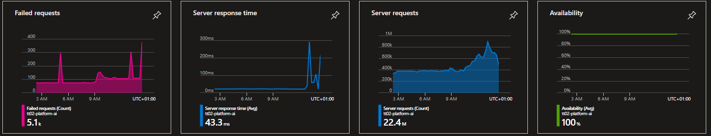

{}
Konfigurering av egendefinerte regler og varsler er for øyeblikket ikke tilgjengelig for tjenesteeiere,
men vi har som mål å støtte dette i løpet av våren 2023.
{}

Azure Application Insights (AI) er en utvidelse av
[Azure Monitor](https://learn.microsoft.com/en-us/azure/azure-monitor/overview) og er det verktøyet vi
bruker i Altinn for å tilby overvåkingsfunksjonalitet for apper.

AI kan gi deg som apputvikler verdifull innsikt i helse, ytelse og bruk av appen din.
Med sanntidsovervåking og ytelsesanalyse kan utviklere identifisere og løse problemer før de påvirker
brukeropplevelsen til en sluttbruker. Feilsøking og varsling* gjør AI til en verdifull ressurs også i drift.

{}

Altinn har også innsyn i telemetrien som logges av applikasjonene og tilgjengliggjøres for tjenesteeierene i AI.
I tillegg monitorerer vi infrastrukturen til hver tjenesteeier som Kubernetes cluster, storagekontoer og key vault. 

Hovedregelen er at Altinn-teamet agerer på alarmer knytte til infrastrukturen som kreves for å kjøre en app
for eksempel for lite CPU tilgjengelig i app clusteret eller at en pod står i en feilstate i clustert 

__Altinn overvåker ikke aktivt ytelsen eller feilraten til den individuelle applikasjonen.__
{}


