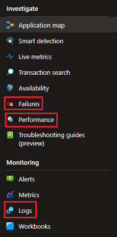
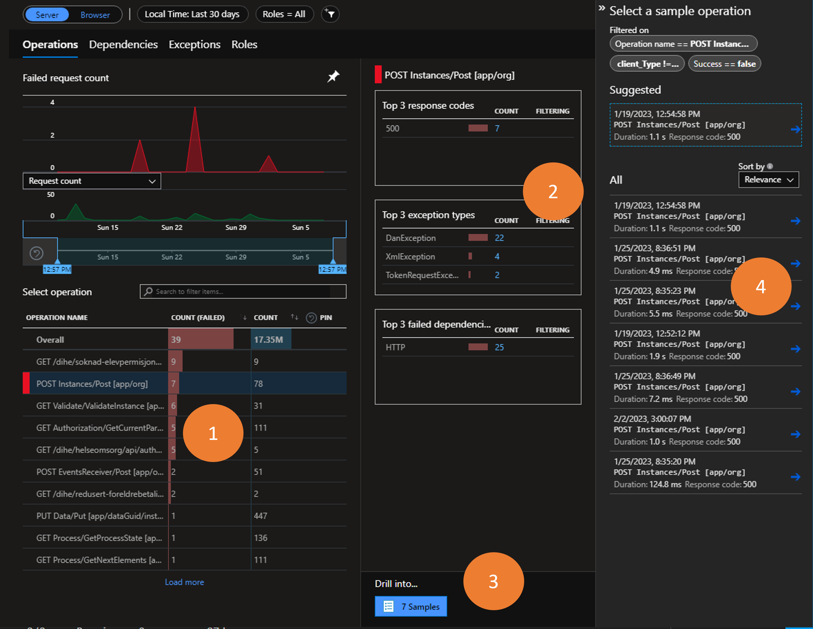
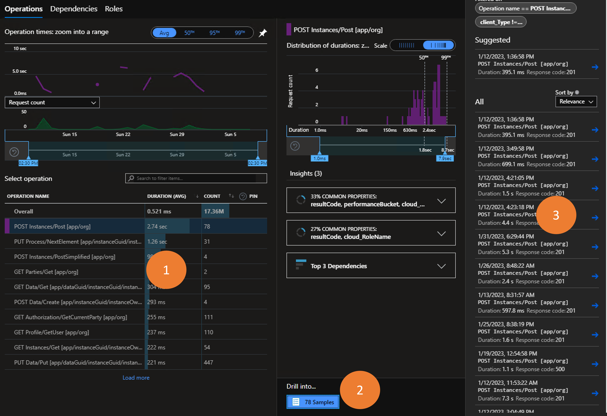

{}
Do you have any good tips or questions that you needs answers?

Please contribute to this page by using the __Edit page on GitHub__ feature at the bottom of this page!
{}

[//]: <> (Section: How can I set up alerts based on what is logged to AI?)

{}
Unfortunately, there is no resource group where alerts can be persisted for application owners.
We know this is a feature many application owners are requesting, and the Altinn team is working hard on making
this available for you.
{}

[//]: <> (Section: What are the top three most useful features in AI?.)
{}


- **Failures**: get an overview over all failing requests within a time frame and drill into the stack trace
  to investigate which request in the call chain produces the error response
- **Performance**: get an overview over all requests withing a time frame. Identify slowest requests and drill into
  stack trace to investigate which part of the call chain is harming the request performance.
- **Logs**: query log and trace data to find exception messages or identify custom telemetry related to a specific request
{}


[//]: <> (Section: How can I see who performed the request?)
{}
The application template logs identity telemetry whenever this information is available to the app.
Data points include authentication level (authLevel), partyId, userId and organisation number (orgNumber).


To present the custom telemetry data when querying the logs use the property `customDimensions`.
Here is an example of how to list all requests presented by their request url and userId that performed the requests

```
requests
| project url, customDimensions["userId"]
```
{}

[//]: <> (Section: We have many apps in my organisation, but I am only interested in one of them)
{}
All logs and dashboard in AI can include filters. Use a _role filter_ to filter out data related to your application.
The role (or cloud role name) for your application is equal to your application name (i.e. the repository name in Altinn Studio).


When working with the user interface look for the filter icon (1) and add or adjust the role filter (2).

If working with logs the following _where_ clause is used to filter out the data for your app.

```
where cloud_RoleName == <insert app name>
```

To retrieve all request for the application _bli-tjenesteeier_ the query would look like this

```
requests
| where cloud_RoleName == "bli-tjenesteeier"
```
{}


[//]: <> (Section: An end user is reporting that their experiencing an error)
{}
When end users report errors this could be an error that affects all users and it is easy to identify the failing
request in the failure tab.
However, if the error is affecting a single or very few users the instanceId can be a helpful tool.

End users should always include the instanceGuid or archive reference (last 12 chars of an instance guid).
This GUID can be included in a filter on the _Performance_ page to get an overview over all incoming requests related
to the instance, maybe this can give a clear picture of what has happened.

Alternatively, you can query the log tool for actions related to the instance.

```
requests
| where url contains "165dc739-0f55-4a4c-9b0b-781340a68cd8"
| order by timestamp desc
```

{}

[//]: <> (Section: My application shows ukjent feil...)
{}
... but I don't know what is causing it.

_Ukjent feil_ in the application is caused by the application returning an unexpected response
during a request from the client (app frontend). To investigate situations like these starting in the
_Failures_ tab is often the way to go.



1. Based on the scenario when things fail you might be able to identify the correct
request in the _operation overview_. Highlight this request.
1. In the summary section you will see top three response codes and exception types related to the failing request.
2. If further investigation is required you may drill into the request samples.
3. Instances of the request are listed and you may sort them based on relevance or date.
   Click one of the requests to be forwarded to the end-to-end transaction details.


Looking through the transactions all requests with a non-successful response code will be marked in red.
To see addition details for a specific request highlight it and review the blade on the right hand side of the screen.
{}

[//]: <> (Section: How can I identify what is causing a request to be slow? )
{}
Use the _Performance_ page to investigate slow requests


1. Identify the request you are interested in
2. Click the _Drill into x samples_ button
3. Select one of the requests in the list to be shown the end-to-end transaction details.


From this point one can investigate each dependency and the time it takes to get a response.
{}