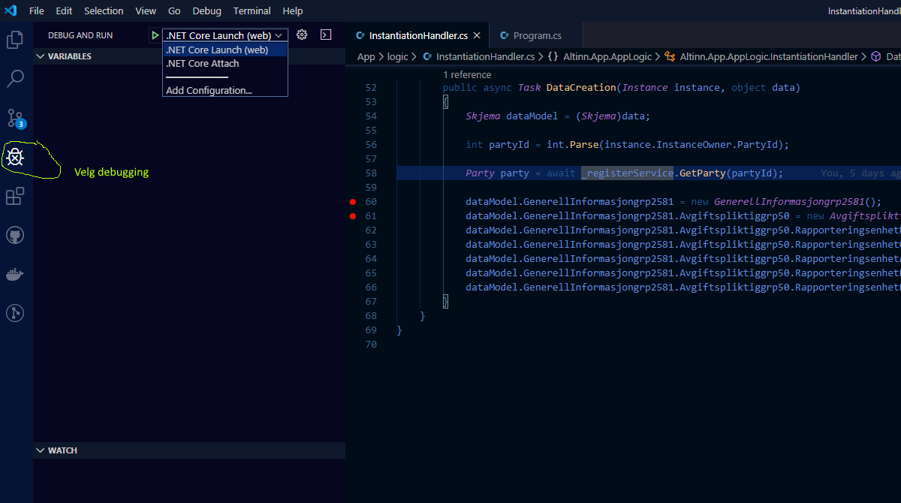
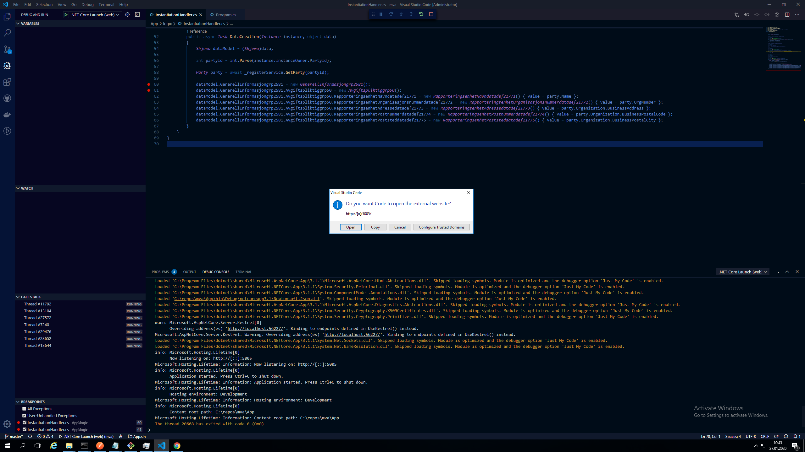
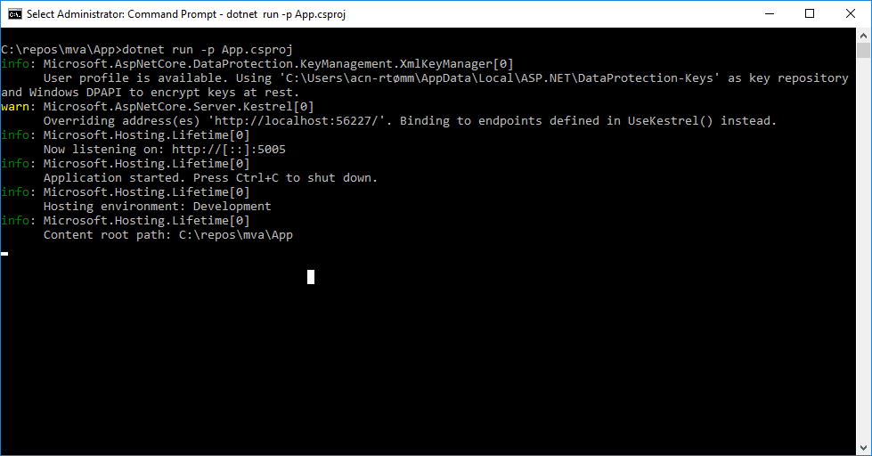
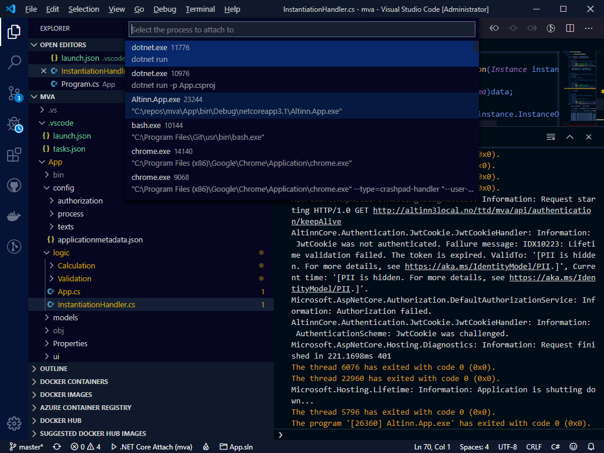
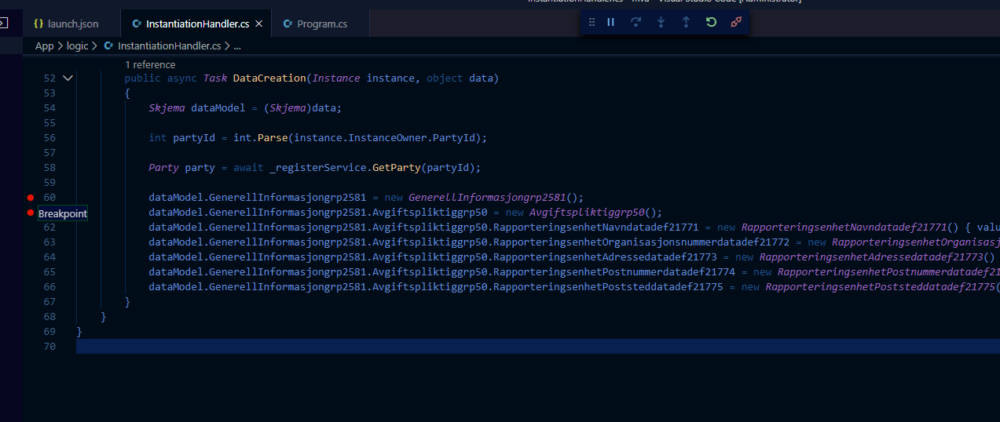
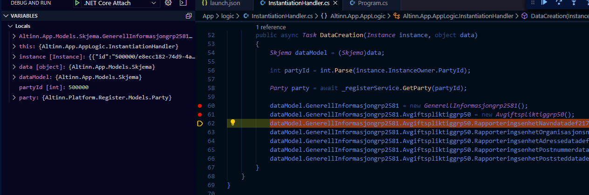
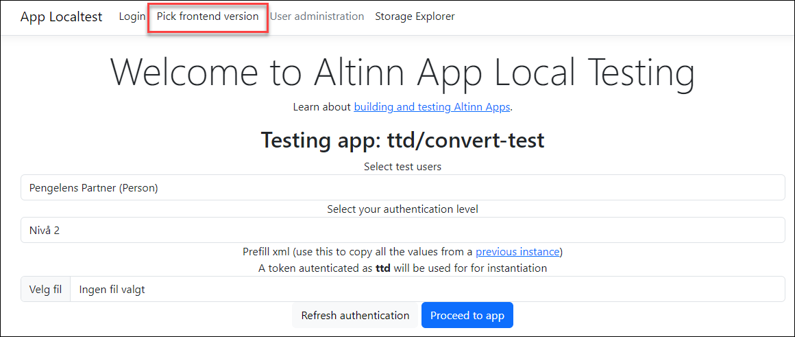
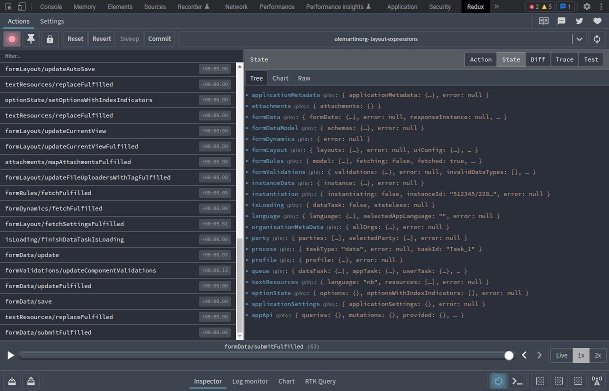
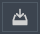

Følgende beskrivelse forutsetter at du har clonet applikasjonen fra Altinn Studio Repositories og har filene liggende på lokal harddisk. 

## Debugging i Visual Studio Code

For å debugge applikasjonen lokalt må du åpne applikasjonsprosjektet i Visual Studio Code.
Velg åpne folder og bla deg frem til hvor repostoriet er lagret på din maskin.

Velg debugging knappen til venstre i vertikal meny. 

Det er to måter å starte debugging av en applikasjon lokalt:

### Starte appen fra Visual Studio Code (.NET Core Launch)

Denne metoden er den enkleste. Her vil Visual Studio Code starte applikasjonen og koble seg til i en og samme prosess

Velg .NET Core Launch og trykk på den grønne "play" knappen.

Applikasjonen vil da starte og han vil spørre om du skal starte en browser. Velg bare close.

Åpne et browservindu og gå til http://local.altinn.cloud (forutsetter at du har startet lokal utviklingsplattform).

### Starte appen fra commando vindu

Dette forutsetter at du har startet applikasjonen allerede. 
Gå til folderen hvor applikasjonen ligger og kjør kommando for å starte dotnet prosessen.

I Visual Studio Code ha åpnet folderen med applikasjonsprosjektet. Attach deg til prosessen som heter Altinn.App.exe

## Legg til Breakpoints og analysere kode

Sett breakpoints i code der du vil at debugger skal stoppe 

Der debugger stopper kan du analysere lokale verdier på objekter for å finne ut hvordan kode fungerer og eventuelt finne feil.

Les mer om debugging i Visual Studio Code i [dokumentasjonen til code](https://code.visualstudio.com/docs/editor/debugging).

## Endre frontend-versjon

Hvis du har et lokalt utviklingsmiljø for [frontend-applikasjonen](https://github.com/Altinn/app-frontend-react/),
eller om du ønsker å teste med en spesifikk versjon av frontend, kan dette gjøres ved å endre den kjørende
frontend-versjonen fra lenken på forsiden av local.altinn.cloud:

{}
**BEMERK:** Dette virker bare dersom du har beholdt standardstien for lasting av frontend-applikasjonen sin JavaScript-fil
in `Index.cshtml`-filen i appen du jobber med. Om du har endret til å bruke en annen sti, vil dette overstyre eventuelle
endringer du gjør via local.altinn.cloud.
{}

## Se og lagre redux tilstandshistorikk

Frontend-applikasjonen bruker redux til å holde styr på tilstandsendringer. For enkelte typer feil i
frontend-applikasjonen kan historikken fra disse tilstandsendringene være veldig nyttig for å feilsøke og fikse et
problem som ellers kan være vanskelig å reprodusere. Denne tilstandshistorikken gjør det mulig å spole frem og tilbake
i tid, og lagrer rekkefølgen på alt du har gjort i applikasjonen.

{}
**BEMERK:** Dette virker bare i frontend-versjoner fra `3.50.5` og nyere, eller ved lasting fra et lokalt utviklingsmiljø.
{}

{}
Tilstandshistorikken inneholder alle tilstandsendringer i applikasjonen (hvilket inkluderer alt du har skrevet, og alle
endringer du har gjort siden siden ble lastet). Ikke lagre eller send denne historikken dersom du jobber med
sensitiv informasjon.
{}

1. Start med å installere Redux Devtools-utvidelsen i nettleseren din ([Chrome](https://chrome.google.com/webstore/detail/redux-devtools/lmhkpmbekcpmknklioeibfkpmmfibljd) eller [Firefox](https://addons.mozilla.org/nb-NO/firefox/addon/reduxdevtools/))
2. Bruk applikasjonen som normalt. Når problemet du vil lagre tilstandshistorikk for har inntruffet, åpne
   utviklerverktøyene i nettleseren din (trykk F12).
3. Gå til Redux-flaket i utviklerverktøyene. Her pleier applikasjonsinstansen din å bli automatisk valgt, og
   visningen ligner på denne:

   

4. Klikk eksport-knappen nederst i venstre hjørne for å lagre tilstandshistorikken: 
5. Legg ved den eksporterte filen når du oppretter en [feilrapport](https://github.com/Altinn/app-frontend-react/issues/new?assignees=&labels=kind%2Fbug%2Cstatus%2Ftriage&template=bug_report.yml), eller send filen til en utvikler