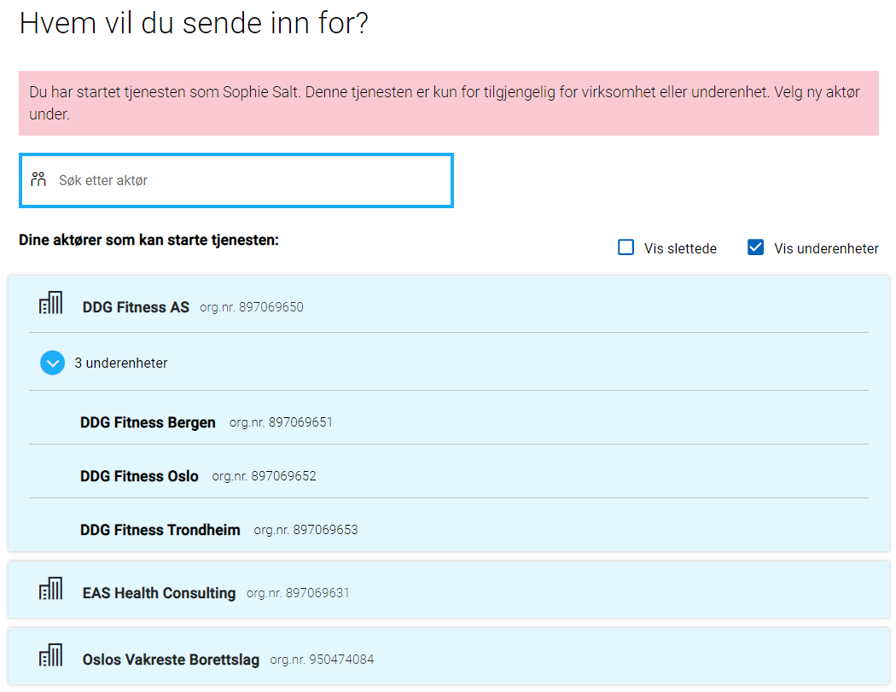

## Standard brukere
Disse kan man velge når man logger inn i lokal test.


### Sophie Salt
Sophie er en svært driftig dame som bor i Oslo. Hun har startet en kjede med treningsententer som heter DDG Fitness og til nå er det startet 3 underenheter i Oslo, Bergen og Trondheim.
Sophie har rollen DAGL og dens underroller for DDG Fitness AS og dens underhenheter.

I tilegg er hun ekspert på helse og har startet eget konsulentfirma for helsetjenester. Sophie har rollen LEDE + knyttede roller for EAS Health Consulting.

Hun er også styremedlem i borettslaget der hun bor. "Oslos Vakreste Borettslag".  Sophie har rollen MEDL + knyttede roller for "Oslos Vakreste Borettslag".

#### Avgivere

| Avgiver                                                                                                                                         | Roller                                                                                                                                                          |
| ----------------------------------------------------------------------------------------------------------------------------------------------- | --------------------------------------------------------------------------------------------------------------------------------------------------------------- |
| [01039012345 Sophie Salt](https://github.com/Altinn/altinn-studio/blob/master/src/development/TestData/Register/Person/01039012345.json)        | [Privatperson](https://github.com/Altinn/altinn-studio/blob/master/src/development/TestData/authorization/roles/User_1337/party_1337/roles.json)                |
| [897069650 DDG Fitness AS](https://github.com/Altinn/altinn-studio/blob/master/src/development/TestData/Register/Org/897069650.json)            | [Daglig leder + knytninger](https://github.com/Altinn/altinn-studio/blob/master/src/development/TestData/authorization/roles/User_1337/party_500000/roles.json) |
| [897069651 DDG Fitness Bergen](https://github.com/Altinn/altinn-studio/blob/master/src/development/TestData/Register/Org/897069651.json)        | [Daglig leder + knytninger](https://github.com/Altinn/altinn-studio/blob/master/src/development/TestData/authorization/roles/User_1337/party_500001/roles.json) |
| [897069652 DDG Fitness Oslo](https://github.com/Altinn/altinn-studio/blob/master/src/development/TestData/Register/Org/897069652.json)          | [Daglig leder + knytninger](https://github.com/Altinn/altinn-studio/blob/master/src/development/TestData/authorization/roles/User_1337/party_500002/roles.json) |
| [897069653 DDG Fitness Trondheim](https://github.com/Altinn/altinn-studio/blob/master/src/development/TestData/Register/Org/897069653.json)     | [Daglig leder + knytninger](https://github.com/Altinn/altinn-studio/blob/master/src/development/TestData/authorization/roles/User_1337/party_500003/roles.json) |
| [897069631 EAS Health Consulting](https://github.com/Altinn/altinn-studio/blob/master/src/development/TestData/Register/Org/897069631.json)     | [Styreleder + knytninger](https://github.com/Altinn/altinn-studio/blob/master/src/development/TestData/authorization/roles/User_1337/party_500600/roles.json)   |
| [950474084 Oslos Vakreste Borettslag](https://github.com/Altinn/altinn-studio/blob/master/src/development/TestData/Register/Org/950474084.json) | [Styremedlem + knytninger](https://github.com/Altinn/altinn-studio/blob/master/src/development/TestData/authorization/roles/User_1337/party_500700/roles.json)  |



### Ola Nordmann. 
Ola Nordmann er en privatperson som kun kan representere seg selv. 
Er bosatt på Stokmarknes.


#### Avgivere
- [01017512345 Ola Nordmann](https://github.com/Altinn/altinn-studio/blob/master/src/development/TestData/Register/Person/01017512345.json)

### Andre brukere
For å teste et spesifikt skjema har Altinn gjengen også lagt til 
- Pengelens Partner
- Gjentagende Forelder
- Rik forelder

Det er ikke dokumentert hva slags egenskaper disse skal ha.

## App spesifikke brukere
Om standard settet med brukere ikke passer for å teste din app lokalt, kan du legge sørge for at appen din svarer med et
json dokoument på url `/[org]/[appId]/testData.json`. Den enkleste måten er å legge fila på `App/wwwroot/testData.json`

Typiske endringer du kan være interresert i er å bruke andre organisasjonsnummer/fødselsnummer for at oppslag i apier som
appene er avhengig av skal virke, eller testing av autorisasjonsreglene med andre roller enn det standard brukerene har.

### Json Struktur
Det finnes et [JsonSchema](https://altinncdn.no/schemas/json/test-users/test-users.schema.v1.json) som hjelper deg å skrive
en `testData.json` fil i verktøy som VSCode. En full versjon av brukerene som ligger i TestData mappa er tilgjengelig i
[testData.json](testData.json)

```json
{
    "$schema": "https://altinncdn.no/schemas/json/test-users/test-users.schema.v1.json",
    "persons": [
      {
        "partyId": 512345,
        "ssn": "01017512345",
        "firstName": "Ola",
        "middleName": "",
        "lastName": "Nordmann",
        "customClaims": [
          {
            "type": "some:extra:claim",
            "value": "claimValue",
            "valueType": "http://www.w3.org/2001/XMLSchema#string"
          }
        ],
        "partyRoles": {
          "512345": [
            {
              "type": "altinn",
              "value": "regna"
            },
            {
              "type": "altinn",
              "value": "dagl"
            },
            {
              "type": "altinn",
              "value": "priv"
            }
          ]
        },
        "addressCity": "Stokarknes",
        "addressHouseLetter": null,
        "addressHouseNumber": "7",
        "addressMunicipalName": "Hadsel",
        "addressMunicipalNumber": "1866",
        "addressPostalCode": "8450",
        "addressStreetName": "Bl\u00E5b\u00E6rveien",
        "mailingAddress": "Bl\u00E5b\u00E6reveien 7",
        "mailingPostalCity": "Stokmarknes",
        "mailingPostalCode": "8450",
        "mobileNumber": "87654321",
        "telephoneNumber": "12345678",
        "email": "test@test.com",
        "userId": 12345,
        "language": "nb",
        "userName": "OlaNordmann"
      },
      {
        "partyId": 501337,
        "ssn": "01039012345",
        "firstName": "Sophie",
        "middleName": "",
        "lastName": "Salt",
        "customClaims": [
          {
            "type": "some:extra:claim",
            "value": "claimValue",
            "valueType": "http://www.w3.org/2001/XMLSchema#string"
          }
        ],
        "partyRoles": {
          "500000": [
            {
              "type": "altinn",
              "value": "DAGL"
            },
            {
              "type": "altinn",
              "value": "UTINN"
            }
          ],
          "501337": [
            {
              "type": "altinn",
              "value": "PRIV"
            },
            {
              "type": "altinn",
              "value": "UTINN"
            }
          ]
        },
        "addressCity": "Oslo",
        "addressHouseLetter": null,
        "addressHouseNumber": "9",
        "addressMunicipalName": "Oslo",
        "addressMunicipalNumber": "0301",
        "addressPostalCode": "0151",
        "addressStreetName": "Grev Wedels Plass",
        "mailingAddress": "Grev Wedels Plass 9",
        "mailingPostalCity": "Oslo",
        "mailingPostalCode": "0157",
        "mobileNumber": "87654321",
        "telephoneNumber": "12345678",
        "email": "1337@altinnstudiotestusers.com",
        "userId": 1337,
        "language": "nn",
        "userName": "SophieDDG"
      }
    ],
    "orgs": [
      {
        "partyId": 500000,
        "orgNumber": "897069650",
        "parentPartyId": null,
        "name": "DDG Fitness",
        "businessAddress": "Sofies Gate 1",
        "businessPostalCity": "By",
        "businessPostalCode": "0170",
        "eMailAddress": "central@ddgfitness.no",
        "faxNumber": "92110000",
        "internetAddress": "http://ddgfitness.no",
        "mailingAddress": "Sofies Gate 1",
        "mailingPostalCity": "Oslo",
        "mailingPostalCode": "0170",
        "mobileNumber": "92010000",
        "telephoneNumber": "12345678",
        "unitStatus": null,
        "unitType": "AS"
      }
    ]
  }
```