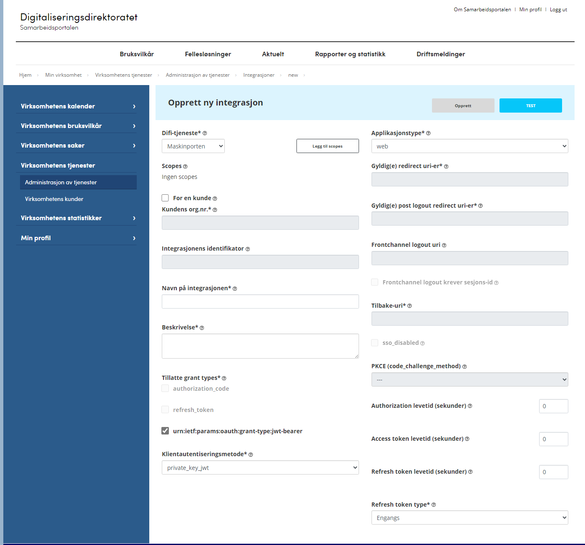
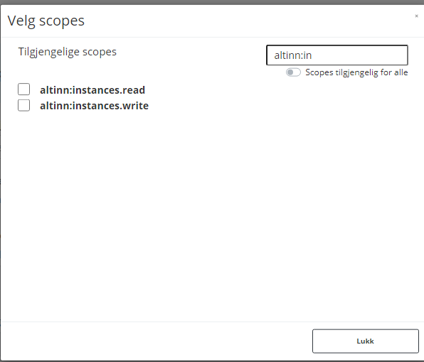
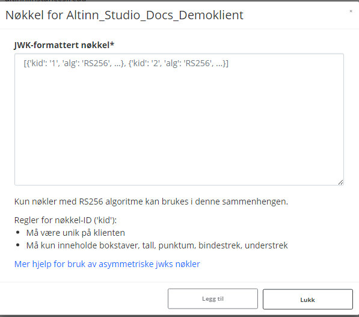

To use the Altinn API, several scenarios require a Maskinporten client:

- Calling the Altinn API as an organization
- Authenticating as an enterprise user
- Authenticating as a system user

## Setting up Maskinporten Integration

Maskinporten clients is managed in [Samarbeidsportalen](https://sjolvbetjening.samarbeid.digdir.no/integrations/)  [test environment](https://sjolvbetjening.test.samarbeid.digdir.no/integrations/)



## Selecting scopes

Depending of usage you would need to select the correct scopes




|Scope | Usage | Description | 
|----| -----| ------- |
|altinn:instances.read | Altinn Apps API read  |         |
|altinn:instances.write | Altinn Apps API write |     |
|altinn:authentication/systemregister | Access to system register | For system providers that need to mange systems available in system register |
|altinn:authorization/authorize | Access to PDP endpoint | For orgs that need to authorize access |

For legacy list of scopes see [here](https://altinn.github.io/docs/api/rest/kom-i-gang/scopes/).

## Creating JWK

You need to give your own JWK for the client. One option to create JWK is to use Altinn JWKS tool for this.

Available [here](https://github.com/Altinn/altinn-authorization-utils/tree/main/src/Altinn.Cli)


```
PS C:\keys> altinn-jwks create testklient
Generating key testklient-TEST.2024-07-10
Generating key testklient-PROD.2024-07-10
```

```
PS C:\keys> altinn-jwks export maskinporten testklient
[{"alg":"RS256","e":"AQAB","key_ops":[],"kid":"testklient-TEST.2024-07-10","kty":"RSA","n":"va4lqufzxUFe9WkTnmA7EvJ0G6LT1MHpDqSepil_F6JZJ7quG8t65pSMJVu-BDlVNep9KTikmnZLks0ifaI60vsvV0JbvU6DtGNmA8QNGFDGpLedChkA1AwBhYflrvAX_fag8tUg2WTxuLclyJ4zpyOUP3F72bf7OP5r5YIBKM4QkBYwQm2FmK70RirhU4vC_wzvOTt5weDuu_Dvx74FXaB3YtEPM1c5unS-AAkKLbRyrEsD78Fh8EMp0ZtWSsceqhOOIeDL2iY1_KGk8yT585xvO1id8iNcQUoAggJ2s6qCCPAqg13y5X1_CtvPvEG179h2AJT100D85AtDvYr2LQ","oth":[],"use":"sig","x5c":[]}]
```


When Public keys are created this can be uploaded in portal




If you use Azure Keyvault to store your private keys this need to be base 64 encoded before adding it to the secrets

```
PS C:\keys> altinn-jwks export key testklient --base64
eyJhbGciOiJSUzI1NiIsImQiOiJ2VC1fdldGb1N1c0tQM2p6WmhWRlc0WWthbDV2VTl1VkdGTVBKMkpIdC1EM2F6aEs5dGh5YXhUVEw0TDFkMmxzcHpxcVhqSnhxTnRXVThYd0g4RjVSM191bl9WSmF2dW5WSmZIOVFIcXZ0UDVIZWRFX0FvdVZXTVZNWkdCaktWb2lxOURyb1VQSFZnbUJOSlhGRzhqd2lNeGlvdERzdHBxQVZkM2Q2bmFWa1pwODltSkU1MHZGTkxRM0xDeG81UHVLMFFWVktqSTR4QkxsUjhrOHI0U2JRTFRBc3BLekRHV2JMeS1VaFpXREs4S0V6UUd0ODE4NnkzSHg4RjRyaURxSDRndVNVUnlReVBnZEpYa29JSFNLUVVZTjJQRUpBd0NYeTl5aWwwcm1zdFZyb3JEQ2RZeVRKYm1pdVE0dThmWEJsOW5JWVY0SXJqR1JBV21iOEhQMFEiLCJkcCI6Ik1iNFZHeUFMcWFLbFdFa2NtcTVRZklJRTBIR2FNQ1U2UmlMQlBkV19kVm5mXzczNDR0c1RObEpwaURmYkl1V2NOVVE4UmV5ejVLNmVaUEtuOVBhZjF2Q0k0R1dIZHJ0QVI1UDA4aHU4ZmdGbUo4ajhIM0lvWjJLR2NrM3d0UUtVZHk0U0wxVUJTYy0weU5YZjBSRjNMQUxfdkNzUWFkWDM2SjdwNHEyamVIYyIsImRxIjoiVDhzOC16cl8wUnFFMmlMdU9Hd1NaVHdqMW9CMTdQWExGbHJubzRXWXJzNFVlWFR2bzdGbU1iSWpybmtEY3NYaFpaYVN2Y19xRThoYUpob3B4akN3TGROSWUteGMyUGVDWVA2bFdJNDRhZDJFRjdiUEFJRmR6S1psY3R5ZERZRUR6MlZkTGxGNjk4VHNESXNzb2sxOHk2SWdQV3o2UGItc21fNlpYYVgwMlpVIiwiZSI6IkFRQUIiLCJrZXlfb3BzIjpbXSwia2lkIjoidGVzdGtsaWVudC1URVNULjIwMjQtMDctMTAiLCJrdHkiOiJSU0EiLCJuIjoidmE0bHF1Znp4VUZlOVdrVG5tQTdFdkowRzZMVDFNSHBEcVNlcGlsX0Y2SlpKN3F1Rzh0NjVwU01KVnUtQkRsVk5lcDlLVGlrbW5aTGtzMGlmYUk2MHZzdlYwSmJ2VTZEdEdObUE4UU5HRkRHcExlZENoa0ExQXdCaFlmbHJ2QVhfZmFnOHRVZzJXVHh1TGNseUo0enB5T1VQM0Y3MmJmN09QNXI1WUlCS000UWtCWXdRbTJGbUs3MFJpcmhVNHZDX3d6dk9UdDV3ZUR1dV9Edng3NEZYYUIzWXRFUE0xYzV1blMtQUFrS0xiUnlyRXNENzhGaDhFTXAwWnRXU3NjZXFoT09JZURMMmlZMV9LR2s4eVQ1ODV4dk8xaWQ4aU5jUVVvQWdnSjJzNnFDQ1BBcWcxM3k1WDFfQ3R2UHZFRzE3OWgyQUpUMTAwRDg1QXREdllyMkxRIiwib3RoIjpbXSwicCI6Inl2XzNPRDQzRm5kUjExTkdjT0RpcWxMeWdWSmcydFRxNWsyZnNVeE1vWW1rWFNETkZMMG8yUVNLZWJlbUFnVV9ENzIxaG5LbGRjUVVBLWdKOFBYME1sRUNwU2hRS0JadDhaX3lVczgtMGZuWmFNU1Y2d2FjLTFnU2taejlRZC1wc0wteTdqNllXT2R4cjNtNHVkVE5tZnFibXRtTENhYUlxRklLcEdqOXdRTSIsInEiOiI3elB1THVMSTJSU2IxNGRBcDI0czd5VG1Bd0JQT01vUXJUQW1rNzdaVnNGWUUyaHc0OWFkdm5uTVYtenBmY0ZzdXl0YWhYbmwzREpILVU0LVdPSUc5aTVONG1oUjdfd3l4NWdYVVF6ZVpOSVkxdGEtTk1yTFRsZEpQM2ZLV05UYVhwVU1ucFVDd1RYdTY3dWc0d0lHNWdQVzNyQW9tRUFDa29FQzRpM0tqUTgiLCJxaSI6IlAteDlDMEs0LWV1SDlNTnNtWFBpTXR5TUc2b2ZId0ptQ1hqRmdxT1BoZGE1c25UTHBVZGgwUnFVaE10dS11ZE1uUGowdkxNYURadW5oeEl1d0tjTUgyMGJsMXZpbUdRU0R6UUtsbkRkYk5XX2phVWl5LUJOU1lFZ1BMVnB1dDFpSzFnWWQyaENyX1BrV2hLWmV1TFh0SExJaUFPRGpuV2RzYW5STTN6VE9udyIsInVzZSI6InNpZyIsIng1YyI6W119

```
## Authentication with client

The detailed description on how to authenticate your client with JWT Grant is described [here](https://docs.digdir.no/docs/Maskinporten/maskinporten_guide_apikonsument)

If you use .Net you might consider our .Net [Maskinporten Client](https://github.com/Altinn/altinn-apiclient-maskinporten). 
