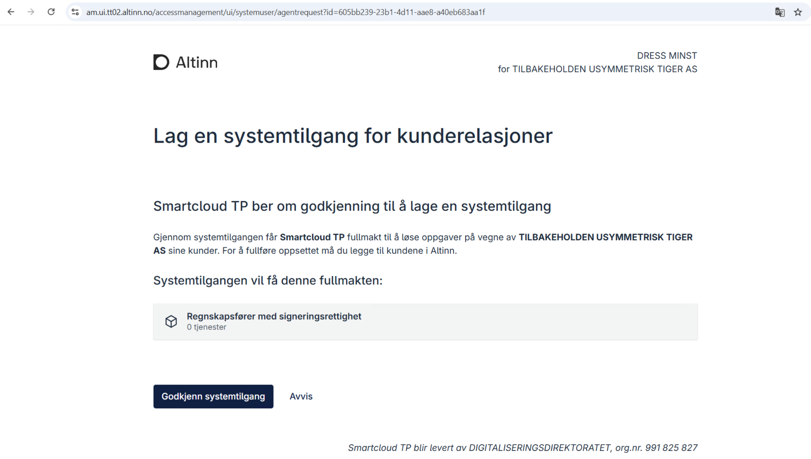
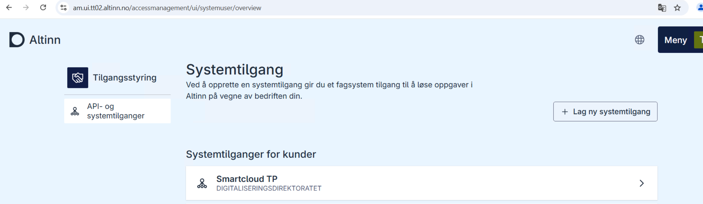
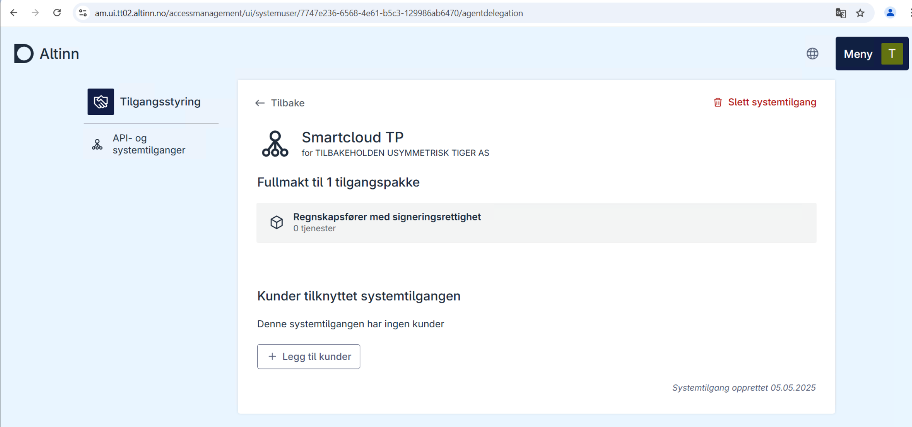
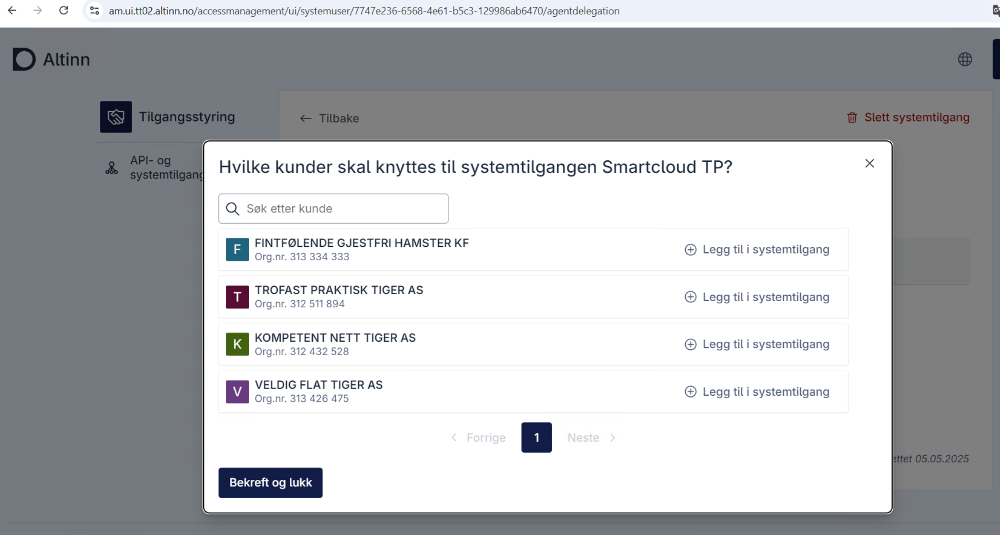
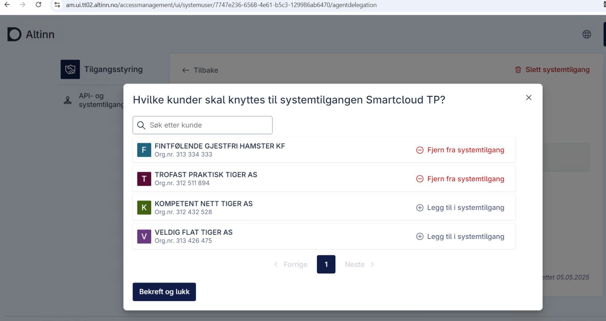
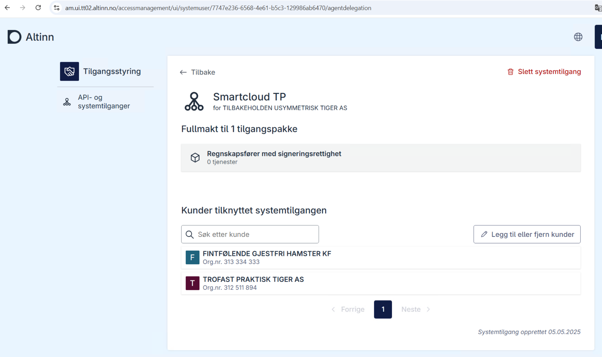

#### Guide for End User (DRESs MINST, Client Administrator for TILBAKEHOLDEN USYMMETRISK TIGER AS )
   1. Purchasing the Accounting System
      - DRESs MINST, the CEO of TILBAKEHOLDEN USYMMETRISK TIGER AS , purchases SmartCloud to manage different services for their clients .
      - for example, The software offers a feature to view their client company's total tax and fee claims.
   2. Approving the System User Request
      - As part of the software setup, DRESs MINST must approve the system user request from SmartCloud.
      - In this example, DRESs MINST is sent to the agent system user request and must approve in Altinn portal, where DRESs MINST creates a system user, adds their clients to the system user which grants access to the access package "Regnskapfører med signeringsrettighet" which gives access to one or more services.

      Approve agent system user request

      

      End user sent to the vendor's receipt page after approve/reject
      

      End user logs in to the system to manage the system users
      

      Clicks on the particular system user for managing/viewing. clicks on add client to add clients
      

      Adds the clients
      
      
      Clients are added
      
      
      Overview of the system user and clients
      

   3. Granting the Required Permissions
      - After DRESs MINST's approval and client addition, the system access includes the access package that gives access to various services for clients of TILBAKEHOLDEN USYMMETRISK TIGER AS.
DRESs MINST has granted authorization to SmartCloud for this specific access package and can revoke the access at any time via Altinn.
