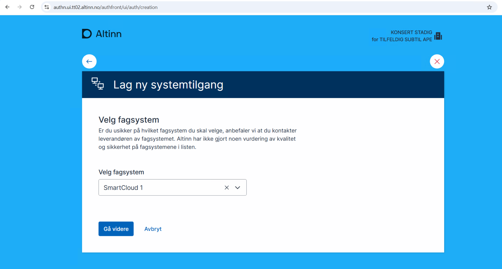
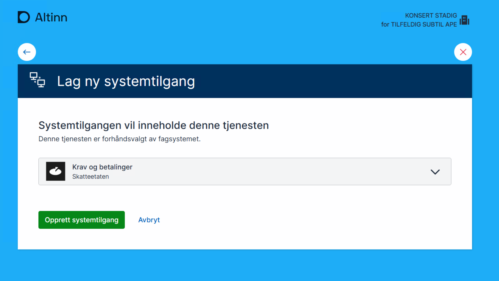
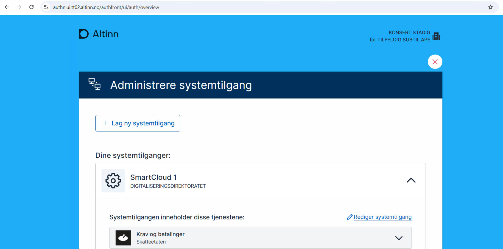
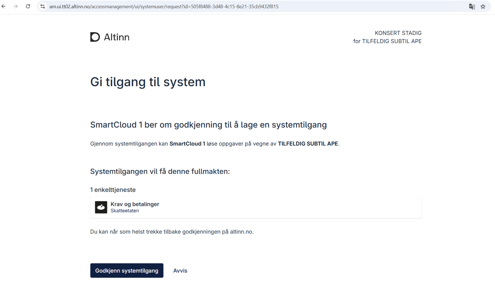
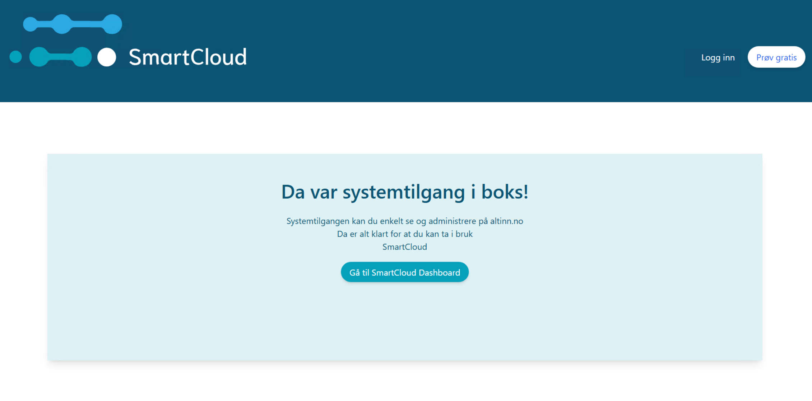
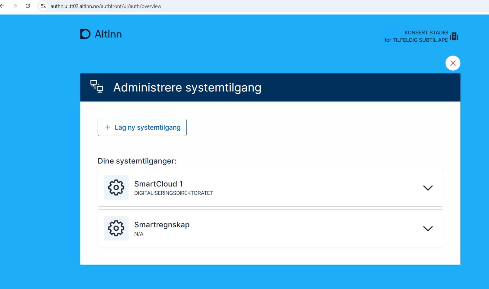

### Guide for End User (STADIG KONSERT, Dagligleder of TILFELDIG SUBTIL APE)
1. Purchasing the Accounting System
   - STADIG KONSERT, the Dagligleder of TILFELDIG SUBTIL APE, purchases SmartCloud to manage the company’s tax and fee claims.
   - The software offers a feature to view the company's total tax and fee claims.
2. Approving the System User Request
   - As part of the software setup, STADIG KONSERT can either create a system user in altinn portal via end user driven system user creation or approve a system user request sent by the SmartCloud.      
   - For example, STADIG KONSERT can create a system user for TILFELDIG SUBTIL APE from altinn portal like below
      
      Select the system
      
      Create the system user
      
      see the list of system users
      
      - In this example, STADIG KONSERT is sent to the system user request and must approve in Altinn portal, where STADIG KONSERT grants the necessary access rights to SmartCloud for the "Krav og betalinger" service.
      

      Once the request is approved, the user is sent to the redirecturl specified in the system user request
      

      STADIG KONSERT can login to altinn again, to see that the system user that was approved is listed
      

   3. Granting the Required Permissions
      - After STADIG KONSERT's approval, the system access includes the rights to view TILFELDIG SUBTIL APE’s tax and fee claims.
STADIG KONSERT has granted authorization to SmartCloud for this specific service and can revoke the access at any time via Altinn.
