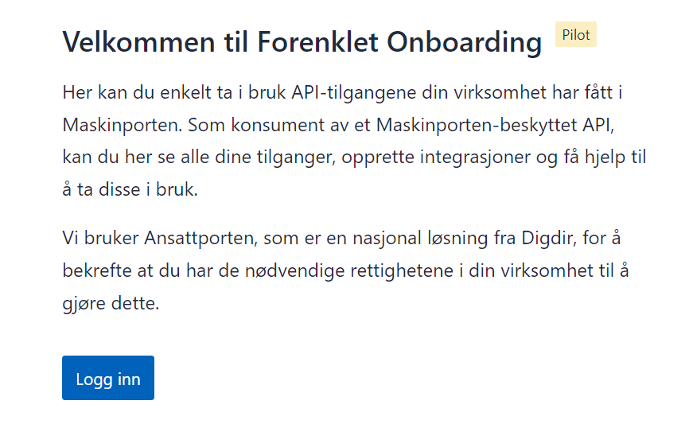
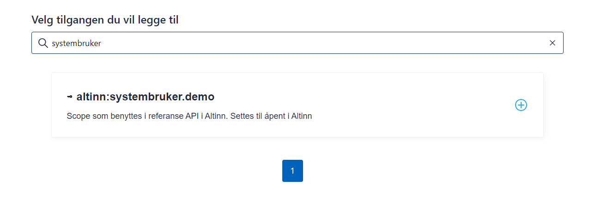
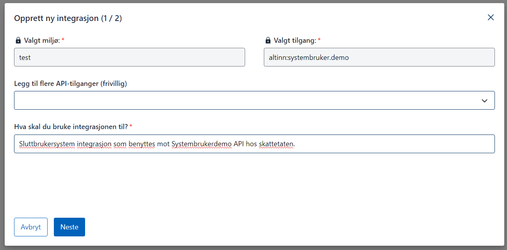
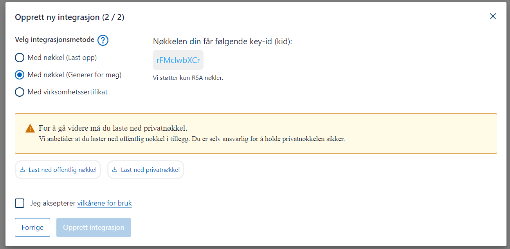
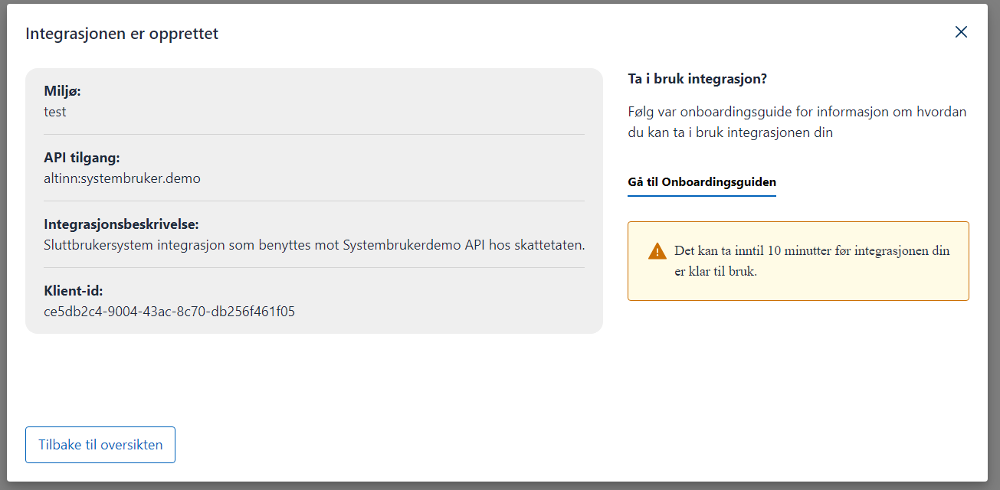
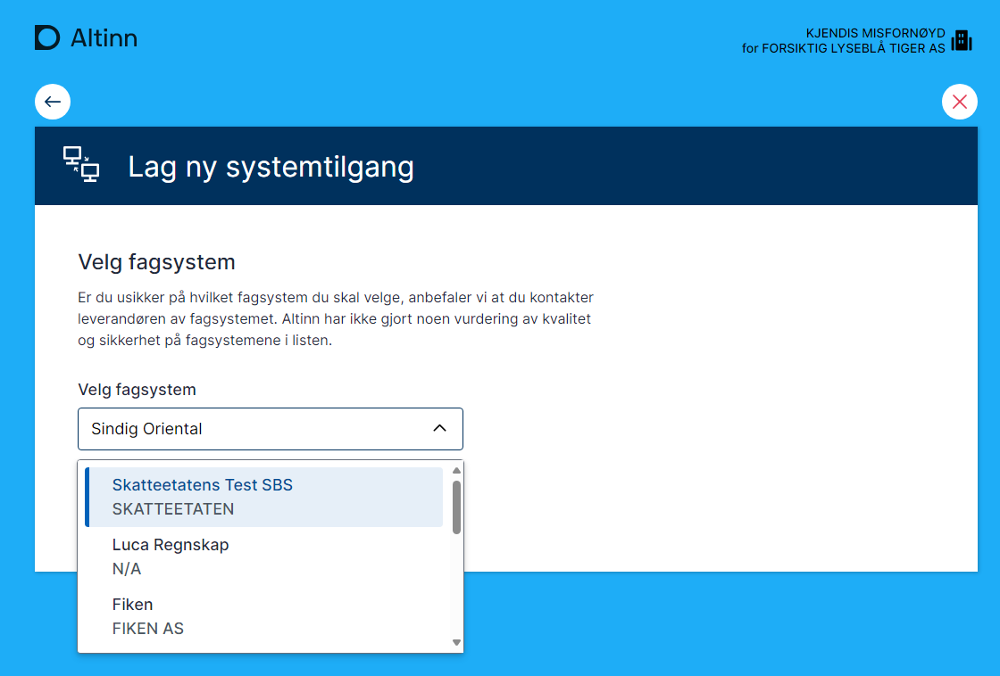
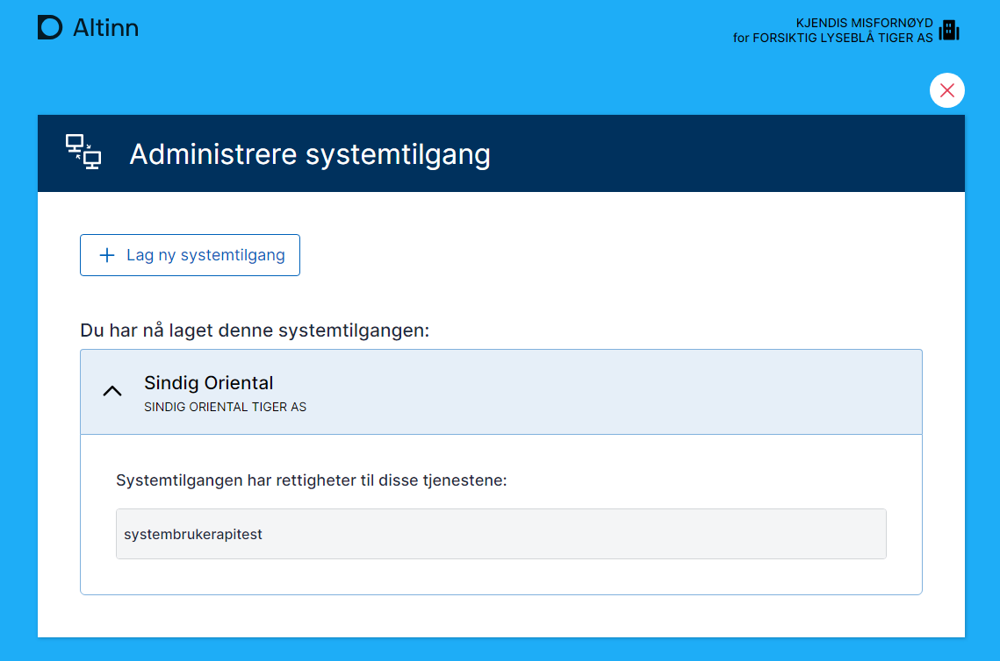


 Denne funksjonaliteten er i test og kan endres


## Bakgrunn

Bakgrunnen til systembruker konsept kan leses om [her](https://github.com/Altinn/altinn-authentication/issues/200).

## Forutsetninger

For at en systemleverandør skal kunne benytte seg av systembruker, må følgende forutsetninger være oppfylt:

- [Avtale med Maskinporten som konsument](https://samarbeid.digdir.no/maskinporten/konsument/119)
- Avtale med Digdir som gir tilgang til systemregisteret
- Delegert tilgang til scope for registrering av system i systemregisteret: `altinn:authentication/systemregister.write`

Hvis man ønsker å bruke leverandørstyrt flyt for opprettelse av systembruker, trenger man følgende scopes for å opprette forespørsler og sjekke status:

- `altinn:authentication/systemuser.request.read`
- `altinn:authentication/systemuser.request.write`

I tillegg trengs tilgang til scopes for API-ene som skal benyttes av systemet. Dette vil være informasjon som tjenesteeier sitter på.

## Sette opp maskinporten integrasjon

For å konsumere offentlige API med systembrukere trenger man å registrere minst en MaskinPorten integrasjon. 
Dette kan gjøres i [sammarbeidsportalen](https://docs.digdir.no/docs/Maskinporten/maskinporten_sjolvbetjening_web#opprette-klient-for-%C3%A5-konsumere-api) eller via [API](https://docs.digdir.no/docs/Maskinporten/maskinporten_sjolvbetjening_api#registrere-klient).

## Registrere system

Det første steget etter at man har fått tilgang til systemregisteret, er å registrere systemet.

Systemet er typisk en nettbasert programvare som er tilgjengelig i markedet, og som sluttkunder (virksomheter) kan benytte for kommunikasjon med det offentlige.

Systemet må beskrives med følgende egenskaper:

### Id

Dette er en unik ID som vil benyttes for å identifisere programvaren. Gyldige tegn er a-z 0-9 og _

Id må starte med organisasjonsnr til leverandør.  Eksempelet nedenfor viser med Digitialiseringsdirektorates organisasjonsnr

### Vendor

Dette er informasjon om leverandør. 
ID er på formatet 0192:{orgnr}

0192 er referanse til Enhetsregisteret i [Electronic Adress Scheme](https://docs.peppol.eu/poacc/billing/3.0/codelist/eas/)

### Name

Navn på systemet må oppgis på engelsk (en), bokmål (nb) og nynorsk (nn). Navn kan settes likt på alle språk. 

Navn presenteres på Altinn sider under registrering av systembruker. 

### Description

Description beskriver systemet. Vil kunne presenteres på Altinn sider for informasjon til sluttbrukere. 

Oppgis på engelsk, bokmål og nynorsk.

### Rights

Rights beskriver hvilke tjenester systemet trenger rettighet for å kunne fungere. Dette er referanser til applikasjoner i Altinn plattformen eller tjenester utenfor Altinn som er registrert hos Altinn.

Hvilke rettigheter som kreves vil avhengig av bruksscenario. 

Eksempelet nedenfor viser et system som har behov for tilgang til tjenesten [Krav og betalinger](https://skatteetaten.github.io/api-dokumentasjon/api/kravogbetalinger) fra Skattedirektoratet som er [registrert i Altinn ressursregister](https://platform.tt02.altinn.no/resourceregistry/api/v1/resource/ske-krav-og-betalinger). 

Senere vil Systembruker støtte tilgangspakker som er en samling av rettigheter på tvers av tjenester innfor et område.

### ClientId

Dette er klientidene for integrasjonen som er opprettet i Maskinporten. 

Det er kun pålogginger med Maskinportenintegrasjoner som er knyttet mot oppgitte klientider.


### Eksempel fra TT02

Eksempelet viser systemet som er registrert for demoapplikasjonen SmartCloud i TT02 testmiljø. 


```json
{
  "Id": "991825827_smartcloud",
  "Vendor": {
    "ID": "0192:991825827"
  },
  "Name": {
    "en": "SmartCloud",
    "nb": "SmartCloud",
    "nn": "Smart SKY"
  },
  "Description": {
    "en": "SmartCloud Rocks",
    "nb": "SmartCloud er verdens beste system.",
    "nn": "SmartSky er vestlandets beste system"
  },
  "Rights": [
    {
      "Resource": [
        {
          "value": "kravogbetaling",
          "id": "urn:altinn:resource"
        }
      ]
    }
  ],
  "AllowedRedirectUrls": [ "https://smartcloudaltinn.azurewebsites.net/receipt" ],
  "ClientId": [ "a2ed712d-4144-4471-839f-80ae4a68146b" ]
}
```

Url for å regsistrere

```http
POST https://platform.tt02.altinn.no/authentication/api/v1/systemregister/system
```

Url for å opppdatere dette systemet (ID må endres for andre system)

```http
POST https://platform.tt02.altinn.no/authentication/api/v1/systemregister/system/91825827_smartcloud
```

For produksjon endres domenet til **platform.altinn.no**

Se også [eksempelapplikasjon](https://github.com/TheTechArch/altinn-systemuser/tree/main/src/SystemAdmin) for å registrere system.

## Sende forespørsel om opprettelse av systembruker til virksomhet

Som systemleverandør kan man be sine kunder om å opprette systembruker med nødvendige rettigheter. 
Dette gir en enkel onboarding av nye kunder. 

For å kunne gjøre dette må man være tildelt scopet **altinn:authentication/systemuser.request.write** 

Systembruker støtter kun virksomheter som kunde.

### External ref

Denne benyttes som ekstern refernase hos systemleverandør. Hvis den ikke er satt blir den automatisk satt til orgnr

### SystemId

Referanse til system

### PartyOrgNo

Organiasjonsnr til systemleverandørens kunde. 

### Rights

En liste over rettigheter systembrukeren trenger tilgang til. Det beskrives for øyeblikket med referanse til ressurs


### RedirectUrl

Denne urlen benyttes for sluttbruker har akseptert forespørsel. 


### Eksempel

```json
{
  "externalRef": "313725138_2024",
  "systemId": "991825827_smartcloud",
  "partyOrgNo": "313725138",
  "rights": [
    {
      "resource": [
        {
          "value": "ske-krav-og-betalinger",
          "id": "urn:altinn:resource"
        }
      ]
    }
  ],
  "redirectUrl": "https://smartcloudaltinn.azurewebsites.net/receipt"
}
```
URL for å registrere

```http
POST https://platform.tt02.altinn.no/authentication/api/v1/systemuser/request/vendor/
```

For produksjon, endre domenet til **platform.altinn.no**

## Maskinporten autentisering

Når system skal autentisere seg som systembrukeren til kunden må JWT grant forespørselen til maskinporten inneholde informasjon om kunden


### JWT Grant

```json
{
  "aud" : "https://maskinporten.no",
  "sub" : "fc9a8287-e7cb-45e5-b90e-123048d32d85",
  "authorization_details" : [ {
    "systemuser_org" : {
      "authority" : "iso6523-actorid-upis",
      "ID" : "0192:310385980"
    },
    "type" : "urn:altinn:systemuser"
  } ],
  "scope" : "krr:global/kontaktinformasjon.read",
  "iss" : "fc9a8287-e7cb-45e5-b90e-123048d32d85",
  "exp" : 1718124835,
  "iat" : 1718124715,
  "jti" : "89365ecd-772b-4462-a4de-ac36af8ef3e2"
}

```


### JWT Token


```json
{
  "authorization_details" : [ {
    "type" : "urn:altinn:systemuser",
    "systemuser_org" : {
      "authority" : "iso6523-actorid-upis",
      "id" : "0192:314168267"
    },
    "systemuser_id" : [ "ebe4a681-0a8c-429e-a36f-8f9ca942b59f" ],
    "system_id" : "matrix_test"
  } ],
  "scope" : "krr:global/kontaktinformasjon.read",
  "iss" : "https://test.maskinporten.no/",
  "client_amr" : "private_key_jwt",
  "token_type" : "Bearer",
  "exp" : 1718175135,
  "iat" : 1718175015,
  "client_id" : "fc9a8287-e7cb-45e5-b90e-123048d32d85",
  "jti" : "-SpfU--1Zn_Oqvkpjwu3oVn--VLcPzSAwjqyiP6zBEw",
  "consumer" : {
    "authority" : "iso6523-actorid-upis",
    "ID" : "0192:314330897"
  }
}

```
Se også dokumentasjon hos [Maskinporten](https://docs.digdir.no/docs/Maskinporten/maskinporten_func_systembruker). 


## Bruk av systembrukertoken mot API

Tokenet man får fra maskinporten legges ved som et bearer token mot de API man skal kalle. 

## Test av systembruker i TT02

For å teste systembruker i TT02 kreves følgende

 - Systemleverandør opprettet i maskinporten. Gjøres via servicedesk@digdir.no
 - Systemleverandør opprettet i Altinn. Gjøres vie servicedesk@altinn.no
 - Systemintegrasjon opprettet i maskinporten test.

For opprettelse av systembrukere kan testbrukere/organisasjoner fra Tenor benyttes

### Bruk av systembrukertoken mot API

Tokenet man får fra Maskinporten legges ved som et Bearer Token mot de API-ene man skal kalle.

### Test av systembruker i TT02

For å teste systembruker i TT02 kreves følgende:

- Systemleverandør opprettet i Maskinporten. Dette gjøres via servicedesk@digdir.no.
- Systemleverandør opprettet i Altinn. Dette gjøres via servicedesk@altinn.no.
- Systemintegrasjon opprettet i Maskinporten test.

For opprettelse av systembrukere kan testbrukere/organisasjoner fra Tenor benyttes.

### Referanseimplementasjon og oppsett

Det er utviklet en referanseimplementasjon for å demonstrere bruk av systembruker. Den er utviklet i C# og kan kjøres som en konsollapplikasjon. 
Den gjør følgende:

1. Oppretter token basert på konfigurert JSON Web Key, client ID, scope og organisasjonsnummer til den som har opprettet systembruker.
2. Basert på tokenet den får, gjør den kall mot referanse-API som krever systembruker.

Se kode med dokumentasjon [her](https://github.com/TheTechArch/altinn-systemuser).

### Sette opp referanseimplementasjon med egen konfigurasjon

Det er utviklet en referanseimplementasjon for å demonstrere bruk av systembruker. Den er utviklet i C# og kan kjøres som en konsollapplikasjon.

Den gjør følgende:

1. Oppretter token basert på konfigurert JSON Web Key, client ID, scope og organisasjonsnummer til den som har opprettet systembruker.
2. Basert på tokenet den får, gjør den kall mot referanse-API som krever systembruker.

Se kode med dokumentasjon [her](https://github.com/TheTechArch/altinn-systemuser).

### Sette opp referanseimplementasjon med egen konfigurasjon

I repoet ligger nødvendig testsertifikat for å kjøre applikasjonen. Følgende må gjøres for å sette opp egen integrasjon som systemleverandør:

1. Logg inn på [onboarding Maskinporten](https://onboarding.test.maskinporten.no/). Her kan du bruke en test-ID som er daglig leder for en testenhet.

    

    

    

    

    

    

    

2. Få opprettet system i Systemregister med riktig client ID og knytning mot nødvendige ressurser/tilgangspakker.

3. Logg inn med testbruker i tt02.altinn.no. Brukeren må ha tilgangsstyringsrollen i Altinn for en testorganisasjon og gå til siden [https://authn.ui.tt02.altinn.no/authfront/ui/auth/creation](https://authn.ui.tt02.altinn.no/authfront/ui/auth/creation).

    

    

    

4. Konfigurer key, nøkkel, client ID og scope i testapplikasjon.

```c#
string clientID = "7ee41fce-9f6e-4c32-8195-0fe2c1517f43";
string scope = "altinn:systembruker.demo";
string systemUserOrg = "210493352";
string pemCertificatePath = @".\mp-key.pem";

```
