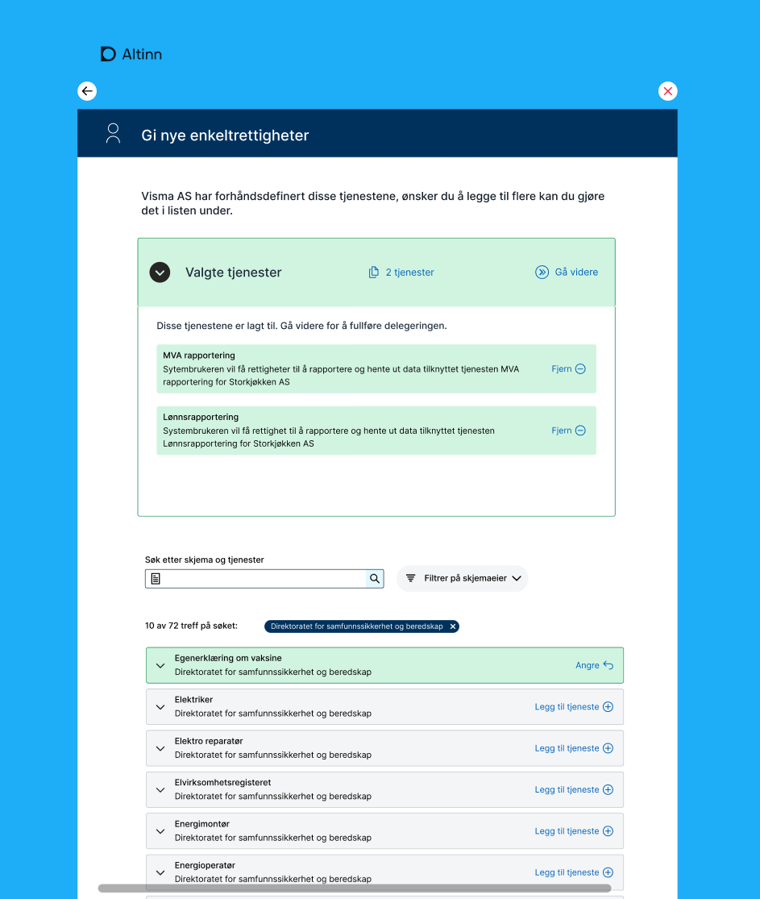
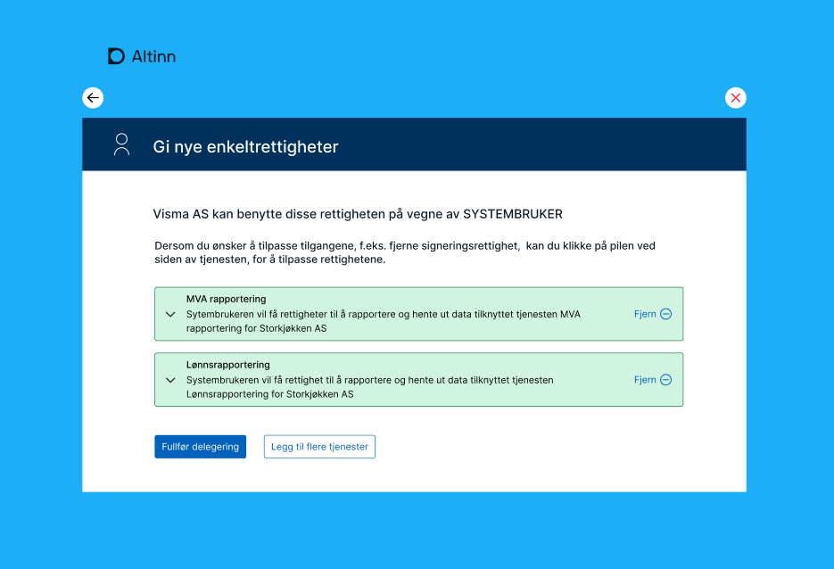

Samlet sett har ca 50% av trafikken av skjema kommet fra APi, hvor enkelte tjenester har omtrent 100%. 
For Altinn 3 utvikles det nye mekanismer som kan benyttes for autentisering og autorisasjon av maskin til maskin integrasjon

## Systembruker for virksomhet

Maskinporten er sentral i det nye konseptet. Alle som skal kalle API som den nye systembrukeren må autentisere seg mot maskinporten for å få et systembrukertoken. 
Det som skiller et systembrukertoken og et vanlig maskinporten token er at man  i tillegg til informasjon om virksomheten som har autentisert seg så finner man informasjon om systembruker og system.
Systembrukeren opprettes av den aktøren som ønsker å benytte et sluttbrukersystem for å integrere mot Altinn. Systembrukeren knyttes mot valgt system/systemleverandør og tildeles nødvendige rettigheter. 

### Eksempel

Rørlegger Hansen & Sønner AS oppretter systembrukeren «Regnskap og MVA» og velger det å knytte systembrukeren til systemet «Regnskap 123»   fra  Bedrfiftshjelp AS. 
I tillegg gis systembrukeren rettigheten til tjenesten «MVA» fra Skatteetaten og tjenesten «Årsregnskap» fra Brønnøysundregistrene. 
Med dette oppsettet vil Bedriftshjelp AS kunne autentisere seg mot maskinporten og be om å få et systembrukertoken for systembrukeren til Rørlegger Hansen & Sønner AS for sitt system. 
Tokenet man da får vil kunne benyttes direkte mot Altinns API eller andre som velger å støtte dette tokenet. Rettighetsmessig vil Bedriftshelp AS sine system kunne behandle data for Rørlegger Hansen & Sønner for de tjenestene systembrukeren har fått rettighet til. 

## Løsningsbeskrivelse

### Systemregister

Som del av nytt konsept etableres det et systemregister i Altinn.  Systemregisteret vil inneholde oversikt over systemer tilbudet av systemleverandører. 

Systemleverandører vil få tilgang til kunne administrere systemene de leverer i registeret. 

Registeret vil inneholde navn og beskrivelse på systemet i tilegg til hvilke rettigheter som kreves av systemet for å kunne fungere.  

Denne informasjonen vil benyttes for å hjelpe sluttbruker til å gi riktig rettigheter til systembrukere som opprettes. 

Systemleverandører vil kunne 

### Leverandørstyrt opprettelse av systembruker

En viktig egenskap med nytt konsept er at det skal være lettere for systemleverandører å rettlede sine kunder til riktig oppsett. I dag betyr dette komplekse handlinger i Altinn portal med påfølgene deling av passord/sertifikater med systemleverandør.  Ny løsning gir mulighet for kraftig forenklet pårullinmg av kunder av systemleverandører
Systemleverandøren vil kunne opprette et forespørsel for sin kunde på opprettelse av systembruker samt tildeling av nødvendige rettigheter. Dette kan minne om hvordan man i dag kan samtykke til å dele inntektsinformasjon til banker. 
Brukeren blir da presentert et forenklet GUI som beskriver at systembruker vil opprettes og at det vil tildeles rettigheter. Det vil også beskrive hvilke system / leverandør som får tilgang til denne systembrukeren. 

Det er også forventet at man vil få kunne mulighet til be om flere rettigheter til systembruker ved samme prinsipp.

### Administrasjon av systembruker

Virksomheter vil kunne administrere sine systembrukere fra Altinn Profill. 

Man vil kunne opprette systembrukere, deaktivere dem, endre rettigheter og endre tilkoblet system/systemtilbyder.

Brukerne vil kunne opprette nye brukere og knytte mot systemer/leverandører 

Systembrukerne kan tildeles rettigheter. Ved å forhåndsdefinere hvilke rettigheter et system trenger til å fungere kan man i Altinn presentere dette i sammenheng med rettighetsdelegering

For virksomheter som bruker egenutviklet system vil man kunne definere integrasjoner i Maskinporten fra Altinns profil.

