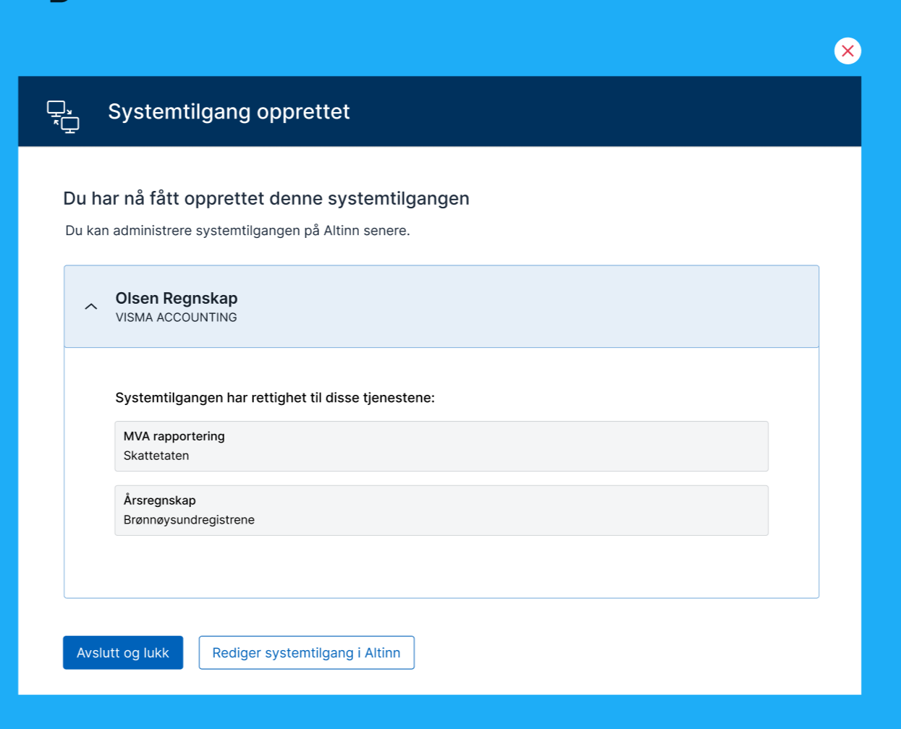


Under arbeid. Ting kan endres. Vi tar gjerne imot innspill.


Samlet sett har ca 50% av trafikken av skjema kommet fra APi, hvor enkelte tjenester har omtrent 100% andel fra fagsystem. 

Det utvikles nå nye mekanismer som kan benyttes for autentisering og autorisasjon av maskin til maskin integrasjon på Altinn plattformen og andre offentlige API.

## Systembruker for virksomhet (aka systemintegrasjon)

Maskinporten er sentral i det nye konseptet. Alle som skal kalle API som den nye systembrukeren må autentisere seg mot maskinporten for å få et systembrukertoken. 

Det som skiller et systembrukertoken og et vanlig maskinportentoken, er at man i tillegg til informasjon om virksomheten som har autentisert seg, så finner man informasjon om systembruker og system.

Systembrukeren opprettes av den aktøren som ønsker å benytte et fagsystem for å integrere mot Altinn eller andre offentlige løsninger. Systembrukeren knyttes mot valgt system/systemleverandør og tildeles nødvendige rettigheter. 

### Eksempel

Rørlegger Hansen & Sønner AS oppretter systembrukeren «Regnskap og MVA» og velger det å knytte systembrukeren til systemet «Regnskap 123»  fra  Bedriftstshjelp AS. 

Bedriftshjelp AS har registrert at "Regnskap og MVA" krever rettighet for tjenestene "MVA" og "Årsregnskap". 
Dette aksepterer Hansen & Sønner AS når de oppretter systembrukeren.

Med dette oppsettet vil Bedriftshjelp AS kunne autentisere seg mot maskinporten og be om å få et systembrukertoken for systembrukeren til Rørlegger Hansen & Sønner AS for sitt system. 

Tokenet man da får vil kunne benyttes direkte mot Altinns API eller andre som velger å støtte dette tokenet. Rettighetsmessig vil Bedriftshelp AS sine system kunne behandle data for Rørlegger Hansen & Sønner for de tjenestene systembrukeren har fått rettighet til. 

## Løsningsbeskrivelse

### Systemregister

Som del av nytt konsept etableres det et systemregister i Altinn. Systemregisteret vil inneholde oversikt over systemer tilbudet av systemleverandører. 

Systemleverandører vil få tilgang til kunne administrere systemene de leverer i registeret via API. 

Registeret vil inneholde navn og beskrivelse på systemet i tilegg til hvilke rettigheter som kreves av systemet for å kunne fungere.  

Denne informasjonen vil benyttes for å hjelpe sluttbruker til å gi riktig rettigheter til systembrukere som opprettes. 

Systemleverandører vil kunne bruke informasjonen i registret til å forhåndsutfylle informasjon for leverandørstyrt opprettelse av systembruker. 

Som del av systeminformasjonen må systemleverandører oppgi clientID fra  Maskinporten for å definere hvilke maskinporten integrasjoner som skal kunne autentisere seg som systemet. 

### Leverandørstyrt opprettelse av systembruker

En viktig egenskap med nytt konsept er at det skal være lettere for systemleverandører å rettlede sine kunder til riktig oppsett. I dag betyr dette komplekse handlinger i Altinn portal med påfølgene deling av passord/sertifikater med systemleverandør.  Ny løsning gir mulighet for kraftig forenklet pårullinmg av kunder av systemleverandører

Systemleverandøren vil kunne opprette et forespørsel for sin kunde på opprettelse av systembruker samt tildeling av nødvendige rettigheter. 
Dette kan minne om hvordan man i dag kan samtykke til å dele inntektsinformasjon til banker. 

Brukeren blir da presentert et forenklet GUI som beskriver at systembruker/systemintegrasjon vil opprettes og at det vil tildeles rettigheter. 
Det vil også beskrive hvilke system / leverandør som får tilgang til denne systembrukeren. 


Ved å akseptere opprettes systembrukeren og den fås de nødvendige rettigheter.



Det er også forventet at man vil få kunne mulighet til be om flere rettigheter til systembruker basert på samme prinsipp.

### Administrasjon av systembruker

Virksomheter vil kunne administrere sine systembrukere fra Altinn Profill. 

Man vil kunne opprette systembrukere og deaktivere dem.


Brukerne vil kunne opprette nye brukere og knytte mot systemer/leverandører 


Systemleverandøren må forhåndsdefinere hvilke rettigheter systemet trengs delegeres til systembrukeren. 


## Teknisk flyt autentisering/autorisasjon

Diagrammet nedenfor viser hvordan et fagsystem kan autentisere seg når systembruker er opprettet og knyttet.

1. Sluttbrukersystemet kaller Maskinporten med et JWT Grant hvor man oppgir hvem som er kunde samt nøkkel/clientinformasjon
2. Maskinporten verifiserer mot Altinn at kunden har gitt systemet som er knyttet mot klienten tilgang
3. Ved bekreftelse utsteder Maskinporten et token som inneholder informasjon om systembruker og eieren av systembrukeren
4. Dette tokenet kan da benyttes i kall mot API. (I Altinn eller utenfor Altinn)
5. API kan autoriseres 


### JWT Grant

```json
{
  "aud": "https://maskinporten.no/",
  "iss": "0e85a8ba-77e8-4a6c-a0f5-74fc328a9ffb",

  "scope": "digdir:dialogporten skatteetaten:mva"

   "authorization_details": [ {
    "type": "urn:altinn:systemuser",
    "systemuser_org": {
       "authority" : "iso6523-actorid-upis",  
       "ID": "0192:999888777"  
    }
}]
}

```


### JWT Token


```json
{
  "iss" : "https://ver2.maskinporten.no/",
  "client_amr" : "virksomhetssertifikat",
  "token_type" : "Bearer",
  "aud" : "unspecified",
  "consumer" : {
    "authority" : "iso6523-actorid-upis",
    "ID" : "0192:910753614"
  },
  "authorization_details": [ {
     "type": "urn:altinn:systemuserorgno",
     "part": "0192:999888777",      
     "systemuser": "12ffc244-e86e-4d7e-9016-cfd0c1ab8b6d",  // Used for authorization
     "systemid": "f9e58561-a165-4e26-85ed-fe9da8d2325a"  // Identifies the software
   }
  "scope" : "digdir:dialogporten skatteetaten:mva",
  "exp" : 1578924303,
  "iat" : 1578923303,
  "jti" : "QPdTeNlE-RtrNczkCIZ0yAoSzJSIC3Jo7L6B_PmY2X4"
}

```


## Hvordan ta i bruk

Nedenfor finner du en beskrivelse på hva som trengs for å ta i bruk systembruker. Beskrivelsen er basert på
at API tilbyder bruker Altinn Autorisasjon for tilgangstyring av API.

### API tilbydere

Som API tilbyder kreves følgende for å kunne bruke systembruker

- API må definieres i Maskinporten. Nødvendig scope opprettes
- API configures til å validere JWT token fra Maskinporten
- Ett policy enforcment punkt implementeres/konfigureres for API endepunkt. PEP sitt ansvar er å bygge opp en XACML autorisasjosnforespørsel til Altinn autorisasjon som inneholder informasjon om ressurs som aksesseres (ressursid i Altinn ressursregister), action og systembrukerinfo fra JWT token
- Ressurs opprettes Altinn Resource Registry som skal benyttes for å autorisere tilgang.

### Tjenesteeiere Altinn Apps

Hypotesen er at det er minimalt hva som må gjøres for systembrukere i Altinn Apps.

TODO: Avklare dette endelig

### Systemleverandører

For systemleverandører må følgende utføres

- Registrere klient i maskinporten.
- Få tilgang til systemregister. Hva som kreves for å få tilgang til systemregisterer er under avklaring.
- Registrere system i systemregistereret med nødvendig informasjon som navn, beskrivelse og informasjon om hvilke tilganger system trenger for en part for å fungere. Tilgangene beskrives som tilgangspakker eller enkelttilganger. I første versjon vil det kun være enkelttilganger. Klientid fra maskinporten må registreres på system.
- Informere kunder om at de må opprette systembruker og knytte det til systemet de leverer
- Informere kunder om rettighetene systemet krever.
- Opprett maskinporten med JWT grand

```json
{
    "SystemTypeId": "bedriftsguru_superbusiness",
    "SystemVendor": "991825827",
    "ClientIds": [
        "f381cbb8-1e5c-4017-977d-f9029e2ee7ca",
        "4349ee94-98a4-49be-8db3-bd60937fcdd4"
    ],
    "RequiredResourceRights": [
        "app_skd_mva",
        "app_nav_sykemelding"
    ],
    "Title":{
        "en": "Bedriftsuguru SuperBusiness",
        "nb": "Bedriftsuguru SuperBusiness",
        "nn": "Bedriftsuguru SuperBusiness"
    },
    "Description":{
        "en": "This is our best product. It helps you with everything. ",
        "nb": "Dette er vårt beste produkt. Få hjelp til alt",
        "nn": "Dette er vårt beste produkt. Få hjelp til alt"
    }
}

```

### Sluttbrukere

## Leveranseplan

Systembruker vil leveres som del av flere leveranser. 


### Leveranse 1

Første leveranse inneholder følgende funksjonalitet

#### Ressurseier​

- Oppretter generisk autorisasjonsressurs i Ressursregister​
- Melder inn nødvendige tilgangspakker til Digdir​
- Tillater “Enterprise bruker”​
- Integrere mot PDP​

#### Fagsystem​

- Melder inn navn, enkeltrettighet(er), beskrivelse​
- Digdir legger inn i Systemregister​

#### Virksomhet​

- Sluttbrukerstyrt opprettelse

### Leveranse 2

#### Fagsystem​

- API for systemregister administrasjon​
- Leverandørstyrt flyt 

### Leveranse 3

#### Fagsystem​

- Legge til/fjerne rettigheter på system ​

#### Virksomhet​

- Varsling og godkjenning av endrede rettigheter

### Leveranse 4

#### Fagsystem​

- Legge til nødvendige tilgangspakker​

#### Virksomhet​

- Godkjenne endrede rettighetsbehov

### Leveranse 5

#### Virksomhet​

- Støtte for leverandør – hjelper – kunde forhold


## Detaljerte issues

Dette jobbes det med i flere issues på Github

 [Analyse: Fremtidig løsning for sluttbrukersystemer](https://github.com/Altinn/altinn-authentication/issues/200)
 [Epic: New machine-machine authentication method](https://github.com/Altinn/altinn-authentication/issues/331)


