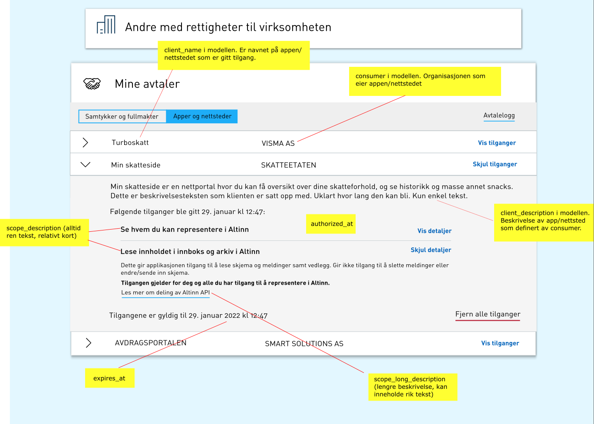

End-user systems can authenticate users via ID-porten to use APIs from applications running in Altinn Apps and certain functions in Altinn Platform on behalf of the end-user.

There are mainly two types of systems where this is relevant: web-based solutions and thick clients.

Common to both solutions is that the end-user logs in via a browser in ID-porten with the desired authentication mechanism, for example:

- Min-ID
- BankID on mobile
- BankID

The system must request a set of scopes in ID-porten that the end-user must accept for the system to perform actions on behalf of the end-user. These scopes limit what the system can do on behalf of the end-user.

Relevant scopes for Altinn 3 are:

- **altinn:instances.meta** - View inbox and archive overview in Altinn
- **altinn:instances.read** - Read the content of the inbox and archive in Altinn for all items the end-user is authorized for
- **altinn:instances.write** - Fill out, sign, and submit forms in Altinn for all items the end-user is authorized for
- **altinn:lookup** - Use lookup services in Altinn
- **altinn:reportees** - See who you can represent in Altinn

The image below shows how the end-user must confirm access.

For details on scopes and a list of all available scopes, see [documentation from ID-porten](https://docs.digdir.no/oidc_protocol_scope.html).

Once login is completed, the system will have access to an ID token, refresh token, and an access token. The access token has a limited lifespan but can be renewed using the refresh token.

## Web-based systems

Web-based systems consist of solutions with a web-based frontend running in a browser, as well as server-side code.

[See details at ID-porten](https://docs.digdir.no/oidc_guide_idporten.html).

## Thick clients

Thick clients refer to applications that are installed and run locally on a computer and not in a browser. These must still use a browser to log in.

[See details at ID-porten](https://docs.digdir.no/oidc_auth_sbs.html).

## Exchanging access token for Altinn token

The access token issued by ID-porten must be exchanged for an Altinn token before it can be used against Altinn's APIs. This Altinn token will have the same lifespan as the access token.

The flowchart below shows how the token is exchanged.

See details in [Altinn's API documentation](../../../api/authentication/spec) under the method `GET /exchange/{tokenProvider}`.

End-users in Altinn have the ability to get an overview of all systems and their accesses. This way, long-term accesses can be revoked. The system will then be rejected the next time it tries to renew the access token.

The image below shows how this will be in Altinn (not yet in production).

A system that has obtained a token from ID-porten will be able to perform actions that the user is authorized for, only limited by the scope's usage area. This means that if the system has obtained a scope for form submission, the system will be able to submit all forms for all entities that the end-user is authorized for. Therefore, it is important that the end-user can trust the system.
