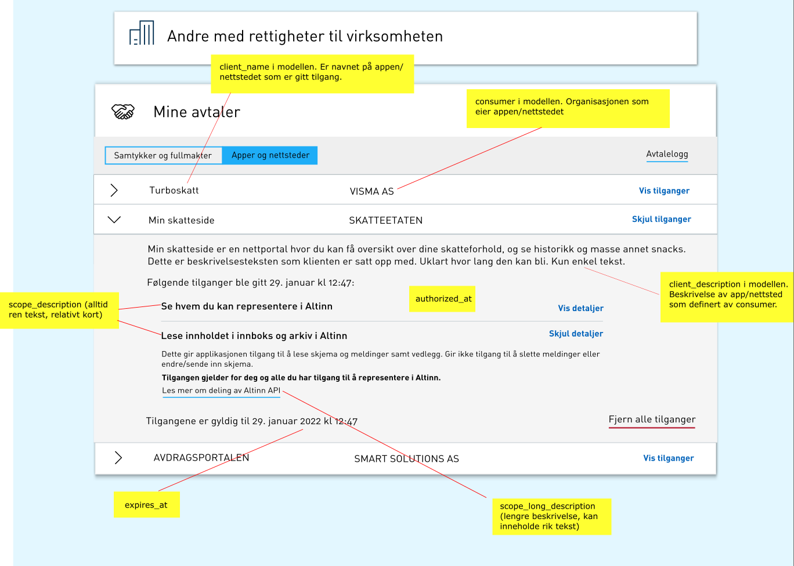

Systemer for sluttbrukere kan autentisere brukere via ID-porten for å benytte API fra applikasjoner kjørende i Altinn Apps og enkelte funksjoner i Altinn Platform på vegne av sluttbruker.

Det er hovedsakelig to typer systemer hvor dette er aktuelt: webbaserte løsninger og tykke klienter.

Felles for begge løsninger er at sluttbruker logger inn via nettleser i ID-porten med ønsket autentiseringsmekanisme, for eksempel:

- Min-ID
- BankID på mobil
- BankID

Systemet må forespørre et sett med scopes i ID-porten som sluttbruker må akseptere at systemet kan utføre på vegne av sluttbruker. Disse scopene avgrenser hva systemet kan utføre på vegne av sluttbruker.

Relevante scopes for Altinn 3 er:

- **altinn:instances.meta** - Se oversikt over innboks og arkiv i Altinn
- **altinn:instances.read** - Lese innholdet i innboks og arkiv i Altinn for alle elementer sluttbruker er autorisert for
- **altinn:instances.write** - Fylle ut, signere og sende inn skjema i Altinn for alle elementer sluttbruker er autorisert for
- **altinn:lookup** - Benytte innsynstjenester i Altinn
- **altinn:reportees** - Se hvem du kan representere i Altinn

Bildet nedenfor viser hvordan sluttbruker må bekrefte tilgangen.

For detaljer om scope og opplisting av alle tilgjengelige scopes, se [dokumentasjon fra ID-porten](https://docs.digdir.no/oidc_protocol_scope.html).

Når pålogging er gjennomført, vil systemet ha tilgang til et ID-token, refresh token og et access token. Access tokenet har begrenset levetid, men kan fornyes ved hjelp av refresh token.

## Webbaserte systemer

Webbaserte systemer består av løsninger med en webbasert frontend som kjører i nettleser, samt serverside kode.

[Se detaljer hos ID-porten](https://docs.digdir.no/oidc_guide_idporten.html).

## Tykke klienter

Med tykke klienter menes applikasjoner som installeres og kjøres lokalt på en datamaskin og ikke i nettleser. Disse må likevel benytte nettleser for å logge inn.

[Se detaljer hos ID-porten](https://docs.digdir.no/oidc_auth_sbs.html).

## Veksling av access token til Altinn token

Access-tokenet som utstedes fra ID-porten må veksles inn i et Altinn-token før det kan benyttes mot Altinns API'er. Dette Altinn-tokenet vil ha samme levetid som access-tokenet.

Flytdiagrammet nedenfor viser hvordan tokenet veksles inn.

Se detaljer i [Altinns API dokumentasjon](../../authentication/spec) under metoden `GET /exchange/{tokenProvider}`.

Sluttbrukere har i Altinn mulighet til å få oversikt over alle systemer og hvilke tilganger de har. På denne måten kan man trekke langvarige tilganger. Systemet vil da bli avvist neste gang det prøver å fornye access-token.

Bildet nedenfor viser hvordan dette vil bli i Altinn (ikke satt i produksjon enda).

Et system som har fått tilgang til et token fra ID-porten vil kunne utføre handlinger som bruker er autorisert for, kun begrenset av bruksområdet til scope. Det betyr at hvis systemet har fått scope for innsending av skjema, vil systemet kunne sende inn alle skjema for alle avgivere som sluttbruker er autorisert for. Det er derfor viktig at sluttbruker kan stole på systemet.
