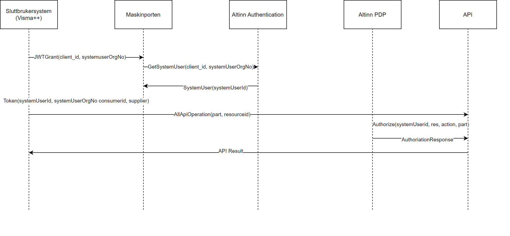

Approximately 50% of form traffic comes via API, with some services having almost 100% from business systems.

New authentication and authorization mechanisms are now being developed for machine-to-machine integration on the Altinn platform and other public APIs.



## Features of System User

System user offers several advantages compared to the enterprise user and end-user system concept in Altinn 2.

- An option for acquiring end-user systems without exchanging certificates/passwords.
- Easy onboarding of customers for system providers.
- Fine-grained authorization with machine-to-machine.
- Overview of system user accesses.
- System providers can share client setups across their customers (no need for multiple certificates).
- Will support client relationships with accountants/auditors from Q1 2025.
- Will be supported by Altinn Apps Q1 2025.

## Maskinporten and System User Token

Maskinporten is central to this new concept. Anyone who wants to use APIs with a system user must authenticate against Maskinporten to receive a system user token.

### Differences from Regular Maskinporten Tokens

System user token includes information about both the organization and the specific system user/system.

## Creation of System User

The system user is created by the actor who wants to use a business system for integration with Altinn or other public solutions. The system user is linked to the chosen system/system provider and assigned the necessary rights.

### Example

- **Organization:** Rørlegger Hansen & Sønner AS
- **System User:** "SmartCloud"
- **System:** "SmartCloud" from SmartCloud AS
- **Rights:** SmartCloud AS registers that "SmartCloud" needs rights to "VAT" and "Annual Accounts".
- **Approval:** Hansen & Sønner AS accepts these rights upon the creation of the system user.

With this setup, SmartCloud AS can authenticate against Maskinporten and get a system user token for the system user of Rørlegger Hansen & Sønner AS. This token can be used against Altinn's API or other services that support it. SmartCloud AS can thus process data for Rørlegger Hansen & Sønner AS within the assigned rights.

## Solution Description


### System Register

As part of the new concept, a system register is established in Altinn. The system register will contain an overview of systems offered by system providers.

System providers will have access to manage the systems they deliver in the register via API.

The register will contain the name and description of the system, in addition to the rights required for the system to function.

This information will help end-users grant the correct rights to system users that are created.

System providers will be able to use the information in the register to pre-fill information for provider-driven creation of system users.

As part of the system information, system providers must provide a clientID from Maskinporten to define which Maskinporten integrations should be able to authenticate as the system.

### Provider-Driven Creation of System User

An important feature of the new concept is to make it easier for system providers to guide their customers to the correct setup.

Today, this involves complex actions in the Altinn portal, followed by sharing passwords/certificates with the system provider. The new solution allows for significantly simplified onboarding of customers for system providers.

The system provider will be able to create a request for their customer to create a system user and assign the necessary rights. This can be compared to how one can consent to share income information with banks today.

The user is presented with a simplified GUI that describes that a system user/system integration will be created and that rights will be assigned. It will also describe which system/provider gets access to this system user.

In the example below, you can see how [SmartCloud](https://smartcloudaltinn.azurewebsites.net/) sends the user to Altinn during customer onboarding. Here, Per Olsen at "Rørlegger Olsen & Sønner AS" has registered as a user with SmartCloud.


The flow itself will vary from system to system.

In some cases, one can imagine that the system provider sends an email to the end-user with a link to confirmation, while in the future, one might also potentially see such requests from the Altinn workspace.

### Administration of System User

Organizations will be able to manage their system users from Altinn Profile.

They will be able to create system users and deactivate them.


Users will be able to create new users and link them to systems/providers.


The system provider must predefine which rights the system needs to be delegated to the system user.


### System Users and Client Relationships

In many cases, an organization has an accountant or auditor who will report for the organization.

Support for this will come in delivery 5 of client delegation.

If we take the scenario above as a starting point, **Rørlegger Hansen & Sønner AS** has chosen **Fine Tall AS** as their accountant.
This is reported via coordinated register notification.

1. **Fine Tall AS** has created a system user for the system **SmartCloud** from SmartCloud AS.
2. The client administrator at Fine Tall AS delegates the access package "Accounting Responsible Payroll" for **Rørlegger Hansen & Sønner AS** to the system user that has been created.

In this way, **SmartCloud** can report for **Rørlegger Hansen & Sønner AS** with the system user for **Fine Tall AS**.

**Fine Tall AS** will be able to manage which of their customers should be handled by the system user. This administration can take place via GUI in Altinn or via their own API for client administration.

See more details in [Issue for Delivery 5](https://github.com/Altinn/altinn-authentication/issues/548).

## Technical Flow Authentication/Authorization

The diagram below shows how a business system can authenticate when a system user is created and linked.

1. The end-user system calls Maskinporten with a JWT Grant where the customer and key/client information are specified.
2. Maskinporten verifies with Altinn that the customer has granted the system linked to the client access.
3. Upon confirmation, Maskinporten issues a token containing information about the system user and the owner of the system user.
4. This token can then be used in calls to APIs (in Altinn or outside Altinn).
5. The API can be authorized.



### JWT Grant

```json
{
  "aud": "https://maskinporten.no/",
  "iss": "0e85a8ba-77e8-4a6c-a0f5-74fc328a9ffb",

  "scope": "digdir:dialogporten skatteetaten:mva",

  "authorization_details": [
    {
      "type": "urn:altinn:systemuser",
      "systemuser_org": {
        "authority": "iso6523-actorid-upis",
        "ID": "0192:999888777"
      }
    }
  ]
}
```

### JWT Token

```json
{
  "iss": "https://ver2.maskinporten.no/",
  "client_amr": "enterprise certificate",
  "token_type": "Bearer",
  "aud": "unspecified",
  "consumer": {
    "authority": "iso6523-actorid-upis",
    "ID": "0192:910753614"
  },
  "authorization_details": [
    {
      "type": "urn:altinn:systemuser",
      "systemuser_id": ["a_unique_identifier_for_the_systemuser"],
      "systemuser_org": {
        "authority": "iso6523-actorid-upis",
        "ID": "0192:999888777"
      },
      "system_id": "a_unique_identifier_for_the_system"
    }
  ],
  "scope": "digdir:dialogporten skatteetaten:mva",
  "exp": 1578924303,
  "iat": 1578923303,
  "jti": "QPdTeNlE-RtrNczkCIZ0yAoSzJSIC3Jo7L6B_PmY2X4"
}
```

See also documentation at [Maskinporten](https://docs.digdir.no/docs/Maskinporten/maskinporten_func_systembruker).

## How to Use

There are separate guides for using system users.

- [How to use system user as a system provider](../../guides/systemauthentication-for-systemproviders/)
- [How to use system user as an API provider/service owner](../../guides/systemauthentication-for-apiproviders/)

## Delivery Plan

System user will be delivered as part of several deliveries.

### Delivery 1

The first delivery includes the following functionality:

#### Resource Owner

- Creates a generic authorization resource in the Resource Register.
- Reports necessary access packages to Digdir.
- Allows "Enterprise User".
- Integrates with PDP.

#### Business System

- Reports name, single right(s), description.
- Digdir adds to System Register.

#### Organization

- End-user driven creation.

[Github issue](https://github.com/Altinn/altinn-authentication/issues/525)

### Delivery 2

#### Business System

- API for system register administration.
- Provider-driven flow.

[Github issue](https://github.com/Altinn/altinn-authentication/issues/544)

### Delivery 3

#### Business System

- Add/remove rights to the system.

#### Organization

- Notification and approval of changed rights.

[Github issue](https://github.com/Altinn/altinn-authentication/issues/545)

### Delivery 4

#### Business System

- Add necessary access packages.

#### Organization

- Approve changed rights requirements.

[Github issue](https://github.com/Altinn/altinn-authentication/issues/547)

### Delivery 5

#### Organization

- Support for provider-helper-client relationships.

[Github issue](https://github.com/Altinn/altinn-authentication/issues/548)

### Support for System User in Altinn Apps

Initially, system user will be used in scenarios outside Altinn, but apps developed on the Altinn platform will also support this.

To support system user in Altinn, the following is being worked on:

- Update App template to support system user.
- Update Platform components to support system user.

## Detailed Issues

This is being worked on in several issues on Github:

[Analysis: Future solution for end-user systems](https://github.com/Altinn/altinn-authentication/issues/200)
[Epic: New machine-machine authentication method](https://github.com/Altinn/altinn-authentication/issues/331)
