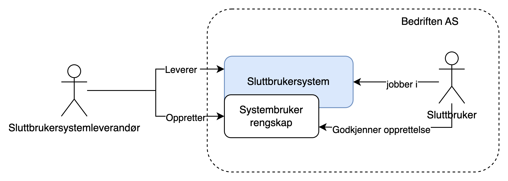
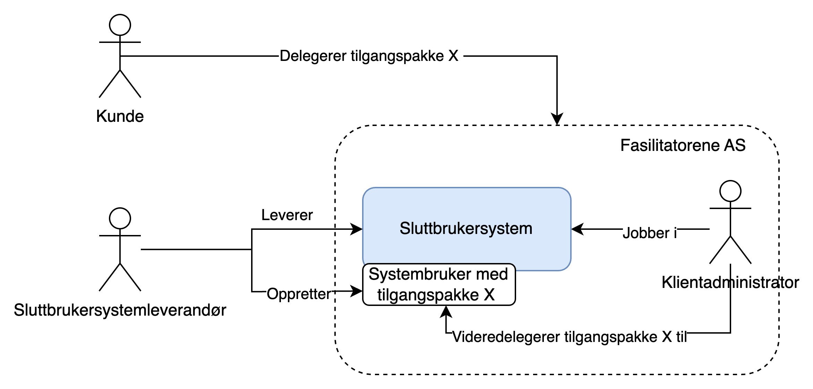
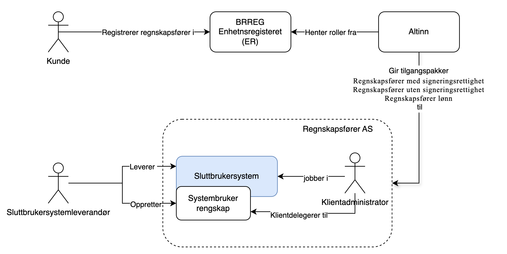
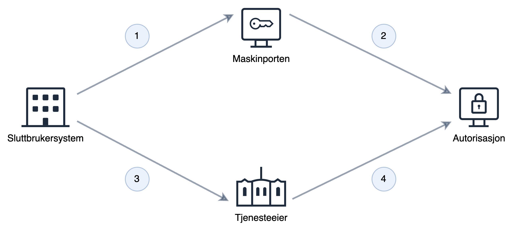

En stor del av kommunikasjonen mellom det offentlige og næringslivet skjer via API i Altinn og hos andre platformleverandører i det offentlige. Mye av denne kommunikasjonen skjer på veien av virksomheten og trenger ikke utføres av en spesifkk person. 
Systembruker gjør det enkelt opprette en bruker, som gis nødvendige fullmakter i forhold til oppgavene den skal utføre.

Systembruker bygger videre på Maskinporten, som gir sikker autentisering og grovkornet tilgangsstyring, og utvider dette med finkornet tilgangsstyring

Systembruker gjør det enkelt å sette opp en virtuell bruker som kan opperere på vegne av virksomehten, endten som egenoppreret system eller i et kunde - leverandørforhold 
Systembruker både brukes mot tjenster som kjører i Altinn og mot eksterne tjenester som bruker Altinn Autorisasjon som autorisasjonsløsning.

> Systembruker bør kun brukes i tilfeller der det ikke er behov for at Altinn kan koble operasjonene som utføres med hvilken person som utfører dem.

For en overordnet funsjonell gjennomgang og brukerreise se [Samarbeidsportalen](https://samarbeid.digdir.no/altinn/systembruker/2542).

## Begrep
`Fasilitator`: Virksomhet som selger tjester i markedet og utfører disse i et sluttbrukersystem på vegne av sine kunder. Eksempel på dette er regnskapsføre og revisor.  
`Sluttbruker`: Ansatt som jobber i sluttbrukersystem
`Sluttbrukersystem`; Fagsystem virksomheten jobber i. Systemet kan kjøre i sky eller internt hos virksomheten, brukes av virksomheten selv eller av en fasilitator som oppererer på vegne av virksomheten.  
`Sluttbrukersystemleverandør`: Virsomhet som utvikler og/eller leverer sluttbrukersystem.  

## Egenskaper med systembruker

Systembruker gir en rekke fordeler sammenlignet med dagens virksomhetsbruker og sluttbrukersystemkonsept i Altinn 2: 

**For sluttbrukersystemleverandør**
- Mulighet for etablering av sluttbrukersystemintegrasjon uten utveksling av sertifikat/passord
- Enkel onboarding av kunder for systemleverandører 
- Fingranulert autorisasjon med maskin til maskin
- Oversikt over tilganger systembrukere har 
- Systemleverandør kan dele klientoppsett på tvers av sine kunder (trenger ikke mange sertifikat)
- Støtte klientforhold til regnskapsfører/revisor fra Q2 2025
- Støttes av Altinn Apps Q1 2025

**For sluttbruker**
- Enkel opprettelse uten deling av sertifiakt eller passord
- Enkelt oversikt over rettigheter gitt til sluttbrukersysem
- Lett å fjerne systembruker når denne ikke lenger skal ha rettigheter 

## Økosystem

### Maskinporten

Autentiseringsmekanismen for alt som har med systembrukere å gjøre:
- Registrering av system i systemregisteret (API hos Altinn Autorisasjon)
- Registrere systembruker (API hos Altinn Autorisasjon)
- Innsending fra systemet (leverandørens system/sluttbrukersystemet)
- Grovkornet tilagnastyring som gir tjenesteeiere mulighet til å styre tigang til sitt API
- Autorisasjonsbærer i form av systembrukertoken (Maskinportentoken med utvidet informasjon om systembruker)

### Systemregisteret
En komponent i Altinn Autorisasjon hvor alle systemdefinisjoner tilhørende sluttbrukersystemer ligger

### Sluttbrukersystem
Definisjonen for sluttbrukersystemet. Denne definisjonen inneholder bl. a. hvilke rettigheter systemet trenger fra systembrukeren, og hvilke Maskinporten klient (klient ID) systemet har tenkt til å bruke ved autentisering i Maskinporten.
Systemet registreres og eies av sluttbrukersystem-leverandøren i systemregisteret

### Systembruker
En virtuell bruker som eies av kunden til leverandøren/sluttbrukersystemet eller fasilitator i et kunde - leverandørforhol
Når systembrukeren registreres, vil rettighetene systemet ber om måtte delegeres til systembrukeren. I praksis må den personen som oppretter systembrukeren (hos kunden) ha disse rettighetene som systemet ber om

## Opprettelse

Systembrukeren opprettes av virksomhet eller fasilitoator som ønsker å bruke et sluttbrukersystem for integrasjon mot Altinn eller andre offentlige løsninger. Systembrukeren kobles til valgt system/systemleverandør og tildeles nødvendige rettigheter.
Opprettelse kan skje via sluttbrukerstyrt opprettelse eller leverandørstyrt opprettelse

### Sluttbrukerstyr opprettelse

Ved sluttbrukerstyrt opprettelse er det kunden selv som går inn i altinn og velger systemet han ønsker opprette systembruker for fra en nedtrekksliste. 
Etter systemet er valg blir det presentert hvilke rettigheter sluttbrukersystemetsystemet krever. Ved å akseptere dette blir systembrukeren opprettet

### Leverandørstyrt opprettelse

Ved leverandørstyrt opprettelse er det sluttbrukersystem-leverandøren som initierer opprettelsen. Dette skjer mens kunden er i sluttbrukersystemet. Leverandøren lager en forespørsel om opprettelse av systembruker, med tilhørende rettigheter, i altinn. I retur får hen en url kunden kan sendes til for å godkjenne opprettelsen. Etter opprettelsen er godkjennt vil kunden sendes tilbake til sluttbrukersystemet.

## Bruksmønster

Systembruker kan kjøpres under forskjellige bruksmønster ut fra hvordan kundeforholdet er med sluttbrukersystemleverandør.

### Kundestyrt system

<!--Bedre tittel?-->
I kundestyrt system er et sluttbrukersystem der kunden selv jobber. 
For å godkjenne opprettelse må vedkommende ha rollen tilgangsstyrer og selv ha tilgangen som delegeres
Systembrukeren støtter både enkeltrettigheter og tilgangspakker (Q2 2025)

Bildet viser leverandørstyrt opprettelse

### Virksomhetsdelegering
Kommer juni 2025

Virksomhetsdelegering omfatter kunde - leverandørforhold som oppstår ved at kunde aktivt delegerer en eller flere tilgangspakker til sin leverandør. 
For virksomhetsdelegering støttes kun leverandørstyrt opprettelse

### Klientdelegering

Klientdelegering omfatter et kunde - leverandørforhold som stammer fra rollene regnskapsfører (REGN) og Revisor (REVI) i Enhetsregisteret.
Kunden registrerer regnskapsfører og revisor gjennom sammordnet registermelling. På bakgrunn av disse rollene får leverandøren delegert tilgangspakker som ligger inn under det aktuelle forholdet
PÅ bakgrunn av dette kan leverandør legge kunden til en systembruker satt opp med tilsvarende tilgangspakke.  
For klientdelegering støttes kun leverandørstyrt opprettelse.

## Systembruker i bruk

Etter systembrukeren er opprettet vil den brukes som i modellen under

1. Sluttbrukersystem ber om systembrukertoken fra Maskinporten. Forespørselen angir nødvendige scopes til klient id og organisasjonsnummeret til sluttbrukervirsomheten det opptrer på vegne av.
2. Maskinporten verifiserer mot Altinn at kunden har gitt systemet som er knyttet mot klienten, tilgang. Gitt at det finnes gyldig Systembruker returneres Maksinportoken med systembrukerinformasjon
3. SBS gjør oppslag mot tjeneste med Maskinportentokenet. 
4. Tjeneste autentiserer SBS og sjekker at tokenet innholder nødvendige scopes for å benytte tjenesten. Deretter gjøres det oppslag mot Altinn Autorisasjon for å sjekke at systembruker har nødvnedige fullmakter 

## Hvordan ta i bruk

- [Hvordan bruke systembruker som systemleverandør](../../guides/systemauthentication-for-systemproviders/)
- [Hvordan bruke systemberuker som apitilbyder/tjenesteeier](../../guides/systemauthentication-for-apiproviders/)

## Leveranseplan

Systembruker vil leveres som del av flere leveranser. 


gantt
    axisFormat %m.%Y
    title Systembruker
    dateFormat  DD.MM.YYYY
    section Systembruker
    L1 Sluttbrukerstyrt  : L1, 01.10.2023, 30.08.2024
    L2 Leverandørstyrt   : L2,  after L1  , 31.10.2024
    L3 Endre rettigheter : L3, after L2, 07.05.2025
    L4 Tilgangspakker : L4, 01.01.2025, 07.05.2025
    L5 Klientdelegering: active, L5, 01.01.2025, 02.04.2025
    L6 Virksomhetsdelegering: L6, after L5, 04.06.2025
    section Autorisasjon
    Delegering av enkeltrettigheter : A1, 01.03.2024, 30.07.2024
    Tilgangspakker: A2, 01.01.2025, 04.06.2025
    Klientdelegering: A3, 01.07.2025, 6M
    Ny brukerflate for tilgangsstyring for virksomheter : 01.08.2024, 04.06.2025
    section Digdir
    Systembruker maskinporten : 01.04.2024, 2M


Mer detaljert informasjon om leveranseplan og status finnes i [Digdirs Raoadmap](https://github.com/digdir/roadmap/issues/284)

