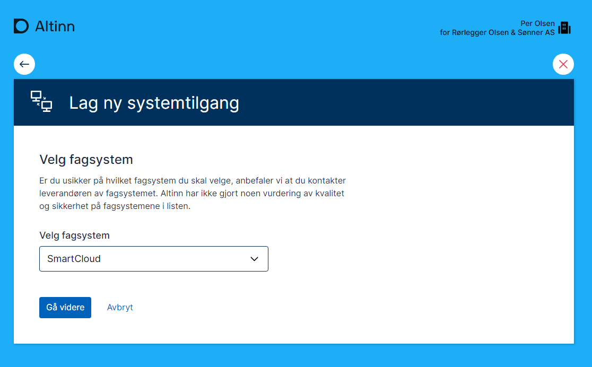
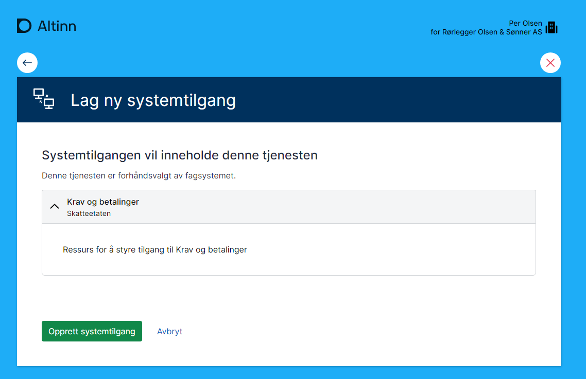
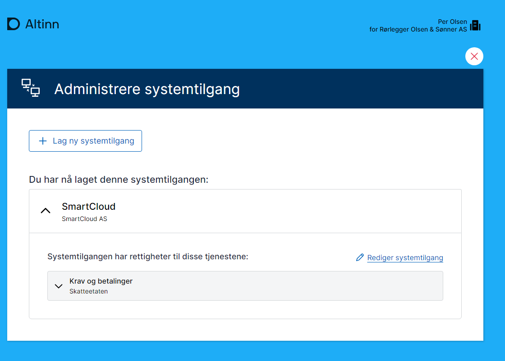

Omtrent 50% av skjematrafikken kommer via API, med enkelte tjenester som har nesten 100% fra fagsystemer.

Nye autentiserings- og autorisasjonsmekanismer utvikles nå for maskin-til-maskin-integrasjon på Altinn-plattformen og andre offentlige API-er.

## Egenskaper med systembruker

Systembruker gir en rekke fordeler sammenlignet med virksomhetsbruker og sluttbrukersystem konseptet i Altinn 2. 

- En mulighet for anskaffelse av sluttbrukersystem uten utveksling av sertifikat/passord/
- Mulighet for systemleverandører for enkel onboarding av kunder
- Fingranulert autorisasjon med maskin til maskin.
- Oversikt over tilganger systembrukere har. 
- Systemleverandør kan dele klientoppsett på tvers av sine kunder. (trenger ikke mange sertifikat)
- Vil støtte klientforhold til regnskapsfører/revisor fra Q1 2025
- Vil støttes av Altinn Apps Q1 2025.

## Maskinporten og systembrukertoken

Maskinporten står sentralt i dette nye konseptet. Alle som skal benytte API med systembruker må autentisere seg mot Maskinporten for å motta et systembrukertoken.

### Forskjeller fra vanlige maskinportentokens

Systembrukertoken inkluderer informasjon om både virksomheten og den spesifikke systembrukeren/systemet.

## Opprettelse av systembruker

Systembrukeren opprettes av aktøren som ønsker å bruke et fagsystem for integrasjon mot Altinn eller andre offentlige løsninger. Systembrukeren kobles til valgt system/systemleverandør og tildeles nødvendige rettigheter.

### Eksempel

- **Virksomhet:** Rørlegger Hansen & Sønner AS
- **Systembruker:** "SmartCloud "
- **System:** "SmartCloud" fra SmartCloud AS
- **Rettigheter:** SmartCloud AS registrerer at "SmartCloud" trenger rettigheter til "MVA" og "Årsregnskap".
- **Godkjenning:** Hansen & Sønner AS aksepterer disse rettighetene ved opprettelse av systembrukeren.

Med dette oppsettet kan SmartCloud AS autentisere seg mot Maskinporten og få et systembrukertoken for systembrukeren til Rørlegger Hansen & Sønner AS. Dette tokenet kan brukes mot Altinns API eller andre tjenester som støtter det. SmartCloud AS kan dermed behandle data for Rørlegger Hansen & Sønner AS innenfor de tildelte rettighetene.

## Løsningsbeskrivelse


### Systemregister

Som en del av det nye konseptet etableres et systemregister i Altinn. Systemregisteret vil inneholde en oversikt over systemer tilbudt av systemleverandører.

Systemleverandører vil få tilgang til å administrere systemene de leverer i registeret via API.

Registeret vil inneholde navn og beskrivelse av systemet, i tillegg til hvilke rettigheter som kreves for at systemet skal kunne fungere.

Denne informasjonen vil hjelpe sluttbrukere med å gi riktige rettigheter til systembrukere som opprettes.

Systemleverandører vil kunne bruke informasjonen i registeret til å forhåndsutfylle informasjon for leverandørstyrt opprettelse av systembruker.

Som en del av systeminformasjonen må systemleverandører oppgi clientID fra Maskinporten for å definere hvilke Maskinporten-integrasjoner som skal kunne autentisere seg som systemet.

### Leverandørstyrt opprettelse av systembruker

En viktig egenskap med det nye konseptet er å gjøre det enklere for systemleverandører å veilede sine kunder til riktig oppsett.

I dag innebærer dette komplekse handlinger i Altinn-portalen, med påfølgende deling av passord/sertifikater med systemleverandøren. Den nye løsningen gir mulighet for en kraftig forenklet onboarding av kunder for systemleverandører.

Systemleverandøren vil kunne opprette en forespørsel for sin kunde om opprettelse av systembruker samt tildeling av nødvendige rettigheter. Dette kan sammenlignes med hvordan man i dag kan samtykke til å dele inntektsinformasjon med banker.

Brukeren blir presentert et forenklet GUI som beskriver at en systembruker/systemintegrasjon vil opprettes og at det vil tildeles rettigheter. Det vil også beskrive hvilket system/leverandør som får tilgang til denne systembrukeren.

I eksempelet nedenfor ser man hvordan [SmartCloud](https://smartcloudaltinn.azurewebsites.net/) sender brukeren til Altinn under onboarding av kunden. Her har Per Olsen hos "Rørlegger Olsen & Sønner AS" registrert seg som bruker hos SmartCloud.


Selve flyten vil variere fra system til system.

I noen tilfeller kan man se for seg at systemleverandøren sender en epost til sluttbruker med lenke til bekreftelse, mens man i fremtiden også potensielt vil kunne se slike forspørsler fra Altinn arbeidsflate.


### Administrasjon av systembruker

Virksomheter vil kunne administrere sine systembrukere fra Altinn Profill. 

Man vil kunne opprette systembrukere og deaktivere dem.


Brukerne vil kunne opprette nye brukere og knytte mot systemer/leverandører 



Systemleverandøren må forhåndsdefinere hvilke rettigheter systemet trengs delegeres til systembrukeren. 







### Systembrukere og klientforhold

I mange tilfeller har virksomhet regnskapsfører eller revisor som skal rapportere for virksomheten.

Støtte for dette vil komme i leveranse 5 av klientdelegering.

Hvis vi tar utgangspunkt i scenarioet over så har **Rørlegger Hansen & Sønner AS** valgt **Fine Tall AS** som regnskapsfører. 
Dette er meldt inn via samordnet registermelding. 

1. **Fine Tall AS** har opprette systembruker for systemet **SmartCloud** fra SmartCloud AS
2. Klientadministrator hos Fine Tall AS delegerer tilgangspakken "Regnskapsansvarlig lønn" for  **Rørlegger Hansen & Sønner AS** til systembrukeren som er opprettet

På denne måten vil da **SmartCloud** kunne rapportere for  **Rørlegger Hansen & Sønner AS** med systembrukeren for **Fine Tall AS**

**Fine Tall AS** vil kunne administrere hvilke av sine kunder som skal håndteres av systembrukeren.  Denne administrasjonen vil kunne skje via GUI i Altinn eller via egne API for klientadministrasjon.

Se mer detaljer i [Issue for Leveranse 5](https://github.com/Altinn/altinn-authentication/issues/548).

## Teknisk flyt autentisering/autorisasjon

Diagrammet nedenfor viser hvordan et fagsystem kan autentisere seg når systembruker er opprettet og knyttet.

1. Sluttbrukersystemet kaller Maskinporten med et JWT Grant hvor man oppgir hvem som er kunde samt nøkkel/clientinformasjon
2. Maskinporten verifiserer mot Altinn at kunden har gitt systemet som er knyttet mot klienten tilgang
3. Ved bekreftelse utsteder Maskinporten et token som inneholder informasjon om systembruker og eieren av systembrukeren
4. Dette tokenet kan da benyttes i kall mot API. (I Altinn eller utenfor Altinn)
5. API kan autoriseres 


### JWT Grant

```json
{
  "aud": "https://maskinporten.no/",
  "iss": "0e85a8ba-77e8-4a6c-a0f5-74fc328a9ffb",

  "scope": "digdir:dialogporten skatteetaten:mva"

   "authorization_details": [ {
    "type": "urn:altinn:systemuser",
    "systemuser_org": {
       "authority" : "iso6523-actorid-upis",  
       "ID": "0192:999888777"  
    }
}]
}

```


### JWT Token


```json
{
  "iss" : "https://ver2.maskinporten.no/",
  "client_amr" : "virksomhetssertifikat",
  "token_type" : "Bearer",
  "aud" : "unspecified",
  "consumer" : {
    "authority" : "iso6523-actorid-upis",
    "ID" : "0192:910753614"
  },
  "authorization_details": [ {
    "type": "urn:altinn:systemuser",
    "systemuser_id": [ "a_unique_identifier_for_the_systemuser" ], 
    "systemuser_org": {"authority" : "iso6523-actorid-upis",  "ID": "0192:999888777" },
    "system_id": "a_unique_identifier_for_the_system",
  }]
  "scope" : "digdir:dialogporten skatteetaten:mva",
  "exp" : 1578924303,
  "iat" : 1578923303,
  "jti" : "QPdTeNlE-RtrNczkCIZ0yAoSzJSIC3Jo7L6B_PmY2X4"
}

```
Se også dokumentasjon hos [Maskinporten](https://docs.digdir.no/docs/Maskinporten/maskinporten_func_systembruker). 

## Hvordan ta i bruk

Det er skrevet egne guider for å ta i bruk systembruker.

- [Hvordan bruke systembruker som systemleverandør](../../guides/systemauthentication-for-systemproviders/)
- [Hvordan bruke systemberuker som apitilbyder/tjenesteeier](../../guides/systemauthentication-for-apiproviders/)

## Leveranseplan

Systembruker vil leveres som del av flere leveranser. 


### Leveranse 1

Første leveranse inneholder følgende funksjonalitet

#### Ressurseier​

- Oppretter generisk autorisasjonsressurs i Ressursregister​
- Melder inn nødvendige tilgangspakker til Digdir​
- Tillater “Enterprise bruker”​
- Integrere mot PDP​

#### Fagsystem​

- Melder inn navn, enkeltrettighet(er), beskrivelse​
- Digdir legger inn i Systemregister​

#### Virksomhet​

- Sluttbrukerstyrt opprettelse

[Github issue](https://github.com/Altinn/altinn-authentication/issues/525)

### Leveranse 2

#### Fagsystem​

- API for systemregister administrasjon​
- Leverandørstyrt flyt 

[Github issue](https://github.com/Altinn/altinn-authentication/issues/544)

### Leveranse 3

#### Fagsystem​

- Legge til/fjerne rettigheter på system ​

#### Virksomhet​

- Varsling og godkjenning av endrede rettigheter

[Github issue](https://github.com/Altinn/altinn-authentication/issues/545)

### Leveranse 4

#### Fagsystem​

- Legge til nødvendige tilgangspakker​

#### Virksomhet​

- Godkjenne endrede rettighetsbehov

[Github issue](https://github.com/Altinn/altinn-authentication/issues/547)

### Leveranse 5

#### Virksomhet​

- Støtte for leverandør – hjelper – kunde forhold

[Github issue](https://github.com/Altinn/altinn-authentication/issues/548)

### Støtte for systembruker i Altinn Apps

I første omgang vil systembruker brukes i scenario utenfor Altinn, men apper utviklet i Altinn plattformen vil få støtte for dette også. 

For å støtte systembruker i Altinn jobbes det med følgende.

- Oppdatere App template til å støtte systembruker
- Oppdatere Platform komponenter til å støtte systembruker
  

## Detaljerte issues

Dette jobbes det med i flere issues på Github

 [Analyse: Fremtidig løsning for sluttbrukersystemer](https://github.com/Altinn/altinn-authentication/issues/200)
 [Epic: New machine-machine authentication method](https://github.com/Altinn/altinn-authentication/issues/331)


