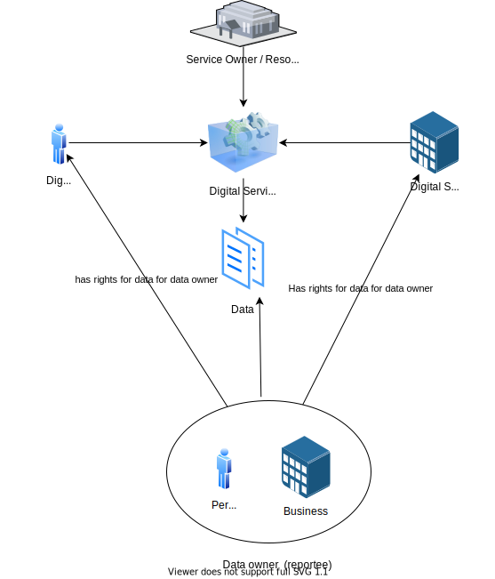

The typical scenario is that some event will be triggered, or data will be read, updated, or created by a digital or analog service. A service owner owns this service and has defined some business rules for who is allowed to use the service.

This service needs to control who can access and modify data.

Altinn Authorization provides the capability to verify and enforce this. 

Users and organizations get rights to access a service from defined rules and policies.

The below drawing show all aspects that control who and what rights a user or organization has.

- Resources - describes the resource a rule applies to. It can be an app, a resource in the resource register, a specific task, or any other sub-resources to an app or resource in the rescource registry.
- Action - describes which action the rules apply to. This can be any action like read, write, sign, fire, Opendoor +++
- Subject - describes who the rules apply to. It can be a role, access group, an organization number or a specific user, and many more
- Obligation - describes additional information like minimum authentication level.
- Condition - Describes additional conditions like the reportee needs to be registered in SRR/RRR for this resource/service.

### Access control Altinn Apps

Altinn Studio bases applications created in Altinn Studio on an application template setup with Altinn Authorization. This setup means these applications have preconfigured authorization settings that are out of the box.

- Each App needs to define a policy determining who can access an application and what the user can do. 
- Each API in the template is configured with a policy enforcement point that verifies that the API caller is authorized to perform operations on applications. For example, the API to read data is [configured to have "read" access](https://github.com/Altinn/app-lib-dotnet/blob/main/src/Altinn.App.Api/Controllers/DataController.cs#L252) while the API to save data for an application [requires "write" access](https://github.com/Altinn/app-lib-dotnet/blob/main/src/Altinn.App.Api/Controllers/DataController.cs#L309).
- The app template uses Altinn platform components like preconfigured storage that authorize access based on the defined policy.

### Access control Altinn Resource Registry Resources

Resources in the Altinn Resource registry are metadata pointing to a digital service implemented outside the Altinn Platform. The service owner defines the resource with attributes like name and description and creates a XACML policy for that resource. When users access the digital service, the Policy enforcement points out that the digital service calls Altinn Authorization to verify if the user is authorized to access it. 

