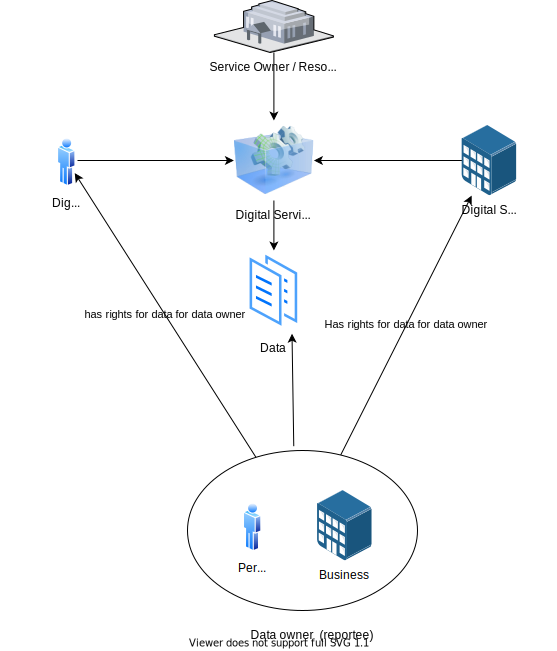

Det typiske scenariet er at en hendelse vil bli utløst, eller data vil bli lest, oppdatert eller opprettet av en digital eller analog tjeneste. En tjenesteeier eier denne tjenesten og har definert noen forretningsregler for hvem som har lov til å bruke tjenesten.

Denne tjenesten må kontrollere hvem som kan få tilgang til og endre data.

Altinn Autorisasjon gir mulighet til å verifisere og håndheve dette.

Brukere og organisasjoner får rettigheter til å få tilgang til en tjeneste fra definerte regler og retningslinjer.

Tegningen nedenfor viser alle aspekter som styrer hvem og hvilke rettigheter en bruker eller organisasjon har.

- Ressurser - beskriver ressursen en regel gjelder for. Det kan være en app, en ressurs i ressursregisteret, en spesifikk oppgave eller andre underressurser til en app eller ressurs i ressursregisteret.
- Handling - beskriver hvilken handling reglene gjelder. Dette kan være hvilken som helst handling som lese, skrive, signere, brann, Opendoor +++
- Emne - beskriver hvem reglene gjelder for. Det kan være en rolle, tilgangsgruppe, et organisasjonsnummer eller en spesifikk bruker, og mange flere
- Obligasjon - beskriver tilleggsinformasjon som minimum autentiseringsnivå.
- Tilstand - Beskriver tilleggsforhold som at rapporteringsmottakeren må være registrert i SRR/RRR for denne ressursen/tjenesten.