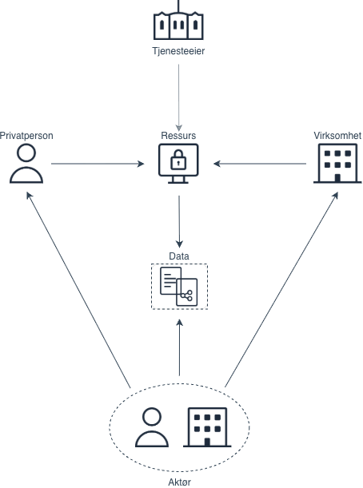

Altinn Autorisasjon tilbyr en samling av komponenter og tjenester som offentlige virksomheter, systemleverandører, virksomheter og innbyggere kan bruke til tilgangsstyring og tilgangskonroll.

Et typisk scenario er at en offentlig virksomhet vil styre hvem som kan lese eller endre data i en tjeneste. Tjenesten kan kjøre på Altinn-plattformen eller på ressurseiers egen plattform.

For å ta i bruk Altinn Autorisasjon registrerer tjenesteeier tjenesten i **Ressursregisteret**. Der beskriver de tjenesten og setter tilgangsregler/policyer som sier hvem som kan bruke tjenesten, på vegne av hvem, og med hvilke operasjoner.

Virksomheter og privatpersoner kan gi fullmakter i Altinn Autorisasjon sin brukerflate. De kan se hvem som har rettigheter på deres vegne og trekke dem tilbake ved behov.

For sluttbrukersystem, som for eksempel et regnskapssystem, tilbyr vi API-er. Systemleverandører kan da bygge inn samme delegering og tilgangskontroll i sine egne løsninger, mens Altinn står for sikker autorisasjon.
