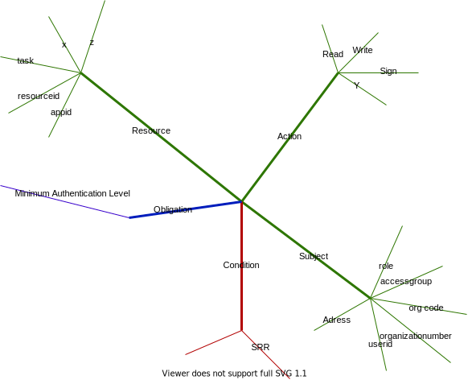

Altinn Autorisasjon tilbyr en samling av komponenter og tjenster offenlige virksomheter, systemleverandører, virksomheter og innbyggere kan benytte seg av for å oppnå dette.

Et vanlig senerio er at en som offentlig virksmhet ønsker styre hvem som kan skal ha tilgang til eller endre data på en gitt tjeneste.
Den offentlige virksomheten som eier denne tjenesten er ressurseier. Tjenesten kan være en tjeneste kjørende på Altinns plattform, eller på ressurseiers egen plattform.
For å kunne benytte seg av Altinn Autorisasjon må ressurseier opprette tjenesten i Ressursregisteret. Her angis det informasjon om tjenesten, samt at man setter tilgangsregler/policy som styrer hvem som kan benytte tjenesten.

<!--
En policy innholder informasjon om hvem som kan gjøre hva i hvilke tilfeller og er beskrevet slik:

- Ressurser - Ressursen en regel gjelder for. Det kan være en app, en ressurs i ressursregisteret, en spesifikk oppgave eller andre underressurser til en app eller ressurs i ressursregisteret.
- Handling - Handlingen reglene gjelder. Dette kan være hvilken som helst handling som lese, skrive, signere, bekrefte, åpne ++
- Emne - Hvem reglene gjelder for. Det kan være en tilgangspakke, enkelttjenste, rolle, organisasjonsnummer eller en spesifikk bruker, og mange flere
- Obligasjon - beskriver tilleggsinformasjon som minimum autentiseringsnivå.
- Tilstand - Beskriver tilleggsforhold, som at rapporteringsmottakeren må være registrert i tilgangsliste for denne ressursen/tjenesten.

-->

Virksomheter og privatpersoner kan gjennom Altinn Autorisasjon brukerflate gi fullmakt slik at andre kan opptrå på vegne av seg selv eller virksomheten. I brukerflaten kan man også se hvem som har fullmakter og eventult trekke denne tilbake
For å understøtte scenarier der man jobber i et fagsystem, for eksempel regnsakpssystem, tilbyr vi også API slik at systemleverandører kan tilby autoriasjonsfunsjonalitet gjennom sine systemer.
