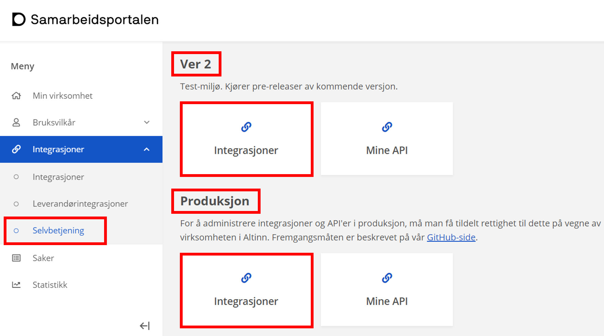

- API for tjenesteeiere i sammenheng med data for Altinn Apps
- API for systemleverandører i sammenheng med systembruker

Beskrivelse av hvordan tjenesteeieres systemer kan benytte Maskinporten for å få tilgang til API-er.

## Samarbeidsportalen

I [Min profil](https://minside-samarbeid.digdir.no) i [Samarbeidsportalen](https://samarbeid.digdir.no/) har du tilgang til selvbetjening for [Maskinporten](https://samarbeid.digdir.no/maskinporten/maskinporten/25), hvor du kan opprette nye integrasjoner (klienter).

- https://tt02.altinn.no er testmiljøet for apper i Altinn, og det er koblet mot **Ver 2**-miljøet i Maskinporten.
- https://www.altinn.no er koblet mot **Produksjon**.



## Tilgang som tjenesteeier

For å kunne hente data fra Storage i Altinn 3 via API som tjenesteeier, må du opprette en integrasjon (klient) i Maskinporten med nødvendige scopes.

Følgende scopes er opprettet av Altinn og delegert til tjenesteeier. Disse scopene er nødvendige for å benytte API-ene relatert til instanser som tjenesteeier:

```js
altinn:serviceowner/instances.read
altinn:serviceowner/instances.write
```

Klienter med *write* scope kan blant annet instansiere apper på vegne av brukere via appens eget API, laste opp data, oppdatere metadata og prosess-status.
Klienter med *read* scope kan kun lese data, metadata og hendelser.

I de fleste tilfeller vil en klient for tjenesteeier ha behov for begge scopene.

Oppretting av klient kan gjøres via API eller i Samarbeidsportalen.

```http
POST https://integrasjon.difi.no/clients/
{
    "integration_type": "maskinporten",
    "client_name": "DIHE testklient for instanser",
    "client_type": "CONFIDENTIAL",
    "description": "Klient for å hente data fra mine apper",
    "scopes": [ "altinn:serviceowner/instances.read", "altinn:serviceowner/instances.write" ],
    "token_reference": "SELF_CONTAINED"
}
```

 i Samarbeidsportalen. Husk å velge riktig miljø.")

## Veksle til Altinn-token

Altinn godtar ikke Maskinporten-token direkte. Disse må veksles inn i Altinn-token. Se detaljer i scenarioet under.

## Mer informasjon

- For mer informasjon, se [dokumentasjon for API-konsument](https://docs.digdir.no/maskinporten_guide_apikonsument.html#prosedyre-for-api-konsument) fra Maskinporten.
- Se også [scenario for autentisering](../../../api/scenarios/authentication/) for flere detaljer (på engelsk).
