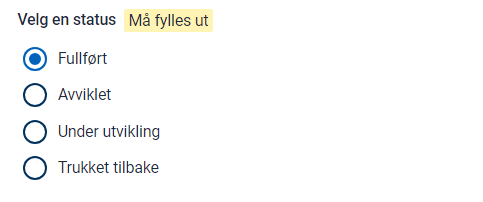
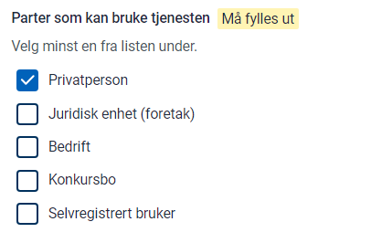

In Altinn Studio Resource admin, you can create resources to use as a basis for access control for services outside of the Altinn Platform. 

## Prerequisites

- The org needs to have enabled the resource admin. Requires a repository under org with name {org}-resources. Example brg-resources
- The developer needs to be a team member with access to this repository. 
- The developer needs to be a member of a published resource group for the given environment.

## Step 1 Create Resource

Log in to Altinn Studio

Create Resource

The ID given for resource will be the one used in Altinn API for checking access 

### Resource Type

For external resources the type will be 

### Title

The title will be shown in Access Management and in service catalogues like data.altinn.no

You need to define the title in bokmål, nynorsk and english.

### Description

The description 

### Delegation description

If the resource should be able to be delegated as resource delegation you need to enable the delegation.

### Keywords

### Status

### User types

### Status

### Contact information

## Create Policy

When resource is created you need to define the policy.
The policy needs to contain a minimum of 1 rule. 

Each rule contains of resource, subject and action

### Resource

Define the resource for the rule

### Action

Define the action for the rule

### Subject

Define the subject for the role. You can choose amongst ER roles, Altinn Roles, and Access Packages(todo)

## Publish

When you have finished setting the resource settings  and policy you can publish.
Before publish you need to set a new version ID and commit changes to the resource repository. 

