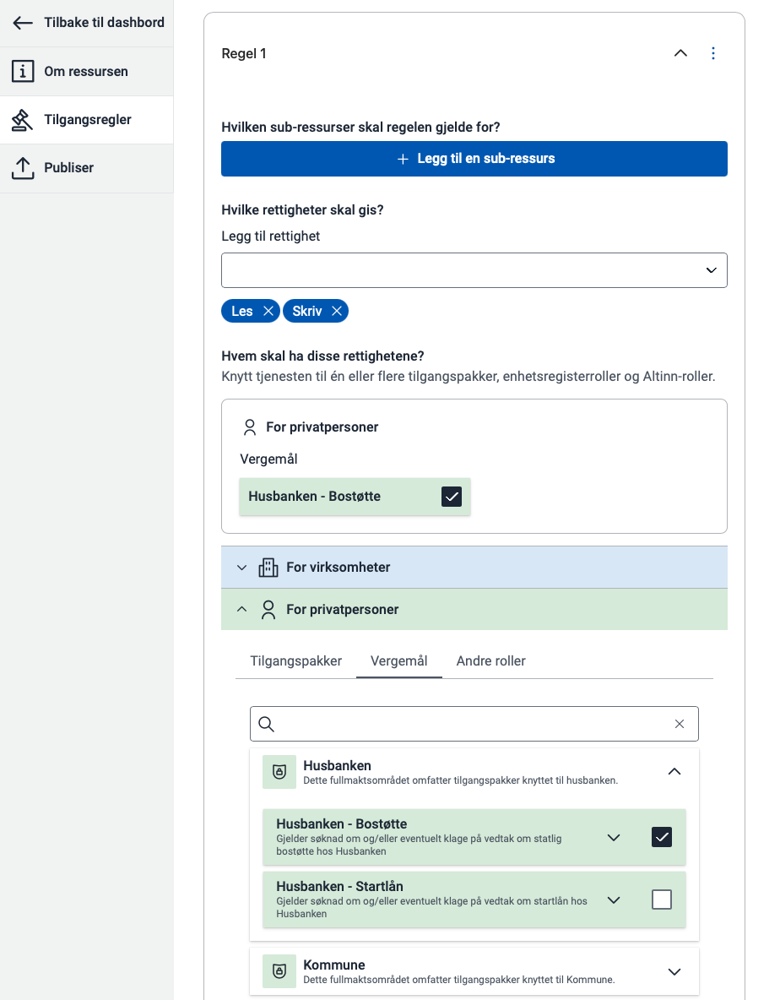



The first step is to create access rules that define which actions the different guardianship powers grant access to on the service.
You can do this via API or in the Policy editor in Resource Administration.

See the [overview of guardianship powers from the Civil Affairs Authority](/en/authorization/what-do-you-get/accessgroups/accessgroups-citizens/verger/).

See the [guide on how to create and publish a resource](/en/authorization/guides/resource-owner/create-resource-resource-admin/).

{}
Using an Altinn Studio app? You only need to complete this step.
{}




The guardian must be able to select who they wish to represent in the service.
Use the Authorised Parties interface to display who the guardian can act on behalf of.

See the [implementation guide for Authorised Parties](/en/authorization/guides/resource-owner/generic-access-resource/integrating-link-service/#integration-with-api-for-authorized-parties-issuers).



To verify that the guardian is permitted to act on behalf of the ward, the service must perform an authorisation lookup.

See the [documentation on how to perform authorisation lookups](/en/authorization/guides/resource-owner/generic-access-resource/integrating-link-service/#integration-with-pdp).

