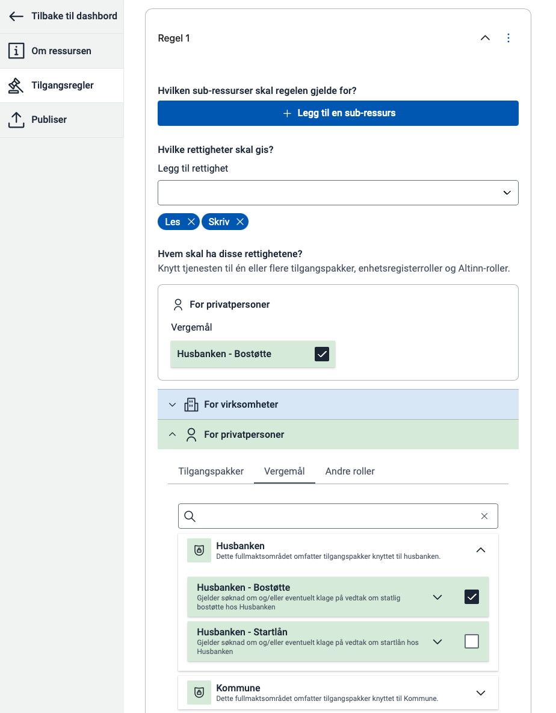



Det første steget er å opprette tilgangsregler som definerer hvilke handlinger de ulike vergemålstypene gir tilgang til på tjenesten.
Du kan gjøre dette via API eller i Policy editor i Ressursadministrasjon.

Se [beskrivelse av de forskjellige vergemålstypene](/nb/authorization/what-do-you-get/accessgroups/accessgroups-citizens/verger/).

Se [gjennomgang av hvordan du oppretter og publiserer en ressurs](/nb/authorization/guides/resource-owner/create-resource-resource-admin/).

> Dersom tjenesten som skal støtte vergemål er en Altinn Studio-app, trenger du kun å gjennomføre dette steget.
> 


Vergen må kunne velge hvem hen skal representere i tjenesten.
Bruk grensesnittet Autoriserte parter (Authorized Parties) for å vise hvem vergen kan handle på vegne av.

Se [implementasjonsguide for Autoriserte parter](/nb/authorization/guides/resource-owner/generic-access-resource/integrating-link-service/#integrasjon-med-api-for-autoriserte-parter-avgivere/).



For å kontrollere at vergen har lov til å handle på vegne av vergehaver, må tjenesten gjøre et autorisasjonsoppslag.
Se [dokumentasjon for hvordan du gjør autorisasjonsoppslag](/nb/authorization/guides/resource-owner/generic-access-resource/integrating-link-service/#integrasjon-med-pdp/).

