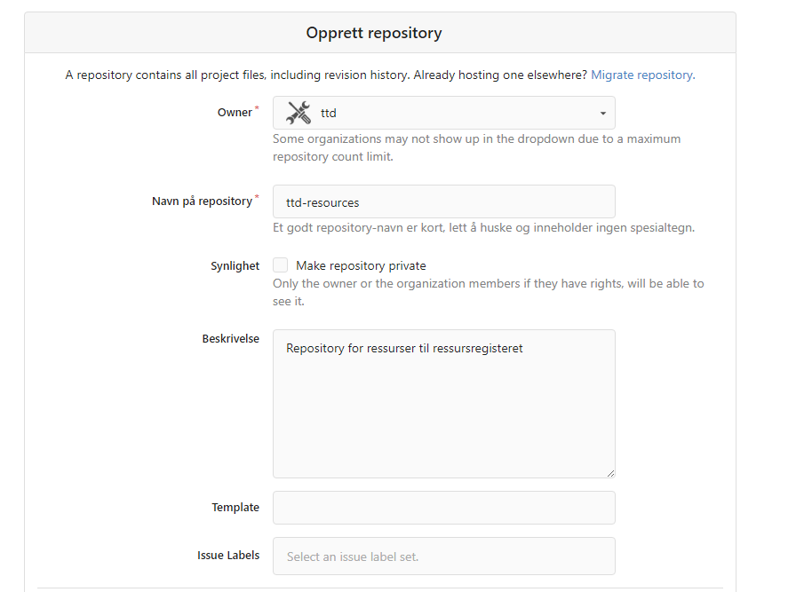
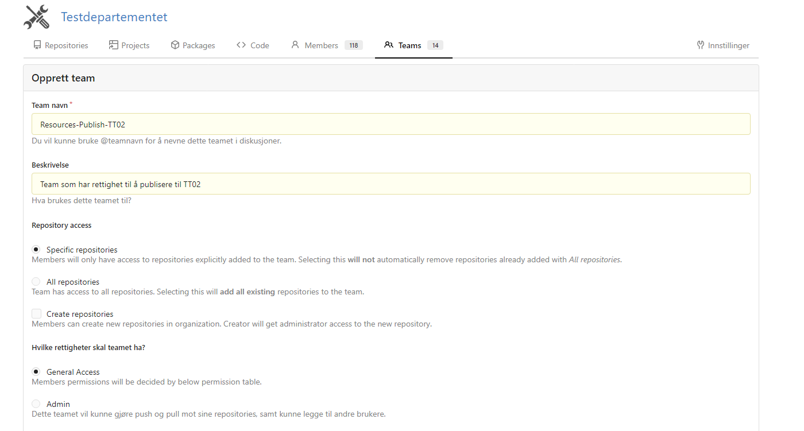

## Opprett bruker og organisasjon

For å få tilgang til ressursadministrasjon i Altinn Studio må du ha en brukerkonto.

Se denne [veiledningen](../../../altinn-studio/getting-started/create-user/)

## Opprett ressursadministrasjonsarkivet for organisasjonen

For å aktivere ressursadministrasjon trenger organisasjonen din et spesifikt depot kalt {org}-ressurser. Dette depotet vil fungere som et sentralisert knutepunkt for å administrere ressursene dine. For eksempel [skd-resources](https://altinn.studio/repos/skd/skd-resources) .

Du kan opprette dette depotet fra organisasjonssiden i Gitea-delen av Altinn Studio.

## Opprett ressursadministrasjonsteam

- Ressursgruppe som kan tilordnes til {org}-resources
- Resources-Publish-PROD: Rett til å publisere til produksjon
- Resources-Publish-TT02: Team med rettigheter til å publisere til TT02

Lag opprettes fra organisasjonssiden i Gitea-delen av Altinn Studio.

