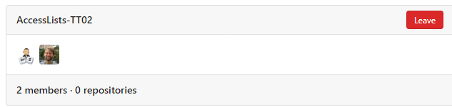


1



For å få tilgang til ressursadministrasjon i Altinn Studio må du ha en brukerkonto.

Se denne [veiledningen](/nb/altinn-studio/v8/getting-started/create-user/)





For å aktivere ressursadministrasjon trenger organisasjonen din et spesifikt depot kalt {org}-resources. Dette depotet vil fungere som et sentralisert knutepunkt for å administrere ressursene dine. For eksempel [skd-resources](https://altinn.studio/repos/skd/skd-resources) .

Du kan opprette dette depotet fra organisasjonssiden i Gitea-delen av Altinn Studio.





- Ressursgruppe som kan tilordnes til {org}-resources
- Resources-Publish-PROD: Rett til å publisere til produksjon
- Resources-Publish-TT02: Team med rettigheter til å publisere til TT02

Lag opprettes fra organisasjonssiden i Gitea-delen av Altinn Studio.




Detaljert guide for opprettelse av ressurser finnes under [Guider](/nb/authorization/guides/resource-owner/create-resource-resource-admin/)



I utgangspunktet får alle som har rolle eller tilgangsliste som tilfredstiller kravet til tjenesten, tilgang til tjenesten.
Dersom det er behov for å begrense tilgangen til enkelte virksomheter kan man benytte tilgangslister.
Dette er samme funsjonalitet som i Altinn 2 het Tjenesterettsregisteret (SRR)

**Definere team for Tilgangsliste**

Din organisasjon bør opprette følgende team:

- **AccessLists-TT02**: Administrerer tilgangslister i TT02-miljøet.
- **AccessLists-PROD**: Administrerer tilgangslister i produksjonsmiljøet.

Medlemmer av disse teamene kan administrere tilgangslister i sine respektive miljøer.

Under [Guider] kan du lese hvordan du definerer tilgangsliter som kan gjenbrukes på tvers av tjenster.




Når all metadata, regler og ev tilgangslister er klare må ressursen publiseres
Gjennomgang av publisering finnes under [Guider](/nb/authorization/guides/resource-owner/create-resource-resource-admin/)


<!-- 
7
 -->
