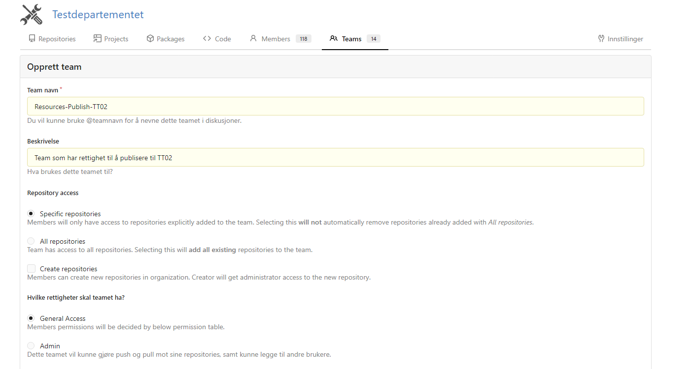
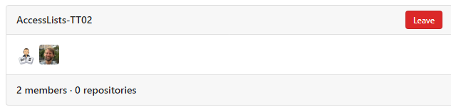


Kontakt [servicedesk@altinn.no](mailto:servicedesk@altinn.no) for å signre avtaler og bli opprettet som tjenesteier i Altinn.



For å få tilgang til ressursadministrasjon i Altinn Studio må du ha en brukerkonto.

Se denne [veiledningen](/nb/altinn-studio/v8/getting-started/create-user/)





Legg til de brukere som skal kunne publisere ressurser som medlemmer i følgende team for din organisasjon:

- **Resources**: Gir tilgang til å opprette og endre ressurser.
- **Resources-Publish-PROD**: Gir tilgang til å publisere ressurs til produksjonsmiljøet.
- **Resources-Publish-TT02**: Gir tilgang til å publisere ressurs til testmiljøet TT02.

Lag opprettes fra organisasjonssiden i Gitea-delen av Altinn Studio.




Detaljert guide for opprettelse av ressurser finnes under [Guider](/nb/authorization/guides/resource-owner/create-resource-resource-admin/)



I utgangspunktet får alle som har rolle eller tilgangsliste som tilfredstiller kravet til tjenesten, tilgang til tjenesten.
Dersom det er behov for å begrense tilgangen til enkelte virksomheter kan man benytte tilgangslister.
Dette er samme funsjonalitet som i Altinn 2 het Tjenesterettsregisteret (SRR)

**Definere team for Tilgangsliste**

Legg til de brukere som skal kunne administrere tilgangslister som medlemmer i følgende team for din organisasjon:

- **AccessLists-TT02**: Administrerer tilgangslister i testmiljøet TT02.
- **AccessLists-PROD**: Administrerer tilgangslister i produksjonsmiljøet.

Medlemmer av disse teamene kan administrere tilgangslister i sine respektive miljøer.

Under [Guider](/nb/authorization/guides/resource-owner/accesslist/) kan du lese hvordan du definerer tilgangsliter som kan gjenbrukes på tvers av tjenster.




Når all metadata, regler og ev tilgangslister er klare må ressursen publiseres
Gjennomgang av publisering finnes under [Guider](/nb/authorization/guides/resource-owner/create-resource-resource-admin/)


<!-- 
7
 -->
