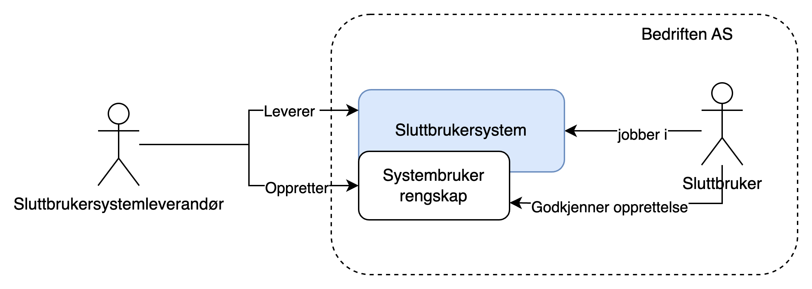
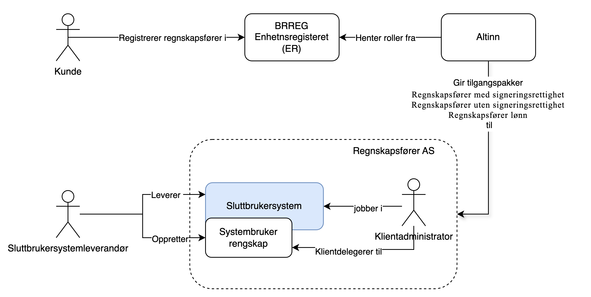

Med systembruker får du: 

- Effektivitet – automatiske innsendinger, mindre manuelt arbeid  
- Kvalitet – data går rett fra systemene  
- Sikkerhet – ingen deling av personlige innlogginger  
- Kontroll – jevnere og mer pålitelig datainnsamling 
- Enklere samarbeid – regnskapsfører og bedrift kan jobbe sømløst 

Systembruker gir enkel og automatisk innsending via programvare. Den passer når innsendingen ikke må knyttes til en bestemt person. Kreves personlig ansvar, må du bruke en vanlig Altinn-innlogging. 

For en overordnet funksjonell gjennomgang og brukerreise se [Samarbeidsportalen](https://samarbeid.digdir.no/altinn/systembruker/2542).

## Begrep

`Fasilitator`: Virksomhet som selger tjester i markedet og utfører disse i et sluttbrukersystem på vegne av sine kunder. Eksempel på dette er regnskapsføre og revisor.  
`Sluttbruker`: Ansatt som jobber i sluttbrukersystem.
`Sluttbrukersystem`: Programvare som vanligvis kjører i public cloud, men kan også kjøres lokalt med noen begrensninger. Sluttbrukersystemet støtter virksomhets- og innbyggerprosesser, og kan for eksempel brukes til lakselusrapportering eller MVA-rapportering.
Sluttbrukersystemet kan identifisere seg som systembruker knyttet til systemet. Hvilke rettigheter som kreves avhenger av hvilke prosesser som støttes.  
`Sluttbrukersystemleverandør`: Leverandør av sluttbrukersystem tilgjengelig i markedet. Har tilgang til systemregisteret i Altinn for å registrere programvare med nødvendige rettigheter.
Ved lokal eller egenutviklet programvare registreres systemkunden også som leverandør.

## Egenskaper med systembruker

Systembruker gir en rekke fordeler sammenlignet med dagens virksomhetsbruker og sluttbrukersystemkonsept i Altinn 2:

**For sluttbrukersystemleverandør**

- Mulighet for etablering av sluttbrukersystemintegrasjon uten utveksling av sertifikat/passord
- Enkel onboarding av kunder for systemleverandører
- Fingranulert autorisasjon med maskin til maskin
- Oversikt over tilganger systembrukere har
- Systemleverandør kan dele klientoppsett på tvers av sine kunder (trenger ikke mange sertifikat)
- Støtte klientforhold til regnskapsfører/revisor
- Støttes av Altinn Apps

**For sluttbruker**

- Enkel opprettelse uten deling av sertifiakt eller passord
- Enkelt oversikt over rettigheter gitt til sluttbrukersysem
- Lett å fjerne systembruker når denne ikke lenger skal ha rettigheter

## Økosystem

### Maskinporten

Autentiseringsmekanismen for alt som har med systembrukere å gjøre:

- Registrering av system i systemregisteret (API hos Altinn Autorisasjon)
- Registrere systembruker (API hos Altinn Autorisasjon)
- Innsending fra systemet (leverandørens system/sluttbrukersystemet)
- Grovkornet tilgangstyring som gir tjenesteeiere mulighet til å styre tilgang til sitt API
- Autorisasjonsbærer i form av systembrukertoken (Maskinportentoken med utvidet informasjon om systembruker)

### Systemregisteret

En komponent i Altinn Autorisasjon hvor alle systemdefinisjoner tilhørende sluttbrukersystemer ligger.

### Sluttbrukersystem

Denne definisjonen inneholder bl. a. hvilke rettigheter systemet trenger fra systembrukeren, og hvilke Maskinporten klient (klient ID) systemet har tenkt til å bruke ved autentisering i Maskinporten.
Systemet registreres og eies av sluttbrukersystem-leverandøren i systemregisteret.

### Systembruker

En virtuell bruker som eies av kunden til leverandøren/sluttbrukersystemet eller fasilitator i et kunde-leverandørforhold.
Når systembrukeren registreres, vil rettighetene systemet ber om måtte delegeres til systembrukeren. I praksis må den personen som oppretter systembrukeren (hos kunden) ha disse rettighetene som systemet ber om.

## Opprettelse

Systembrukeren opprettes av virksomhet eller fasilitoator som ønsker å bruke et sluttbrukersystem for integrasjon mot Altinn eller andre offentlige løsninger. Systembrukeren kobles til valgt system/systemleverandør og tildeles nødvendige rettigheter.
Opprettelse kan skje på to forskjellige måter:

### Sluttbrukerstyrt opprettelse

Ved sluttbrukerstyrt opprettelse er det kunden selv som går inn i altinn og velger systemet han ønsker opprette systembruker for fra en nedtrekksliste.
Etter systemet er valg blir det presentert hvilke rettigheter sluttbrukersystemetsystemet krever. Ved å akseptere dette blir systembrukeren opprettet.

### Leverandørstyrt opprettelse

Ved leverandørstyrt opprettelse er det sluttbrukersystemleverandøren som initierer opprettelsen. Dette skjer mens kunden er i sluttbrukersystemet. Leverandøren lager en forespørsel om opprettelse av systembruker, med tilhørende rettigheter, i altinn. I retur får vedkommende en url som kunden kan sendes til for å godkjenne opprettelsen. Etter opprettelsen er godkjennt vil kunden sendes tilbake til sluttbrukersystemet.

## Bruksmønster

Systembruker kan kjøpres under forskjellige bruksmønster ut fra hvordan kundeforholdet er med sluttbrukersystemleverandør.

### Kundestyrt system

<!--Bedre tittel?-->

Kundestyrt system er et sluttbrukersystem der kunden selv jobber.
For å godkjenne opprettelse må vedkommende ha rollen tilgangsstyrer og selv ha tilgangen som delegeres.
Systembrukeren støtter både enkeltrettigheter og tilgangspakker.

Bildet viser leverandørstyrt opprettelse

### Virksomhetsdelegering

Virksomhetsdelegering omfatter kunde - leverandørforhold som oppstår ved at kunde aktivt delegerer en eller flere tilgangspakker til sin leverandør.
For virksomhetsdelegering støttes kun **leverandørstyrt** opprettelse.

### Klientdelegering

Klientdelegering omfatter et kunde - leverandørforhold som stammer fra rollene regnskapsfører (REGN) og Revisor (REVI) i Enhetsregisteret.
Kunden registrerer regnskapsfører og revisor gjennom sammordnet registermelling. På bakgrunn av disse rollene får leverandøren delegert tilgangspakker som ligger inn under det aktuelle forholdet
PÅ bakgrunn av dette kan leverandør legge kunden til en systembruker satt opp med tilsvarende tilgangspakke.  
For klientdelegering støttes kun **leverandørstyrt** opprettelse.

## Systembruker i bruk

Etter systembrukeren er opprettet vil den brukes som i modellen under

1. Sluttbrukersystem ber om systembrukertoken fra Maskinporten. Forespørselen angir nødvendige scopes til klient id og organisasjonsnummeret til sluttbrukervirsomheten det opptrer på vegne av.
2. Maskinporten verifiserer mot Altinn at kunden har gitt systemet som er knyttet mot klienten, tilgang. Gitt at det finnes gyldig Systembruker returneres Maksinportoken med systembrukerinformasjon.
3. SBS gjør oppslag mot tjeneste med Maskinportentokenet.
4. Tjeneste autentiserer SBS og sjekker at tokenet inneholder nødvendige scopes for å benytte tjenesten. Deretter gjøres det oppslag mot Altinn Autorisasjon for å sjekke at systembruker har nødvnedige fullmakter.

## Hvordan ta i bruk

- [Hvordan bruke systembruker som systemleverandør](../../guides/system-vendor/)
- [Hvordan bruke systemberuker som apitilbyder/tjenesteeier](../../guides/resource-owner/)

## Leveranseplan

Systembruker vil leveres som del av flere leveranser.


gantt
axisFormat %m.%Y
title Systembruker
dateFormat DD.MM.YYYY
section Systembruker
L1 Sluttbrukerstyrt : L1, 01.10.2023, 30.08.2024
L2 Leverandørstyrt : L2, after L1 , 31.10.2024
L3 Endre rettigheter : L3, after L2, 07.05.2025
L4 Tilgangspakker : L4, 01.01.2025, 07.05.2025
L5 Klientdelegering: active, L5, 01.01.2025, 02.04.2025
L6 Virksomhetsdelegering: L6, after L5, 04.06.2025
section Autorisasjon
Delegering av enkeltrettigheter : A1, 01.03.2024, 30.07.2024
Tilgangspakker: A2, 01.01.2025, 04.06.2025
Klientdelegering: A3, 01.07.2025, 6M
Ny brukerflate for tilgangsstyring for virksomheter : 01.08.2024, 04.06.2025
section Digdir
Systembruker maskinporten : 01.04.2024, 2M


Mer detaljert informasjon om leveranseplan og status finnes i [Digdirs Raoadmap](https://github.com/digdir/roadmap/issues/284)
