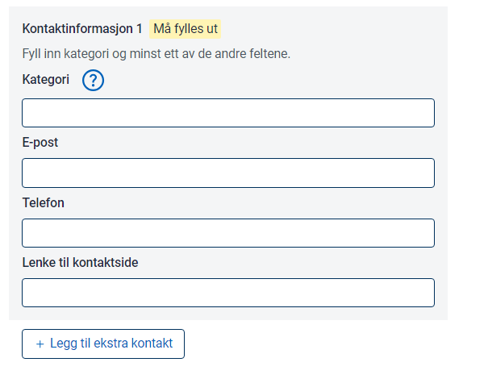

In Altinn Studio Resource admin, you can create resources to use as a basis for access control for services outside of the Altinn Platform. 

## Prerequisites

You need to have access to resource administration for your organization. See [Getting started guide](../../getting-started/resource-admin-studio)

## Step 1 Create Resource

Log in to Altinn Studio

Create Resource

The ID given for resource will be the one used in Altinn API for checking access 

### Resource Type

For external resources, the type will be generic access resource.

### Title

The title will be shown in Access Management and in service catalogues like data.altinn.no

You need to define the title in bokmål, nynorsk and english.

### Description

The description  will be shown in Access Management and in service catalogues like data.altinn.no

You need to define the description in bokmål, nynorsk and english.

### Delegation description

If the resource should be able to be delegated as resource delegation you need to enable the delegation and set delegation description in bokmål, nynorsk and english.

### Keywords

Keywords can be set for help. Currently not used but might be used for different service catalogues later

### Status

The status of the service that the resource is pointing to

### User types

Defines which types of user that can access. This settings does might be used for filtering at a later point. Currently
this is just information. 

### Party tyoe

Defines what type of party the service is targeting. Might be used for filtering in service catalogue in a later stage.

### Contact information

Contact information for the service. Might be presented in service cataloge on a later stage.

## Create Policy

When resource is created you need to define the policy.
The policy needs to contain a minimum of 1 rule. 

Each rule contains of resource, subject and action

### Resource

Define the resource for the rule

### Action

Define the action for the rule

### Subject

Define the subject for the role. You can choose amongst ER roles, Altinn Roles, and Access Packages(todo)

## Publish

When you have finished setting the resource settings  and policy you can publish.
Before publish you need to set a new version ID and commit changes to the resource repository. 

## Verify

When published the resource is avaiable on the search API in Resource Registry.

Example Resource from guide. [https://platform.tt02.altinn.no/resourceregistry/api/v1/resource/ekstern-tjeneste-portal](https://platform.tt02.altinn.no/resourceregistry/api/v1/resource/ekstern-tjeneste-portal)
Policy for Example resource from this guide [https://platform.tt02.altinn.no/resourceregistry/api/v1/resource/ekstern-tjeneste-portal/policy](https://platform.tt02.altinn.no/resourceregistry/api/v1/resource/ekstern-tjeneste-portal/policy)
