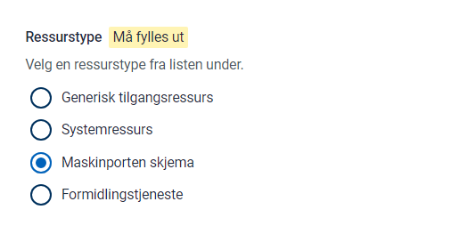
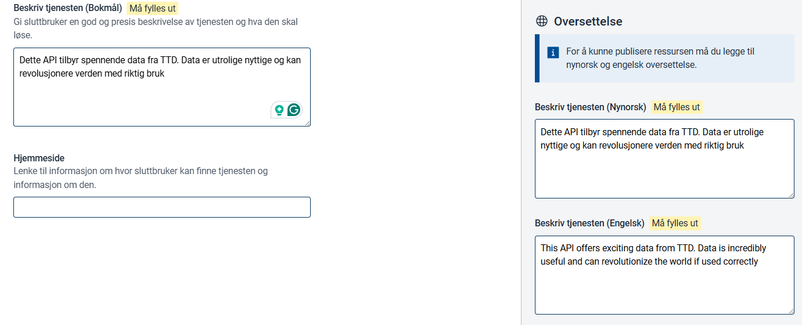
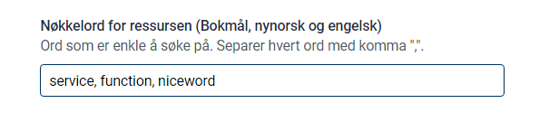
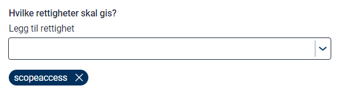
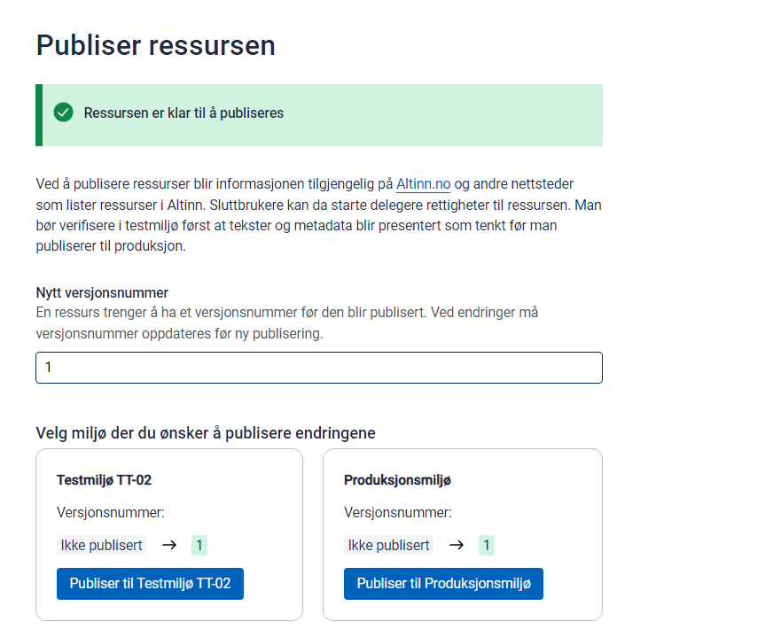

I Altinn Studio Resource admin kan du opprette ressurser som skal brukes som grunnlag for tilgangskontroll for tjenester utenfor Altinn-plattformen. 

Denne guiden erstatter [denne guide](https://altinn.github.io/docs/utviklingsguider/api-delegering/api-eier/).

## Forutsetninger

Du må ha tilgang til ressursadministrasjon for organisasjonen din. Se [Kom i gang-veiledningen](../../getting-started/resource-admin-studio)

## Trinn 1 Opprett ressurs

Logg inn i Altinn Studio

Opprett ressurs

IDen som er gitt for ressursen vil være den som brukes i Altinn API for å sjekke tilgang. Denne må være globalt unik i Altinn.

### Ressurstype

For Api Scheme ressurser så 

### Tittel

Tittelen vil vises i Access Management og i tjenestekataloger som data.altinn.no

Du må definere tittelen på bokmål, nynorsk og engelsk.

### Beskrivelse

Beskrivelsen vil vises i Access Management og i tjenestekataloger som data.altinn.no

Du må definere beskrivelsen på bokmål, nynorsk og engelsk.

### Delegasjonsbeskrivelse

Dersom ressursen skal kunne delegeres som ressursdelegering må du aktivere delegering og angi delegasjonsbeskrivelse på bokmål, nynorsk og engelsk.

### Nøkkelord

Nøkkelord kan angis for hjelp. Foreløpig ikke brukt, men kan brukes til forskjellige tjenestekataloger senere

### Status

Statusen til API som API Scheme peker på. 

### API Scope

For API Scheme ressurser så må man oppgi maskinporten scope som skal beskytter API. Det er dette som blir delegert. 

### Kontaktinformasjon

Kontaktinformasjon for API. Kan bli presentert i servicekatalog på et senere tidspunkt.

## Opprett policy

Når ressursen er opprettet, må du definere policyen.
Policyen må inneholde minst én regel. 

Hver regel inneholder ressurs, emne og handling

### Ressurs

Definer ressursen for regelen

### Handling

Definer handlingen for regelen

### Emne

Definer emnet for rollen. Du kan velge mellom ER-roller, Altinn-roller og tilgangspakker (todo)

## Publisere

Når du er ferdig med å angi ressursinnstillingene og policyen kan du publisere.
Før publisering må du angi en ny versjons-ID og foreta endringer i ressurslageret. 

## Bekrefte

Når den er publisert, er ressursen tilgjengelig på søke-APIet i ressursregisteret.

Eksempel Ressurs fra guide. [https://platform.tt02.altinn.no/resourceregistry/api/v1/resource/ekstern-tjeneste-portal](https://platform.tt02.altinn.no/resourceregistry/api/v1/resource/ekstern- tjeneste-portal)
Retningslinjer for eksempelressurs fra denne veiledningen [https://platform.tt02.altinn.no/resourceregistry/api/v1/resource/ekstern-tjeneste-portal/policy](https://platform.tt02.altinn.no/resourceregistry /api/v1/resource/ekstern-tjeneste-portal/policy)