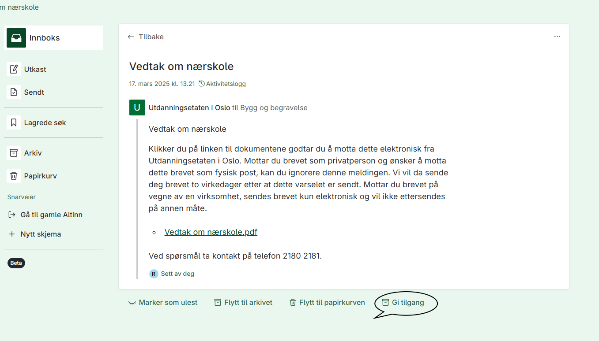
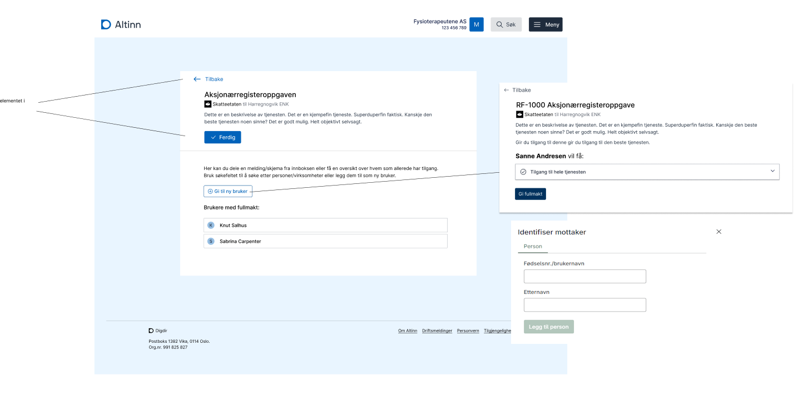
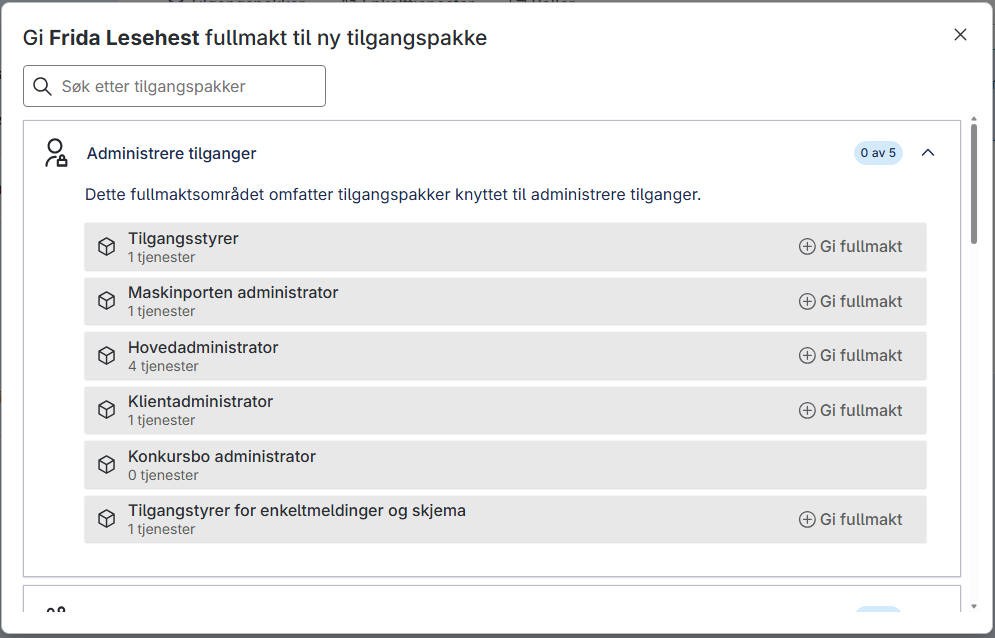
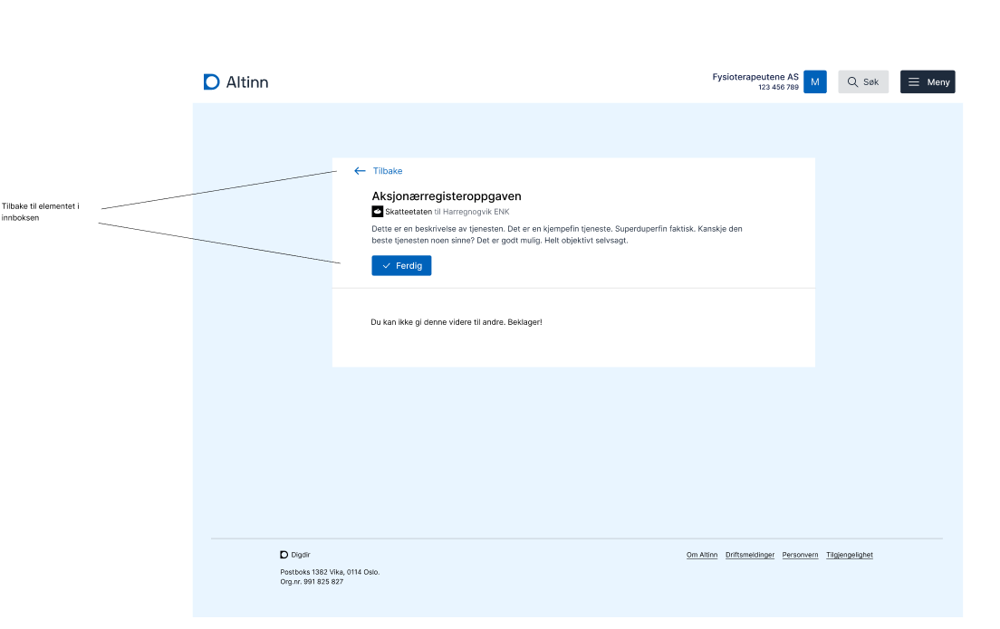

Funksjonen er tilgjengelig fra meldings- eller skjemaelementet i Altinn-innboksen. For å delegere tilgang må du
- ha tilgang til elementet via en tilgangspakke, en rolle eller en tjenestedelegering
- ha fått delegert tilgangspakken «Tilgangsstyring for enkeltmelding, skjema og dialoger»

Hvis du har brukt tilsvarende funksjon i den gamle innboksen, vil du oppleve at kravene er strengere. Nå kan bare autoriserte personer delegere tilgang, ikke alle som har tilgang til meldinger og skjemaer i innboksen.

Når du klikker på knappen **Gi tilgang**, kommer du til en ny side.

På denne siden må du
- velge hvilke handlinger i tjenesten (lese, skrive) mottakeren skal ha tilgang til
- identifisere mottakeren med fødselsnummer og etternavn, eller med Altinn-brukernavn og etternavn

Når du har delegert tilgang, finner mottakeren meldingen eller skjemaet i Altinn-innboksen.

Hvis mottakeren ikke har hatt tilgang til elementer for den aktuelle aktøren tidligere, vil aktøren også dukke opp i aktørlisten for første gang.

## Delegere tilgangspakken for tilgangsstyring

Tilgangspakken «Tilgangsstyring for enkeltmelding, skjema og dialoger» delegerer du i Altinn på samme måte som andre pakker.

## Brukere uten nødvendig tilgangspakke

Brukere som ikke har tilgangspakken «Tilgangsstyring for enkeltmelding, skjema og dialoger», får en melding om at de mangler rettighetene som kreves for å delegere videre.

