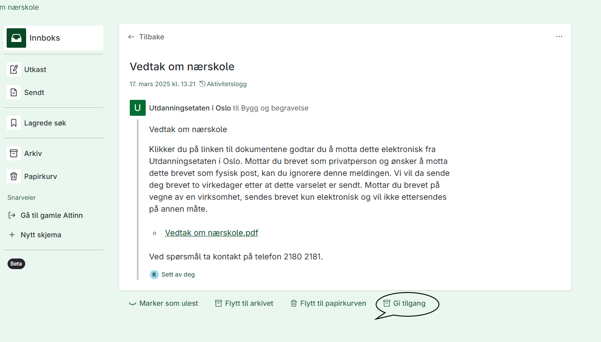
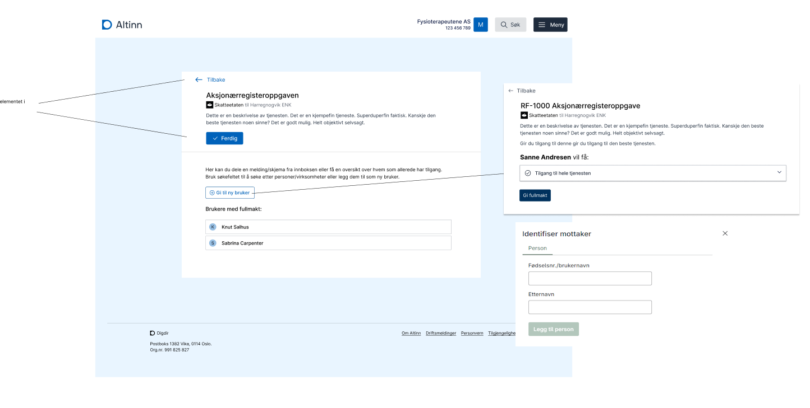
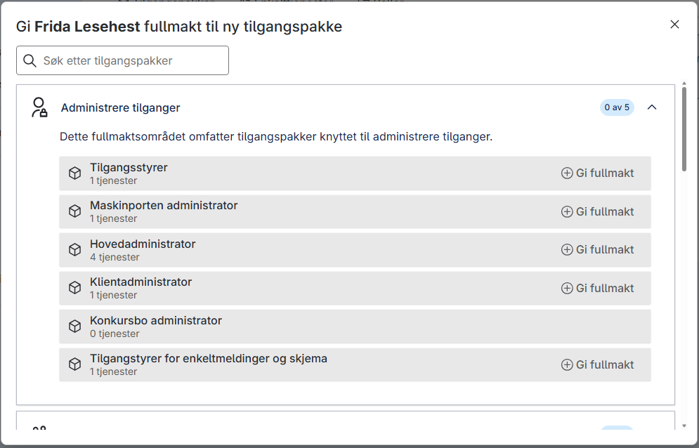
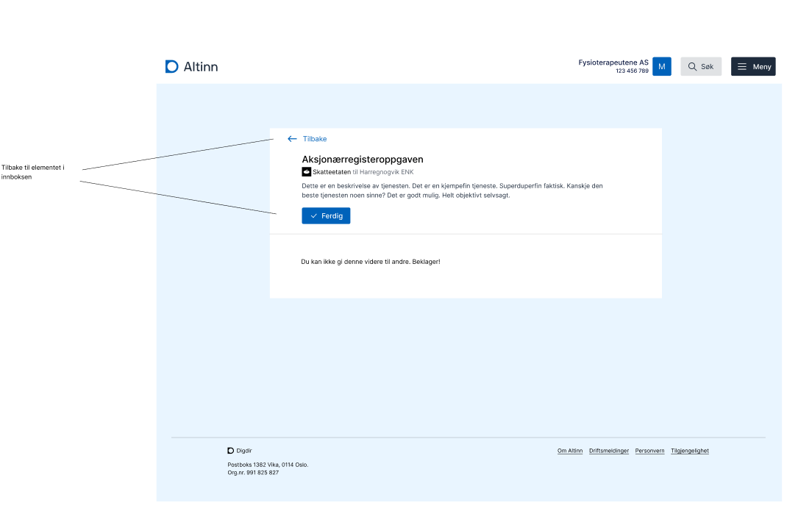

Funksjonen er tilgjengelig fra meldings- eller skjemaelementet i Altinn-innboksen. For å dele elementet og gi mottakeren fullmakt må du
- ha tilgang til elementet via en tilgangspakke, en rolle eller en fullmakt til enkelttjenesten
- ha fått fullmakt til tilgangspakken «Tilgangsstyrer for enkeltmeldinger, enkeltskjemaer og enkeltdialoger»

Hvis du har brukt tilsvarende funksjon i den gamle innboksen, vil du oppleve at kravene er strengere. Nå kan bare personer med riktig fullmakt dele elementet og gi andre fullmakt, ikke alle som har tilgang til meldinger og skjemaer i innboksen.

Når du klikker på knappen **Gi tilgang**, kommer du til en ny side.

På denne siden må du
- velge hvilke handlinger i tjenesten (lese, skrive) mottakeren skal ha rett til å utføre
- identifisere mottakeren med fødselsnummer og etternavn, eller med Altinn-brukernavn og etternavn

Når du har gitt fullmakten, finner mottakeren meldingen eller skjemaet i Altinn-innboksen.

Hvis mottakeren ikke tidligere har hatt tilgang til elementer for personen eller virksomheten du handler på vegne av, vil denne personen eller virksomheten også vises i aktørlisten for første gang.

## Gi fullmakt til tilgangspakken for enkeltmeldinger, enkeltskjemaer og enkeltdialoger

Du gir fullmakt til tilgangspakken «Tilgangsstyrer for enkeltmeldinger, enkeltskjemaer og enkeltdialoger» på samme måte som til andre tilgangspakker i Altinn.

## Brukere uten nødvendig tilgangspakke

Brukere som ikke har tilgangspakken «Tilgangsstyrer for enkeltmeldinger, enkeltskjemaer og enkeltdialoger», får en melding om at de mangler fullmakten som kreves for å gi fullmakt videre.

