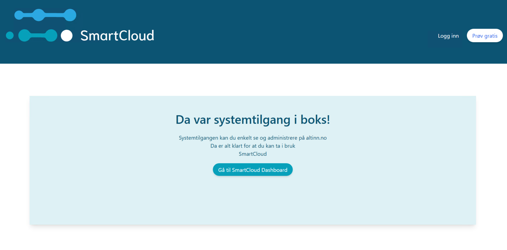

### Guide for End User (STADIG KONSERT, Dagligleder of TILFELDIG SUBTIL APE)

1. Purchasing the Accounting System
   - STADIG KONSERT, the Dagligleder of TILFELDIG SUBTIL APE, purchases SmartCloud to manage the company’s tax and fee claims.
   - The software offers a feature to view the company's total tax and fee claims.
2. Approving the System User Request

   - As part of the software setup, STADIG KONSERT can either create a system user in altinn portal via end user driven system user creation or approve a system user request sent by the SmartCloud.
   - For example, STADIG KONSERT can create a system user for TILFELDIG SUBTIL APE from altinn portal like below

     Select the system
     
     Create the system user
     
     see the list of system users
     

     - In this example, STADIG KONSERT is sent to the system user request and must approve in Altinn portal, where STADIG KONSERT grants the necessary access rights to SmartCloud for the "Krav og betalinger" service.
       

     Once the request is approved, the user is sent to the redirecturl specified in the system user request
     

     STADIG KONSERT can login to altinn again, to see that the system user that was approved is listed
     

   1. Granting the Required Permissions - After STADIG KONSERT's approval, the system access includes the rights to view TILFELDIG SUBTIL APE’s tax and fee claims.
      STADIG KONSERT has granted authorization to SmartCloud for this specific service and can revoke the access at any time via Altinn.

#### Guide for End User (DRESs MINST, Client Administrator for TILBAKEHOLDEN USYMMETRISK TIGER AS )

1.  Purchasing the Accounting System
    - DRESs MINST, the CEO of TILBAKEHOLDEN USYMMETRISK TIGER AS , purchases SmartCloud to manage different services for their clients .
    - for example, The software offers a feature to view their client company's total tax and fee claims.
2.  Approving the System User Request

    - As part of the software setup, DRESs MINST must approve the system user request from SmartCloud.
    - In this example, DRESs MINST is sent to the agent system user request and must approve in Altinn portal, where DRESs MINST creates a system user, adds their clients to the system user which grants access to the access package "Regnskapfører med signeringsrettighet" which gives access to one or more services.

    Approve agent system user request

    

    End user sent to the vendor's receipt page after approve/reject
    

    End user logs in to the system to manage the system users
    

    Clicks on the particular system user for managing/viewing. clicks on add client to add clients
    

    Adds the clients
    

    Clients are added
    

    Overview of the system user and clients
    

3.  Granting the Required Permissions - After DRESs MINST's approval and client addition, the system access includes the access package that gives access to various services for clients of TILBAKEHOLDEN USYMMETRISK TIGER AS.
    DRESs MINST has granted authorization to SmartCloud for this specific access package and can revoke the access at any time via Altinn.
