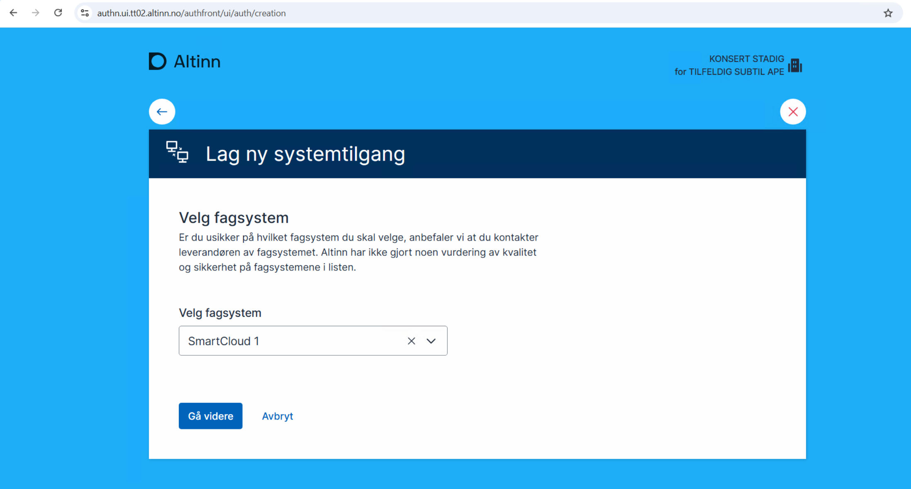
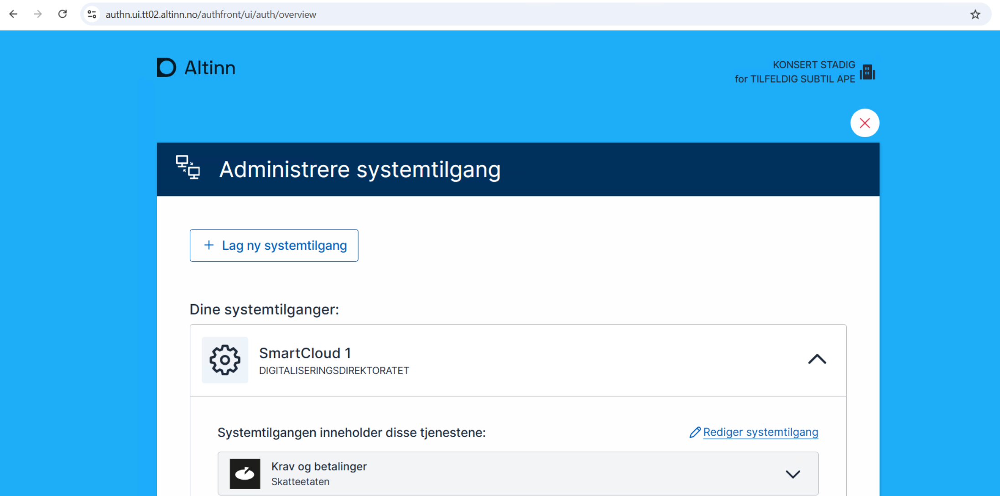
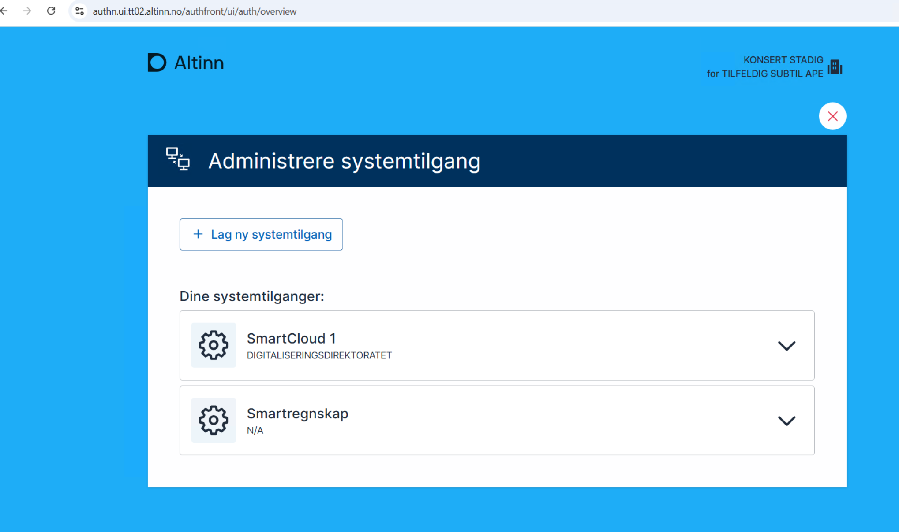
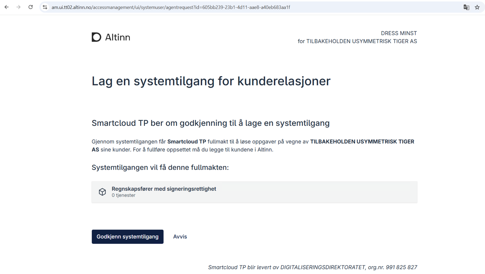
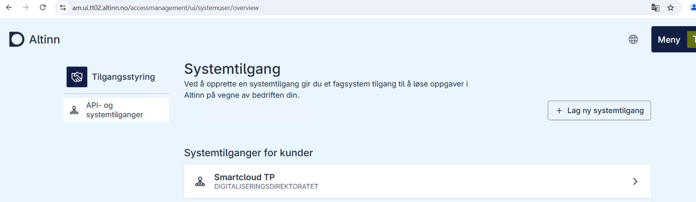

### Hva er systemtilgang?
Systemtilgang gir deg som sluttbruker mulighet til å bruke et fagsystem (for eksempel regnskap eller HR-system) til å hente og sende inn data til offentlige tjenester via Altinn – på vegne av din egen virksomhet eller for dine kunder. Systemtilgang kan brukes enten for din egen virksomhet eller for å utføre oppgaver på vegne av andre. Hvilken type du trenger, avhenger av om du rapporterer kun for deg selv – eller også for kunder, som for eksempel regnskapsfører.

Dette skjer ved hjelp av en systembruker, som er en teknisk bruker koblet til systemet. Systembrukeren har de nødvendige rettighetene for å utføre oppgaver i Altinn, uten at du trenger å logge inn manuelt hver gang.

#### To typer systemtilgang:

- **Systemtilgang for egen virksomhet:** Brukes når du rapporterer kun for din egen organisasjon. Eksempel: sende inn A-melding eller MVA-melding fra et internt system.
- **Systemtilgang for kunder**: Brukes når du rapporterer på vegne av andre, som for eksempel regnskapsfører. Da må kundene gi deg nødvendige rettigheter via Altinn.

### Hvordan får du systemtilgang?
Systemtilgang kan opprettes på to måter:

- **Brukerstyrt opprettelse:** Du logger inn i Altinn og godkjenner tilgang direkte.
- **Leverandørstyrt opprettelse:** Systemleverandøren sender en forespørsel som du godkjenner i Altinn.

Du må ha rettigheter til å delegere tilgangene systemet ber om. Hvis du mangler én av dem, kan ikke systemtilgangen opprettes.

**Hva betyr dette i praksis?**
Når et fagsystem ber om systemtilgang via Altinn, må du som sluttbruker godkjenne at systemet får tilgang til bestemte tjenester – for eksempel å sende inn A-melding eller hente skattemeldinger. 
Hver av disse tjenestene krever en spesifikk rolle eller rettighet i Altinn.
Hvis du ikke har alle nødvendige rettigheter for å gi systemet tilgang til disse tjenestene, vil Altinn stoppe prosessen. Det holder ikke å ha noen av rettighetene – du må ha alle som systemet ber om.

**Eksempel:**
La oss si at systemet ber om tilgang til:
- **Rolle:** "Regnskapsfører"
- **Rolle:** "Lønnsinnsender"

Hvis du bare har "Regnskapsfører"-rollen, men ikke "Lønnsinnsender", vil du ikke kunne godkjenne systemtilgangen. Du må da få tildelt den manglende rollen av noen med rettigheter i virksomheten – for eksempel daglig leder.

Guidene åpnes i nye faner, slik at du enkelt kan følge dem steg for steg uten å miste oversikten. Velg den guiden som passer for deg og kom i gang med systemtilgang.

------
### Veiledning for opprettelse fra Altinn portal

1. Anskaffelse av regnskapssystemet
   - STADIG KONSERT, dagligleder i TILFELDIG SUBTIL APE, anskaffer SmartCloud for å håndtere selskapets skatte- og avgiftskrav
   - Programvaren tilbyr en funksjon for å vise totale skatte- og avgiftskrav.
2. Godkjenning av forespørsel om systemtilgang

   - Som en del av programvareoppsettet, kan STADIG KONSERT enten opprette en systembruker i Altinn-portalen via sluttbrukerdrevet systemtilgangopprettelse, eller godkjenne en forespørsel om systemtilgang sendt av SmartCloud.
   - I dette eksemplet mottar STADIG KONSERT en forespørsel om systemtilgang og må godkjenne den i Altinn-portalen, der STADIG KONSERT tildeler de nødvendige tilganger til SmartCloud for tjenesten "Krav og betalinger"

     Velg system
     
     Opprett systemtilgang
     
     Se listen over systemtilgang
     

     - I dette eksempelet, TILFELDIG SUBTIL APE får en systemtilgangforespørsel fra SmartCloud og må godkjenne denne i Altinn-portalen, der TILFELDIG SUBTIL APE gir SmartCloud nødvendige tilgangene for til tjenesten 'Krav og betalinger'.
       

     Når forespørselen er godkjent, sendes brukeren videre til den redirecturl som ble angitt i systemtilgangforespørselen
     

     STADIG KONSERT kan logge inn i Altinn igjen og representere TILFELDIG SUBTIL APE for å se at systemtilgangen som ble godkjent, er oppført.
     

   1. Tildele nødvendige tillatelser
      - Etter at STADIG KONSERT har godkjent forespørselen, omfatter systemtilgangen rettighetene til å vise skatte- og avgiftskravene for TILFELDIG SUBTIL APE. STADIG KONSERT har gitt SmartCloud nødvendige autorisasjoner for denne spesifikke tjenesten og har mulighet til å fjerne tilgangene når som helst via Altinn.

#### Veiledning for godkjenning av forespørsel sendt av leverandør system for klientforhold

1.  Anskaffelse av regnskapssystemet
    - DRESs MINST, klientadministratør i TILBAKEHOLDEN USYMMETRISK TIGER AS, anskaffer SmartCloud for å håndtere ulike tjenester for kundene.
    - For eksempel, programvaren tilbyr en funksjon for å vise kundeselskapets totale skatte- og avgiftskrav.
2.  Godkjenning av forespørsel om systemtilgang

    - Som en del av programvareoppsettet må DRESs MINST godkjenne forespørselen om systemtilgang fra SmartCloud.
    - I dette eksemplet mottar DRESs MINST en forespørsel om systemtilgang for klientforhold og må godkjenne den i Altinn-portalen. Der oppretter DRESs MINST en systemtilgang, legger til sine kunder til systemtilgangen, og gir dermed SmartCloud de nødvendige tilgangspakkene.

    Godkjenn systemtilgang for klientforhold forespørsel

    

    Etter at forespørselen er behandlet, blir sluttbrukeren sendt til leverandørens kvitteringsside.
    

    Sluttbruker logger inn i Altinn-portalen for å administrere Systemtilganger.
    

    Klikker på den aktuelle Systemtilgangen for å administrere eller se. Klikker på 'Legg til klient' for å legge til klienter.
    

    Legger til klientene
    

    Klientene er lagt til
    

    Oversikt over Systemtilgangene og klientene
    

3.  Tildel nødvendige tillatelser
    - Etter godkjenning fra DRESs MINST og registrering av kunder, gir Systemtilgangen (Systembrukeren) rettigheter til å vise skatte- og avgiftskrav for kundene til TILBAKEHOLDEN USYMMETRISK TIGER AS. DRESs MINST har gitt SmartCloud autorisasjon for denne spesifikke tilgangspakken og kan når som helst fjerne tilgangen via Altinn.
