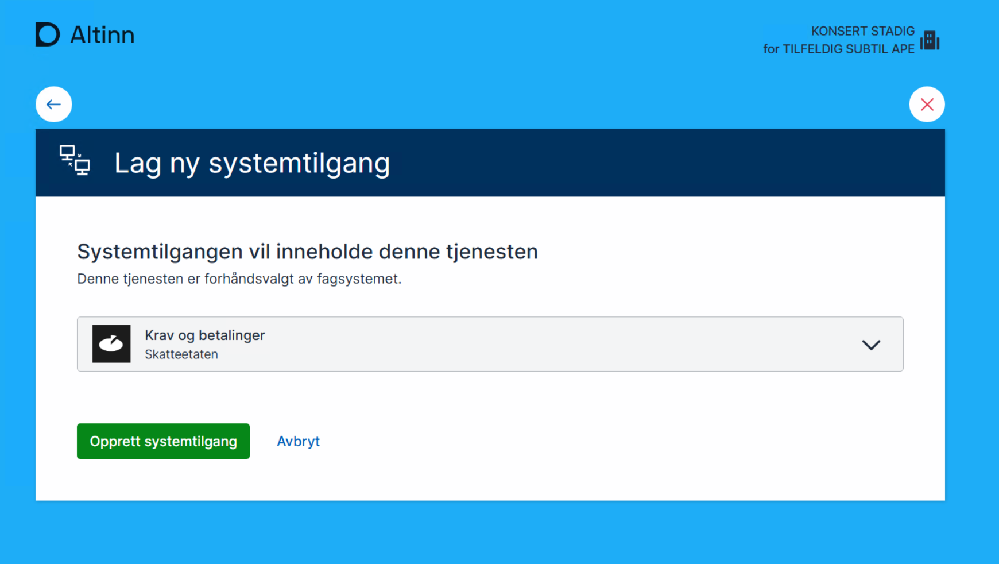
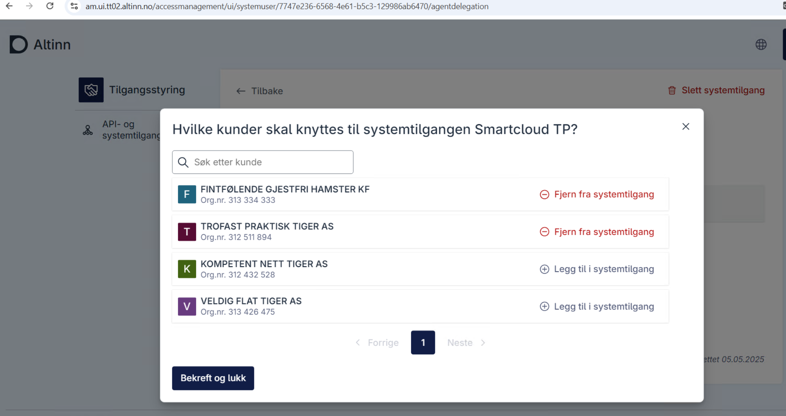
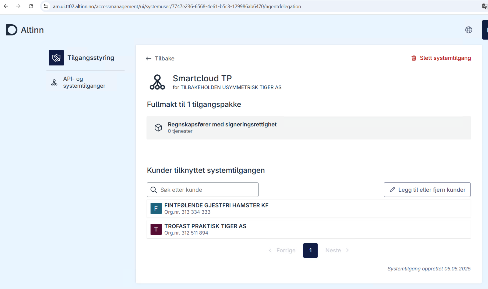

### Veiledning for sluttbruker (STADIG KONSERT, Dagligleder til TILFELDIG SUBTIL APE)

1. Anskaffelse av regnskapssystemet
   - STADIG KONSERT, dagligleder til TILFELDIG SUBTIL APE, anskaffer SmartCloud for å håndtere selskapets skatte- og avgiftskrav
   - Programvaren tilbyr en funksjon for å vise totale skatte- og avgiftskrav.
2. Godkjenning av forespørsel om systemtilgang

   - Som en del av programvareoppsettet, kan STADIG KONSERT enten opprette en systembruker i Altinn-portalen via sluttbrukerdrevet systembtilgangopprettelse, eller godkjenne en forespørsel om systemtilgang sendt av SmartCloud.
   - I dette eksemplet mottar STADIG KONSERT en forespørsel om systemtilgang og må godkjenne den i Altinn-portalen, der STADIG KONSERT tildeler de nødvendige tilganger til SmartCloud for tjenesten "Krav og betalinger"

     Velg system
     
     Opprett systemtilgang
     
     Se listen over systemtilgang
     

     - I dette eksempelet, TILFELDIG SUBTIL APE får en systemtilgangforespørsel fra SmartCloud og må godkjenne denne i Altinn-portalen, der TILFELDIG SUBTIL APE gir SmartCloud nødvendige tilgangene for til tjenesten 'Krav og betalinger'.
       

     Når forespørselen er godkjent, sendes brukeren videre til den redirecturl som ble angitt i systemtilgangforespørselen
     

     STADIG KONSERT kan logge inn i Altinn igjen og representere TILFELDIG SUBTIL APE for å se at systemtilgangen som ble godkjent, er oppført.
     

   1. Tildele nødvendige tillatelser
      - Etter at STADIG KONSERT har godkjent forespørselen, omfatter systemtilgangen rettighetene til å vise skatte- og avgiftskravene for TILFELDIG SUBTIL APE. STADIG KONSERT har gitt SmartCloud nødvendige autorisasjoner for denne spesifikke tjenesten og har mulighet til å fjerne tilgangene når som helst via Altinn.

#### Veiledning for sluttbruker (DRESs MINST, klientadministratør i TILBAKEHOLDEN USYMMETRISK TIGER AS )

1.  Anskaffelse av regnskapssystemet
    - DRESs MINST, klientadministratør i TILBAKEHOLDEN USYMMETRISK TIGER AS, anskaffer SmartCloud for å håndtere ulike tjenester for kundene.
    - For eksempel, programvaren tilbyr en funksjon for å vise kundeselskapets totale skatte- og avgiftskrav.
2.  Godkjenning av forespørsel om systemtilgang

    - Som en del av programvareoppsettet må DRESs MINST godkjenne forespørselen om systemtilgang fra SmartCloud.
    - I dette eksemplet mottar DRESs MINST en forespørsel om systemtilgang for klientforhold og må godkjenne den i Altinn-portalen. Der oppretter DRESs MINST en systemtilgang, legger til sine kunder til systemtilgangen, og gir dermed SmartCloud de nødvendige tilgangspakkene.

    Godkjenn systemtilgang for klientforhold forespørsel

    

    Etter at forespørselen er behandlet, blir sluttbrukeren sendt til leverandørens kvitteringsside.
    

    Sluttbruker logger inn i Altinn-portalen for å administrere Systemtilganger.
    

    Klikker på den aktuelle Systembrukeren for å administrere eller se. Klikker på 'Legg til klient' for å legge til klienter.
    

    Legger til klientene
    

    Klientene er lagt til
    

    Oversikt over Systembrukeren og klientene
    

3.  Tildel nødvendige tillatelser
    - Etter godkjenning fra DRESs MINST og registrering av kunder, gir Systemtilgangen (Systembrukeren) rettigheter til å vise skatte- og avgiftskrav for kundene til TILBAKEHOLDEN USYMMETRISK TIGER AS. DRESs MINST har gitt SmartCloud autorisasjon for denne spesifikke tilgangspakken og kan når som helst fjerne tilgangen via Altinn.
