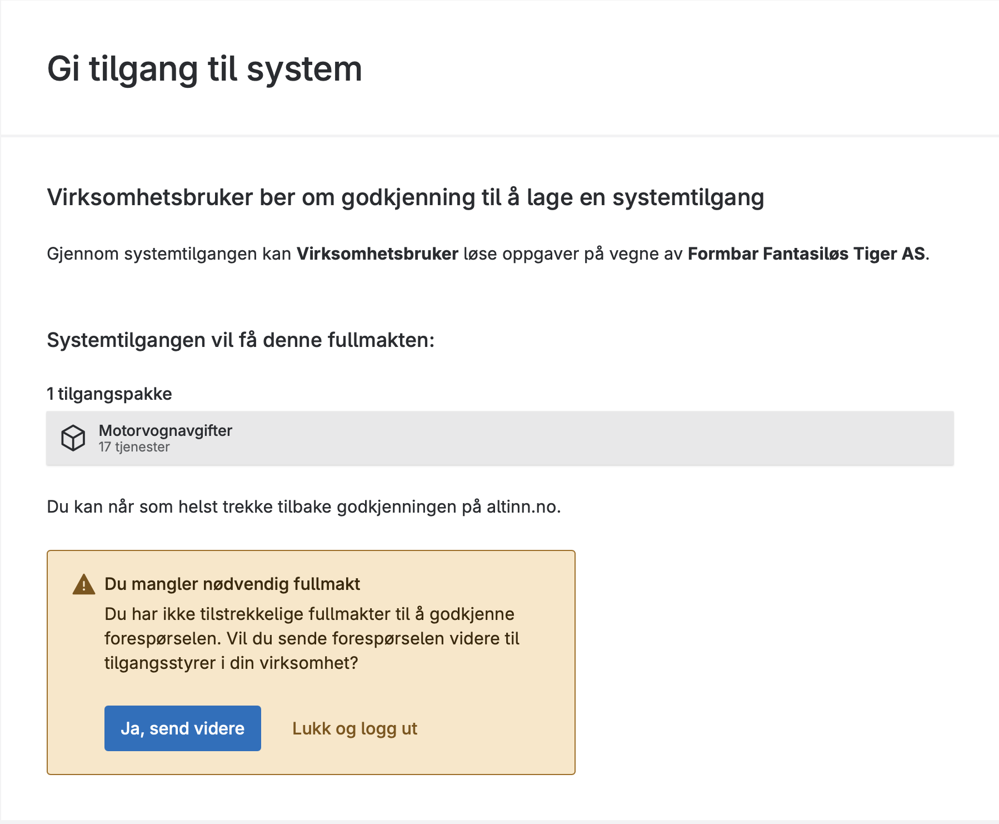
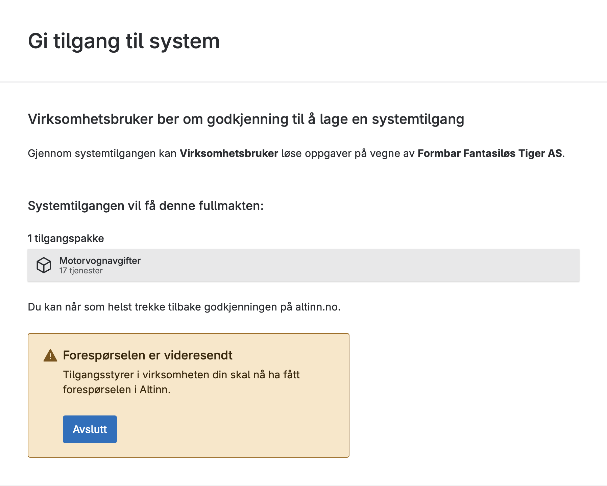
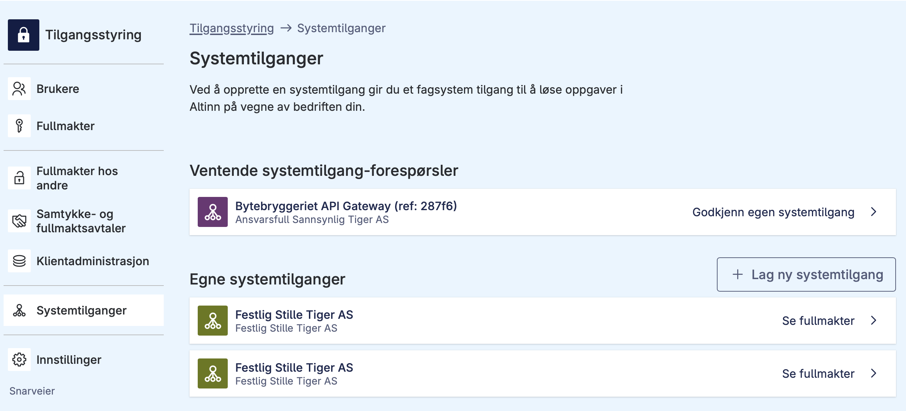

## Approve system access for your own system

{} To approve a system access request, the logged-in user must have the role Tilgangsstyrer in the selected organisation (for example, the managing director has the role Tilgangsstyrer), and must also have the requested permissions.
{}

1. In this example, an end user approves a request to create system access for their own system. DRESS MINST, managing director of DISKRET NÆR TIGER AS, receives a request for system access for their own system from the vendor SmartCloud. This request must be approved in the Altinn portal. 
2. After the request is approved or rejected, the end user will be logged out. If the vendor has set up a verified redirect in the request, the user will be sent to the vendor's receipt page. If not, the end user will be sent to Altinn's logged-out page. 
3. After approval, the system access is created.

## Approve system access for clients

1. In this example, an end user approves a request to create system access for clients. To approve a system access request, the logged-in user must have the role Tilgangsstyrer in the selected organisation (for example, the managing director has the role Tilgangsstyrer), and must also have the requested permissions. DRESS MINST, managing director of DISKRET NÆR TIGER AS, receives a request for system access for clients from the vendor SmartCloud. This request must be approved in the Altinn portal. 
2. After the request is approved or rejected, the end user will be logged out. If the vendor has set up a verified redirect in the request, the user will be sent to the vendor's receipt page. If not, the end user will be sent to Altinn's logged-out page. 
3. After approval, the system access is created. You can now [add clients to the system access](/en/authorization/guides/end-user/system-user/delegate-clients/).

## Escalate request

If the user who opens the approval link does not have the necessary permissions to approve the creation, they can forward the request to a user with the necessary permissions.

1. Click **Ja, send videre** to forward the request to a user with the necessary permissions. 
2. After forwarding the request, you can close and optionally notify the access manager that the request has been forwarded. 
3. The access manager finds the escalated request under **Systemtilganger** in the access management interface in Altinn. 
