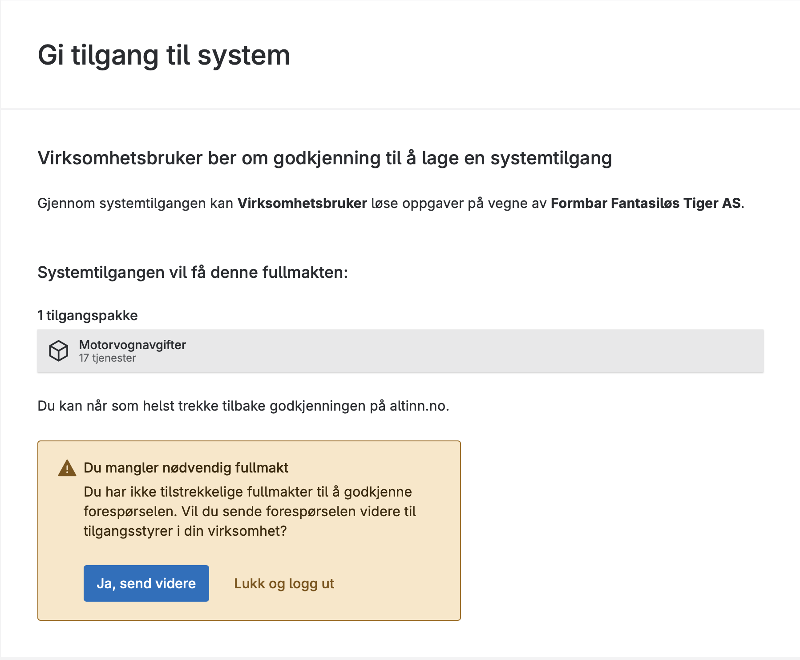
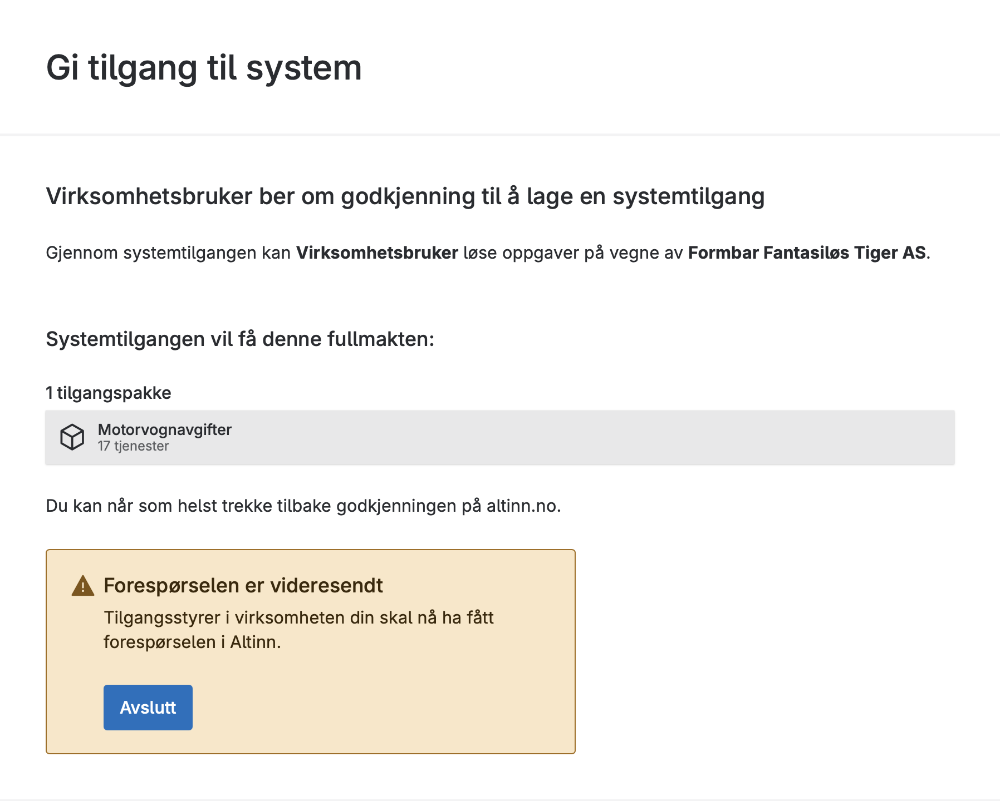
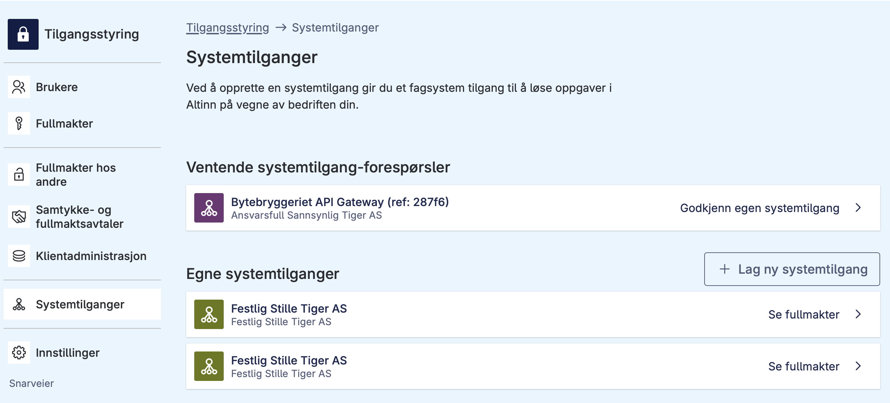

{}
To approve a system access request, you must be able to manage powers of attorney for the selected organization. For example, you can do this as the general manager or with the administrator permission **Access Management** or **Main Administrator**. You must also be able to grant the vendor system every power of attorney included in the request.
{}

## Approve system access for your own system

1. In this example, a user approves a request to create system access for their own organization. DRESS MINST, general manager of DISKRET NÆR TIGER AS, receives a system access request from the provider SmartCloud. The request must be approved in the Altinn portal. 
2. If you opened the request using the provider's link, you are logged out after approving or rejecting it. If the provider configured a verified redirect, you are sent to the provider's receipt page. Otherwise, you are sent to Altinn's logged-out page. If you opened the request under **System accesses** in Altinn, you return to the overview and remain logged in. 
3. After approval, the system access is created.

## Approve system access for clients

1. In this example, a user approves a request to create system access for clients. DRESS MINST, general manager of DISKRET NÆR TIGER AS, receives the request from the provider SmartCloud. The request must be approved in the Altinn portal. 
2. If you opened the request using the provider's link, you are logged out after approving or rejecting it. If the provider configured a verified redirect, you are sent to the provider's receipt page. Otherwise, you are sent to Altinn's logged-out page. If you opened the request under **System accesses** in Altinn, you return to the overview and remain logged in. 
3. After approval, the system access is created. You can now [add clients to the system access](/en/authorization/guides/end-user/system-user/delegate-clients/).

## Escalate request

If the user who opens the approval link does not have the necessary powers of attorney, they can forward the request to someone who has them.

1. Click **Yes, forward request** to forward the request to someone with the necessary powers of attorney. 
2. After forwarding the request, you can close the page and optionally notify the recipient. 
3. The recipient finds the request under **System accesses** in Altinn's access management interface. 
