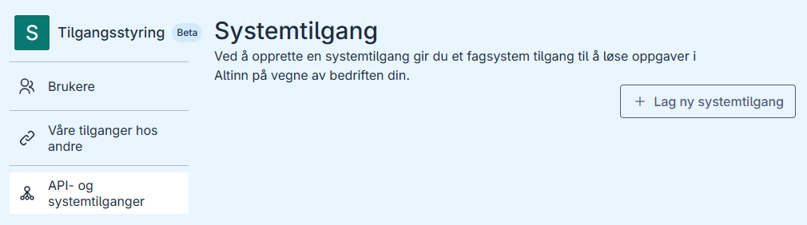
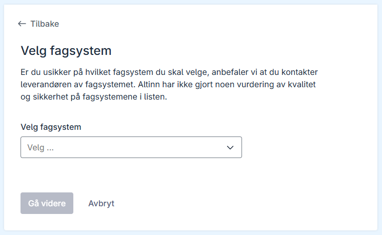
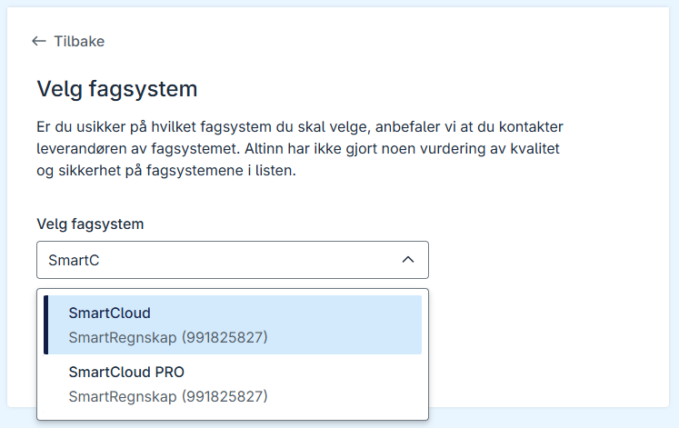
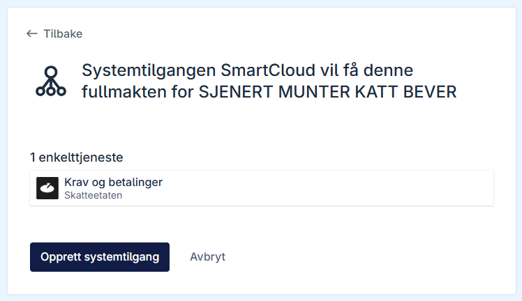
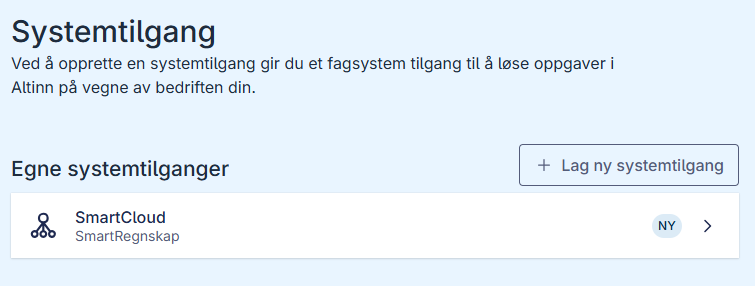

## Create a system access

You can create a system access in the Altinn portal when it is not possible to create it from the vendor system. To create the system access, you must be able to manage powers of attorney for the organization. For example, you can do this as the general manager or with the administrator permission **Access Management** or **Main Administrator**. You cannot create a system access for clients in the Altinn portal.

## Create a system access in the Altinn portal

1. Log in to the Altinn portal and open the [system access overview](https://am.ui.altinn.no/accessmanagement/ui/systemuser/overview).
   
2. Click **Create new system access**.
   
3. Select the vendor system for which you want to create a system access.
   
4. Click **Proceed**. You will now see an overview of the powers of attorney the vendor system will receive.
   
5. Click **Create system access**. The new system access will appear in the overview.
   

Once the system access has been created, the vendor system provider can start using it.
