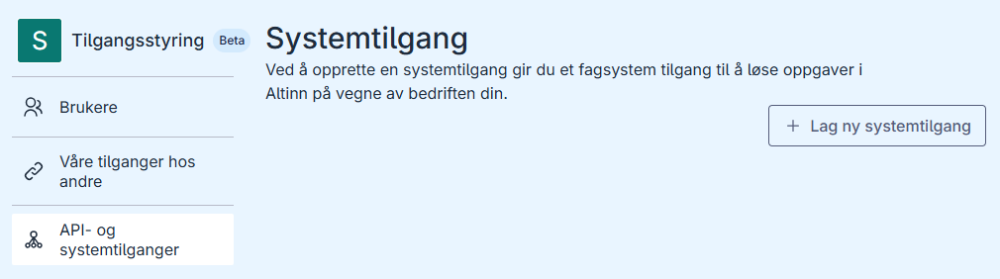
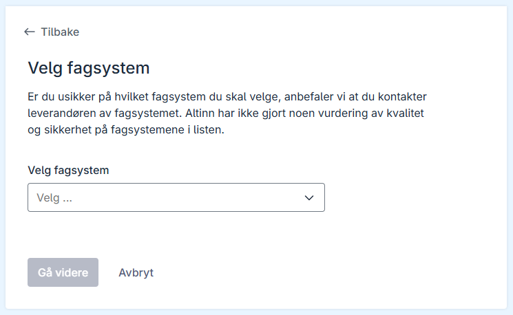
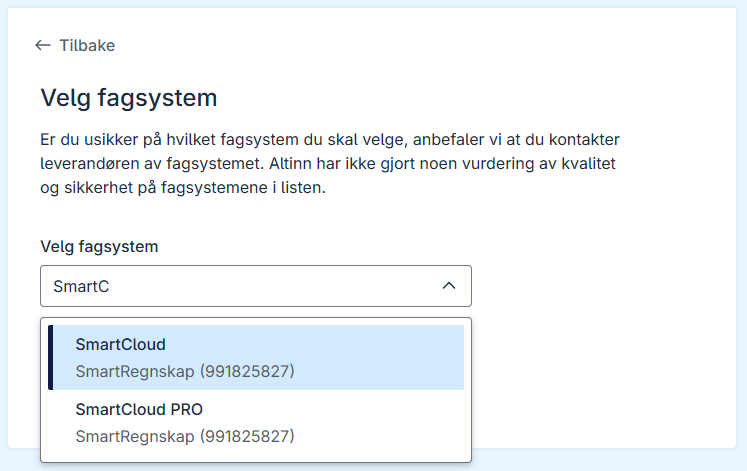
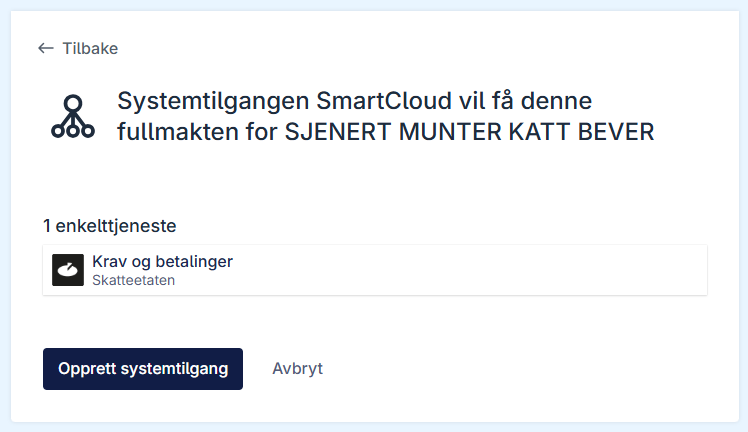
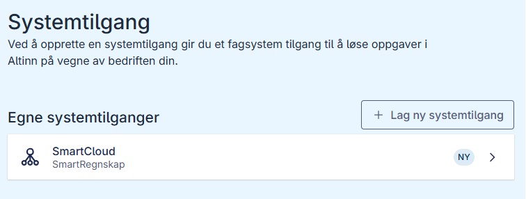

## Oppretting av systemtilgang

Oppretting i Altinn-portalen gjøres kun i de tilfellene det ikke er mulig å opprette systemtilgang fra fagsystemet. Det er sluttbrukeren selv (med rollen tilgangsstyrer) som kan opprette systemtilganger i Altinn-portalen. Systemtilgang for kunder kan ikke opprettes via Altinn-portalen. 

## Slik oppretter du systemtilgang i Altinn-portalen

1. Logg inn til Altinn portalen og åpne [oversikten over systemtilganger](https://am.ui.altinn.no/accessmanagement/ui/systemuser/overview).

2. Trykk på knappen **Lag ny systemtilgang**.

3. Velg fagsystem du skal opprette systemtilgang for.

4. Trykk **Gå videre**. Du vil nå se en oversikt over hvilke tilganger du gir fagsystemleverandøren fullmakt til.

5. Trykk **Opprett systemtilgang**. Du vil nå se den nye systemtilgangen i oversikten.

Når systemtilgangen er opprettet kan den tas i bruk av fagsystemleverandøren.
