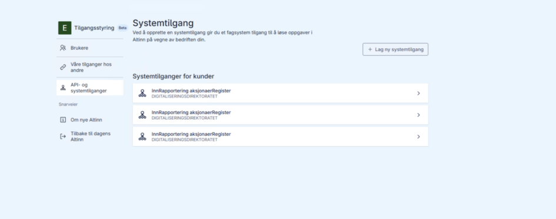
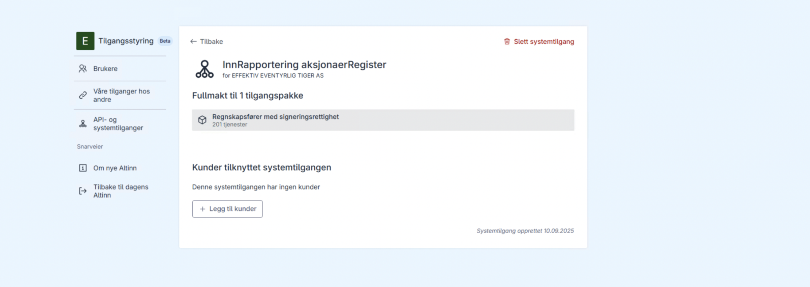
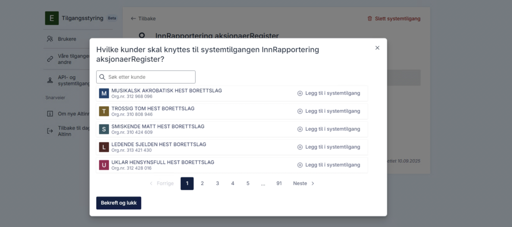

## Add clients to a system access

If you use a system access for clients, you can add clients in the Altinn portal. This does not apply to system access for your own organization. To perform services on behalf of another organization through the system access, the client must grant your organization the necessary powers of attorney.

### Automatic client relationships

Some client relationships are created automatically based on roles registered in the Central Coordinating Register for Legal Entities (Enhetsregisteret). These relationships may give your organization powers of attorney for certain access packages when you use a system access for clients.

The table below shows which access packages are available based on your role in the Central Coordinating Register for Legal Entities:

| ER Role                                 | Available Access Packages                                                                                                                                                                 | Organization type |
| --------------------------------------- | ----------------------------------------------------------------------------------------------------------------------------------------------------------------------------------------- | ----------------- |
| **Revisor** (Auditor)                   | `urn:altinn:accesspackage:ansvarlig-revisor` `urn:altinn:accesspackage:revisormedarbeider`                                                                                             | All               |
| **Regnskapsfører** (Accountant)         | `urn:altinn:accesspackage:regnskapsforer-med-signeringsrettighet` `urn:altinn:accesspackage:regnskapsforer-uten-signeringsrettighet` `urn:altinn:accesspackage:regnskapsforer-lonn` | All               |
| **Forretningsfører** (Business Manager) | `urn:altinn:accesspackage:forretningsforer-eiendom`                                                                                                                                       | ESEK, BRL         |

When a system access for clients is created, the access packages it needs are specified. Your organization's powers of attorney for the client must cover these packages.

> **Note:** Access packages for client relationships are evaluated as an "AND" condition. If the system access includes several access packages, your organization must have received a power of attorney for **all** of them from the client, either directly or through a role in the Central Coordinating Register for Legal Entities. For example, if the system access includes both the agriculture package and the accountant package, the client must grant the agriculture package directly, while the accountant package may follow automatically from the registered role.

### Prerequisites

- You must be able to administer clients in Altinn, for example as **Client Administrator** or **General Manager**.
- An [approved system access for clients](/en/authorization/guides/end-user/system-user/accept-request/#approve-system-access-for-clients) must exist.

### Process in the Altinn portal

1. Open the [system access overview](https://am.ui.altinn.no/accessmanagement/ui/systemuser/overview). In this example, a general manager is logged in on behalf of DISKRET NÆR TIGER AS.
2. Select an existing system access for clients.
   
3. Click **Add clients**.
   
4. Add clients individually by clicking **Add to system access**, or click **Add all clients**. If a client is not shown, check that the client relationship exists and that your organization has a power of attorney for every access package in the system access, either directly or through a role in the Central Coordinating Register for Legal Entities. If the client relationship is missing, see the [guide to setting up a client relationship](/en/authorization/guides/end-user/system-user/setup-client-relationship/).
5. Click **Confirm and close**.
   
