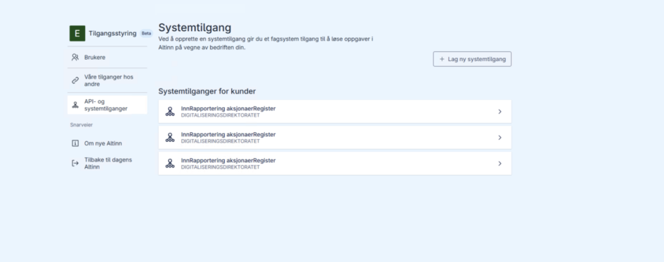
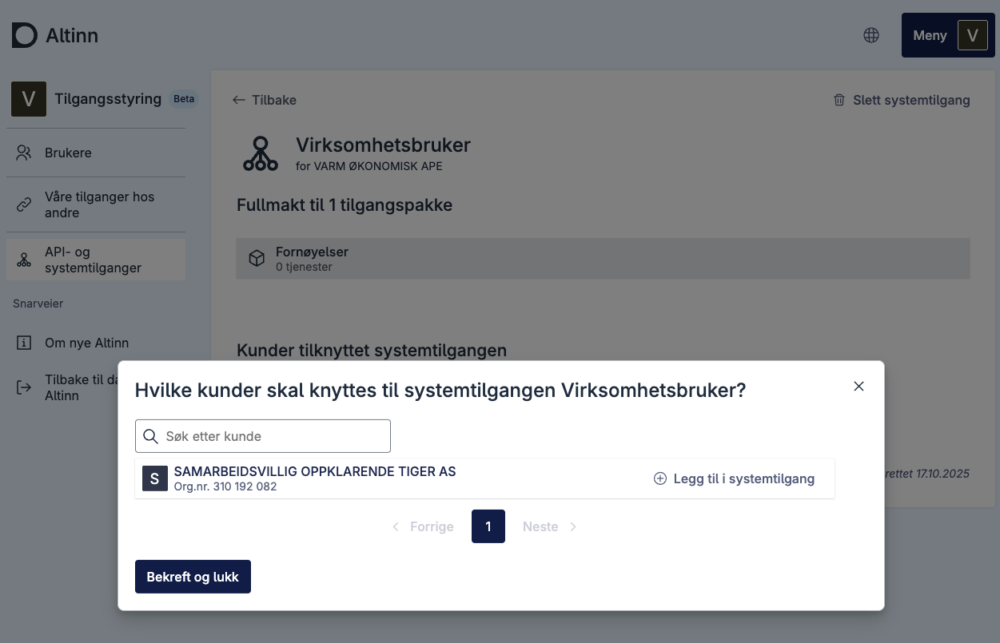

# Assigning Clients to a System User

If you are creating a system user for client relationships, clients can be assigned either in the Altinn portal or via API. This step does not apply if you are creating a system user for your own system.

Part of this process can be done using our API. See the [Client Delegation API documentation](/en/api/authentication/systemuserapi/clientdelegation/).

## Automatic Client Relationships

Some client relationships are created automatically based on roles registered in the Central Coordinating Register for Legal Entities (Enhetsregisteret). These relationships give you access to use certain access packages when creating a system user for client relationships.

The table below shows which access packages are available based on your role in the Central Coordinating Register:

| ER Role                                 | Available Access Packages                                                                                                                                                                 |
| --------------------------------------- | ----------------------------------------------------------------------------------------------------------------------------------------------------------------------------------------- |
| **Revisor** (Auditor)                   | `urn:altinn:accesspackage:ansvarlig-revisor` `urn:altinn:accesspackage:revisormedarbeider`                                                                                             |
| **Regnskapsfører** (Accountant)         | `urn:altinn:accesspackage:regnskapsforer-med-signeringsrettighet` `urn:altinn:accesspackage:regnskapsforer-uten-signeringsrettighet` `urn:altinn:accesspackage:regnskapsforer-lonn` |
| **Forretningsfører** (Business Manager) | `urn:altinn:accesspackage:forretningsforer-eiendom`                                                                                                                                       |

When creating a system user for client relationships, you must specify which access packages the system user should have access to. These packages must align with the roles you have in the Central Coordinating Register.

> **Note:** Access packages with client relationships only work for "AND" cases. This means that if a system user for client relationships has multiple access packages, the client must have **either directly delegated or received delegation through the ER role** for **all** packages for the system user to function. For example: If the system user for client relationships has both the agriculture package and the accountant package, the client must have explicitly delegated the agriculture package (directly delegated) in addition to having received delegation for the accountant package through the ER role (which comes automatically).

## In the Altinn Portal

1. Go to the overview of system accesses
2. Select system access
   
3. Click "Add clients"
   
4. Select clients (one, several, or all)
5. Click confirm and close
   

## Client delegation without existing client relations

If you need to delegate clients but don't have existing client relations established beforehand, you'll need to establish these relations first before proceeding with the delegation process.
This applies to relationships where you don't have any established client relationship in the Brønnøysund Register.

### Prerequisites

- You must have access to Altinn as Client Administrator or Managing Director.

### Process

0. System user for Agent relationship is created for organization (Varm Økonomisk Ape, 311037889)
   

1. Grant authorization to the organization that owns the system user
   

2. Delegate access package to the organization
   You must log in as a potential "client" and then grant authorization to Varm Økonomisk Ape and delegate the access package that the System User is set up with to Varm Økonomisk Ape.
   You have now established a client relationship that can be used for the System User.
   

3. The organization that owns the System User (Varm Økonomisk Ape) can now add clients for the System User
   

After establishing client relations through these steps, you can proceed with the standard client delegation process described above.
