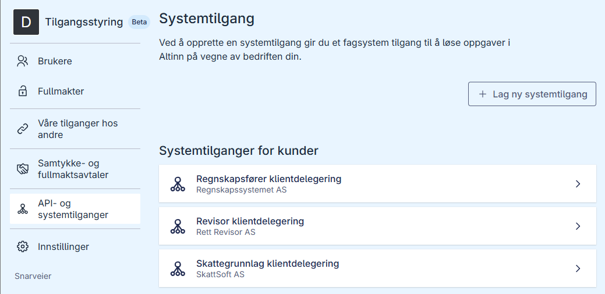
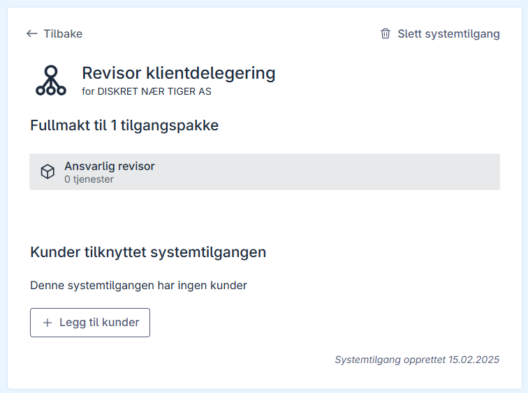
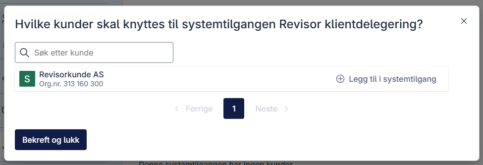

## Tildeling av klienter til systemtilgang

Dersom du oppretter en systemtilgang for klientsystemer, kan klienter tildeles i Altinn-portalen. Dette steget gjelder ikke dersom du oppretter en systemtilgang for eget system.
Om du utøver tjenester på vegne av en annen virksomhet og dette skal gjøres ved hjelp av Systemtilgang må klient-virksomheten gi fullmakt til dette til din virksomhet. Hvordan disse forholdene oppstår kan du lese mer om her: [Systemtilgang for klientsystem](/nb/authorization/guides/system-vendor/system-user/#systembruker-for-klientsystem).

### Forutsetninger

- Du må ha tilgang til Altinn som **Klientadministrator** eller **Daglig leder**.
- Det finnes en systemtilgang for kunder [som er godkjent](/nb/authorization/guides/end-user/system-user/accept-request/#godkjenne-systemtilgang-for-klienter).

### Prosess i Altinn-portalen

1. Gå til oversikten over systemtilganger [i testmiljøet](https://am.ui.tt02.altinn.no/accessmanagement/ui/systemuser/overview). I dette eksempelet logger vi på som daglig leder i virksomheten "DISKRET NÆR TIGER AS" og velger å representere virksomheten "DISKRET NÆR TIGER AS".
   
2. Velg en eksisterende systemtilgang for kunder. I dette eksempelet velger vi systemtilgangen "Revisor klientdelegering".
   
3. Trykk **+ Legg til kunder**  
   
4. Legg til klienter til systemtilgangen, en av gangen, ved å trykke **Legg til i systemtilgang**. I dette eksempelet legger vi til "Revisorkunde AS". Hvis du ikke ser noen klienter i denne modalen, er ikke klientforholdet satt opp. Se [egen guide for å sette opp dette](/nb/authorization/guides/end-user/system-user/setup-client-relationship/).
5. Trykk **Bekreft og lukk** etter klienter er lagt til. 
   
