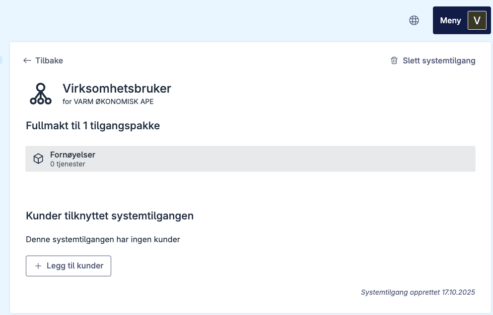
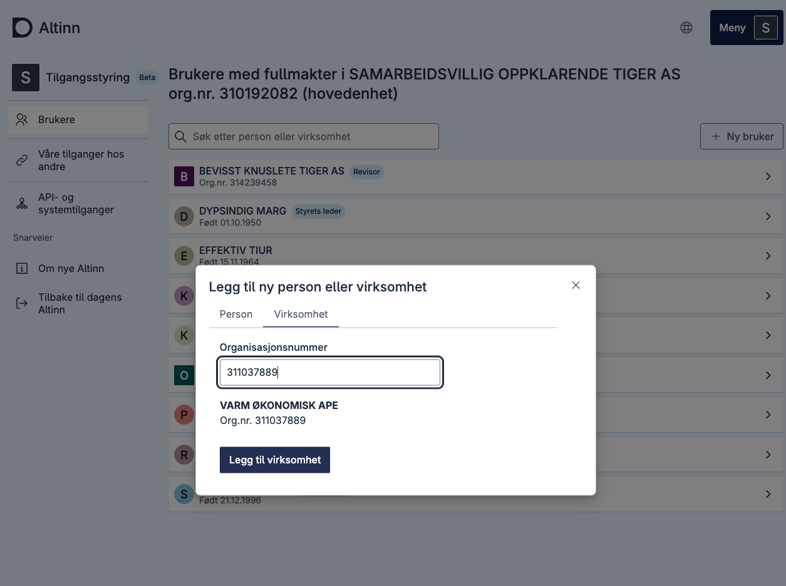
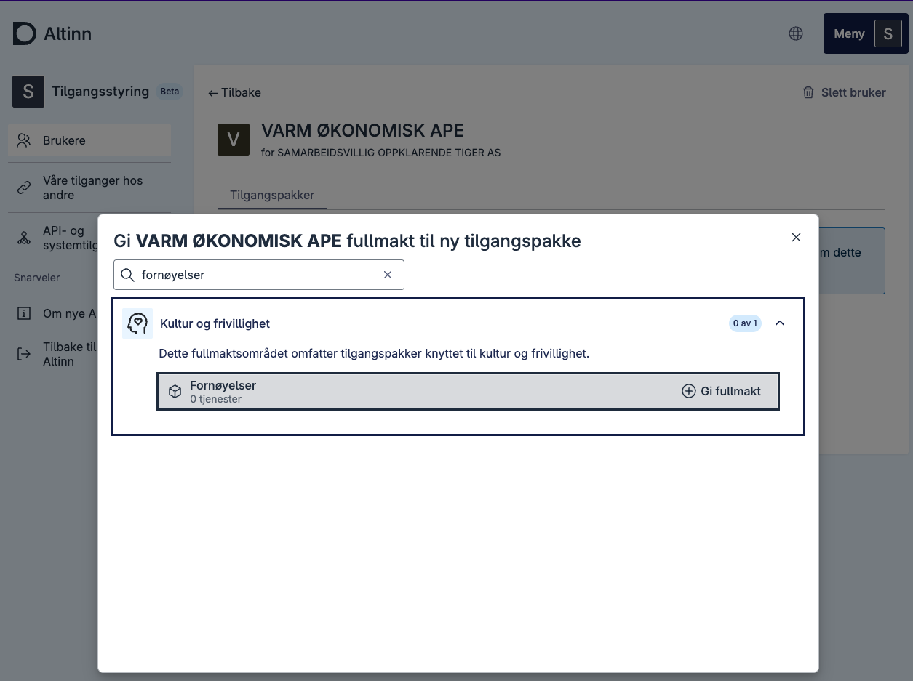
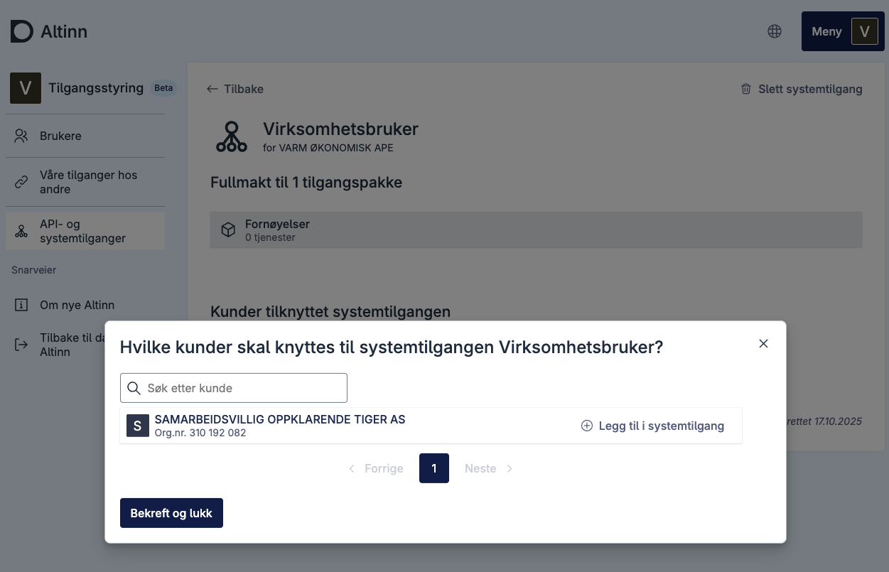

# Tildeling av klienter til systembruker

Dersom du oppretter en systembruker for klientsystemer, kan klienter tildeles enten i Altinn-portalen eller via API. Dette steget gjelder ikke dersom du oppretter en systembruker for eget system.
Om du utøver tjenester på vegne av en annen virksomhet og dette skal gjøres ved hjelp av Systembruker må klient-virksomheten gi fullmakt til dette til din virksomhet. Hvordan disse forholdene oppstår kan du lese mer om her: [Systembruker for klientsystem](/nb/authorization/guides/system-vendor/system-user/#systembruker-for-klientsystem).

Del av denne prosessen kan gjøres ved hjelp av vårt API. Se [Klientdelegering API-dokumentasjonen](/nb/api/authentication/systemuserapi/clientdelegation/).

## I Altinn-portalen

1. Gå til oversikten over systemtilganger
2. Velg systemtilgang  
   
3. Trykk **"Legg til kunder"**  
   
4. Velg klienter (én, flere eller alle)
5. Trykk **Bekreft og lukk**  
   

## Klientdelegering der klientforhold ikke eksisterer fra før

Dersom du trenger å delegere klienter, men ikke har et eksisterende klientforhold etablert fra før, må du først etablere dette forholdet før du kan fortsette med delegeringsprosessen.  
Dette gjelder tilfeller der det ikke finnes et etablert klientforhold i Brønnøysundregistrene.

### Forutsetninger

- Du må ha tilgang til Altinn som **Klientadministrator** eller **Daglig leder**.

### Prosess

0. Systembruker for agentforhold opprettes for virksomheten (Varm Økonomisk Ape, 311037889)  
   

1. Gi fullmakt til virksomheten som eier systembrukeren
   

2. Deleger tilgangspakke til virksomheten
   Logg inn som en potensiell «klient», gi fullmakt til _Varm Økonomisk Ape_, og deleger deretter tilgangspakken systembrukeren er satt opp med til _Varm Økonomisk Ape_.  
   Du har nå etablert et klientforhold som kan brukes for systembrukeren.  
   

3. Virksomheten som eier systembrukeren (Varm Økonomisk Ape) kan nå legge til klient for systembrukeren
   

Etter at du har etablert klientforholdet gjennom disse stegene, kan du fortsette med prosessen beskrevet over der du kan legge til kunder.
