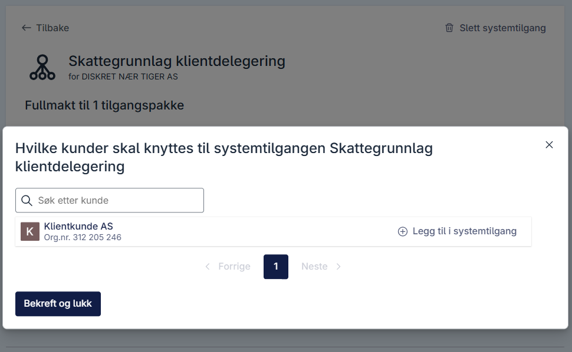

## Tildeling av klienter til systemtilgang

Dersom du oppretter en systemtilgang for klientsystemer, kan klienter tildeles enten i Altinn-portalen. Dette steget gjelder ikke dersom du oppretter en systemtilgang for eget system.
Om du utøver tjenester på vegne av en annen virksomhet og dette skal gjøres ved hjelp av Systemtilgang må klient-virksomheten gi fullmakt til dette til din virksomhet. Hvordan disse forholdene oppstår kan du lese mer om her: [Systemtilgang for klientsystem](/nb/authorization/guides/system-vendor/system-user/#systembruker-for-klientsystem).

### Forutsetninger

- Du må ha tilgang til Altinn som **Klientadministrator** eller **Daglig leder**.
- Det finnes en systemtilgang for kunder [som er godkjent](/nb/authorization/guides/end-user/system-user/accept-request/#godkjenne-systemtilgang-for-klienter).

### Prosess i Altinn-portalen

1. Gå til oversikten over systemtilganger [i testmiljøet](https://am.ui.tt02.altinn.no/accessmanagement/ui/systemuser/overview). I dette eksempelet logger vi på som daglig leder i virksomheten "DISKRET NÆR TIGER AS" og velger å representere virksomheten "DISKRET NÆR TIGER AS".
   
2. Velg en eksisterende systemtilgang for kunder. I dette eksempelet velger vi systemtilgangen "Revisor klientdelegering".
   
3. Trykk **Legg til kunder**  
   
4. Legg til klienter til systemtilgangen, en av gangen, ved å trykke **Legg til i systemtilgang**. I dette eksempelet legger vi til "Revisorkunde AS". Hvis du ikke ser noen klienter i denne modalen, er ikke klientforholdet satt opp. Se [egen guide for å sette opp dette](/nb/authorization/guides/end-user/system-user/delegate-clients/#klientdelegering-der-klientforhold-ikke-eksisterer-fra-før).
5. Trykk **Bekreft og lukk** etter klienter er lagt til. 
   

## Klientdelegering der klientforhold ikke eksisterer fra før

Dersom du trenger å delegere klienter, men det ikke finnes et eksisterende klientforhold fra før, må dette forholdet etableres før du kan fortsette med delegeringsprosessen. 
Dette gjelder tilfeller der det ikke finnes et etablert klientforhold i Brønnøysundregistrene. Det er kundene selv som gir denne fullmakten til virksomheten som eier systembrukeren.

### Forutsetninger

- Du må ha tilgang til Altinn som **Klientadministrator** eller **Daglig leder**.
- Det finnes en systemtilgang for kunder [som er godkjent](/nb/authorization/guides/end-user/system-user/accept-request/#godkjenne-systemtilgang-for-klienter).

### Prosess i Altinn-portalen

1. Logg på som daglig leder i virksomheten som skal legges til som kunde i systemtilgang for kunder. I dette eksempelet er klienten (Klientkunde AS)
2. Gå til **Brukere** i menyen, hvis du ikke allerede er på denne siden.
   
3. Trykk på **+ Ny bruker** for å etablere et klientforhold.
   
4. Skriv inn organisasjonsnummeret til virksomheten du ønsker å gi fullmakt til. I dette eksempelet skriver vi inn organisasjonsnummeret til DISKRET NÆR TIGER AS, som vi brukte i eksempelet over.
   
5. Trykk på **Legg til virksomhet**.
   
6. Trykk på **Gi fullmakt +**. I dette eksempelet vil vi gi fullmakt til tilgangspakken "Skattegrunnlag" til DISKRET NÆR TIGER AS, så vi søker på "Skattegrunnlag".
   
7. Trykk på **Gi fullmakt** på tilgangspakken Skattegrunnlag. DISKRET NÆR TIGER AS har nå fått fullmakt til tilgangspakken Skattegrunnlag. Du har nå etablert et klientforhold som kan brukes for systemtilgangen.
   
8. Logg inn igjen som **Klientadministrator** eller **Daglig leder** i virksomheten som eier systemtilgangen (DISKRET NÆR TIGER AS). Du skal nå kunne legge til klienten (Klientkunde AS) til systemtilgangen.
   

Etter at du har etablert klientforholdet gjennom disse stegene, kan du fortsette med prosessen beskrevet over der du kan legge til kunder.
