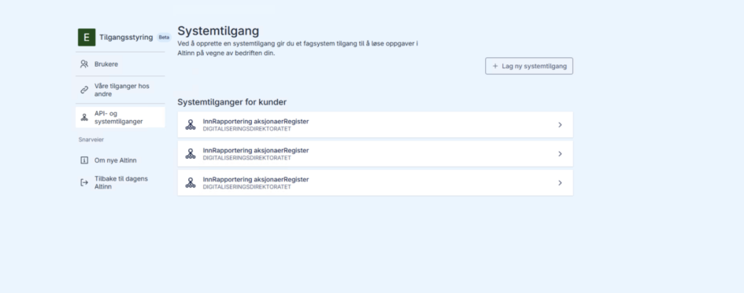
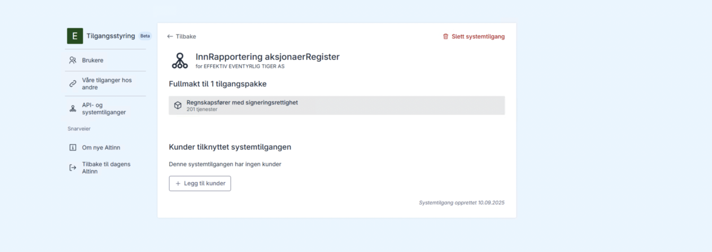
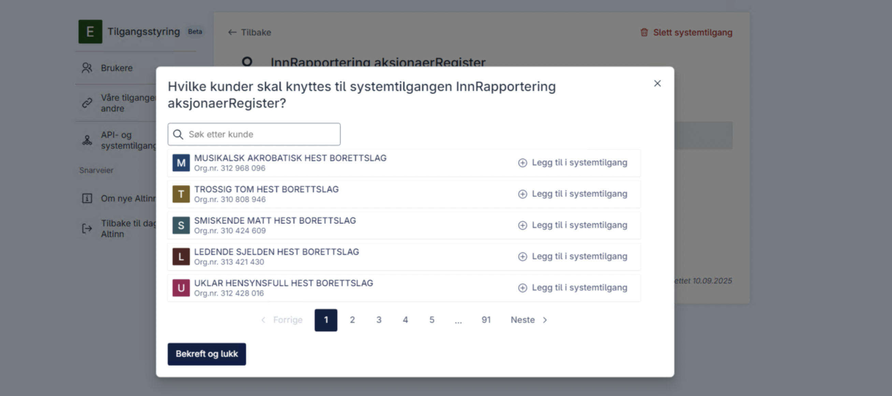

# Tildeling av klienter til systembruker

Dersom du oppretter systembruker for klientsystemer, kan klienter tildeles enten i Altinn portalen eller via API. Dette steget gjelder ikke dersom du oppretter systembruker for eget system.

## I Altinn portalen

1. Gå til oversikten over systemtilganger
2. Velg systemtilgang
   
3. Trykk "Legg til kunder"
   
4. Velg klienter (én, flere eller alle)
5. Trykk bekreft og lukk
   
