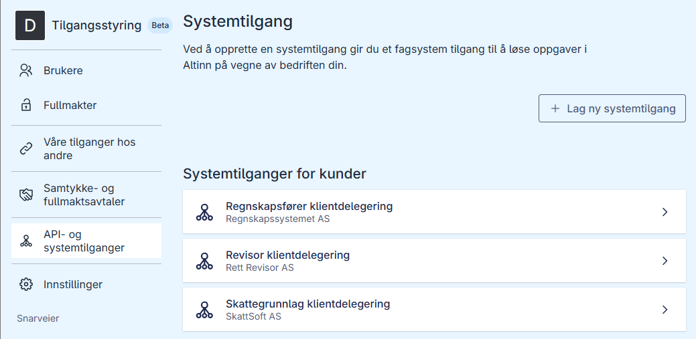
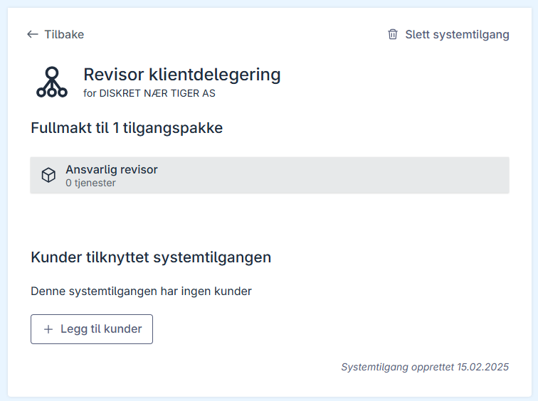
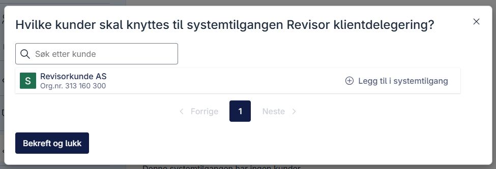
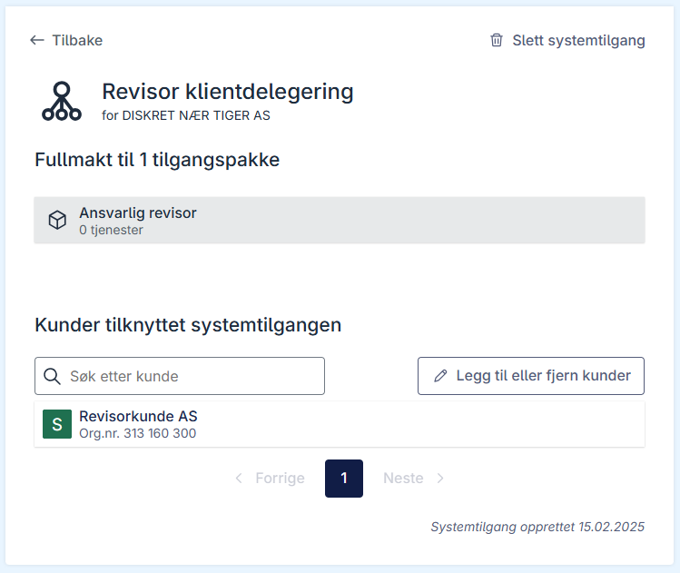

## Legg klienter til en systemtilgang

Dersom du oppretter en systembruker for klientforhold, kan klienter legges til i Altinn-portalen. Dette steget gjelder ikke dersom du oppretter en systembruker for eget system. Hvis du skal utføre tjenester på vegne av en annen virksomhet ved hjelp av systembruker, må klientvirksomheten gi virksomheten din fullmakt til de aktuelle tjenestene.

### Automatiske klientforhold

Noen klientforhold opprettes automatisk basert på roller registrert i Enhetsregisteret. Disse forholdene kan gi virksomheten din fullmakt til bestemte tilgangspakker når du oppretter en systembruker for klientforhold.

Tabellen under viser hvilke tilgangspakker som er tilgjengelige basert på din rolle i Enhetsregisteret:

| ER-rolle             | Tilgjengelige tilgangspakker                                                                                                                                                              | Organisasjonsform |
| -------------------- | ----------------------------------------------------------------------------------------------------------------------------------------------------------------------------------------- | ----------------- |
| **Revisor**          | `urn:altinn:accesspackage:ansvarlig-revisor` `urn:altinn:accesspackage:revisormedarbeider`                                                                                             | Alle              |
| **Regnskapsfører**   | `urn:altinn:accesspackage:regnskapsforer-med-signeringsrettighet` `urn:altinn:accesspackage:regnskapsforer-uten-signeringsrettighet` `urn:altinn:accesspackage:regnskapsforer-lonn` | Alle              |
| **Forretningsfører** | `urn:altinn:accesspackage:forretningsforer-eiendom`                                                                                                                                       | ESEK, BRL         |

Når du oppretter en systembruker for klientforhold, må du angi hvilke tilgangspakker systembrukeren skal få fullmakt til. Pakkene må være i tråd med rollene du har i Enhetsregisteret.

> **NB:** Tilgangspakker for klientforhold fungerer bare som et "OG-forhold". Hvis en systembruker for klientforhold har flere tilgangspakker, må tjenestetilbyderen ha fått fullmakt til **alle** pakkene fra klienten, enten direkte eller gjennom en rolle i Enhetsregisteret. Hvis systembrukeren for eksempel har både jordbrukspakken og regnskapsførerpakken, må klienten gi fullmakt til jordbrukspakken direkte, mens fullmakten til regnskapsførerpakken kan følge automatisk av rollen i Enhetsregisteret.

### Forutsetninger

- Du må ha tilgang til Altinn som **Klientadministrator** eller **Daglig leder**.
- Det finnes en systemtilgang for kunder [som er godkjent](/nb/authorization/guides/end-user/system-user/accept-request/#godkjenne-systemtilgang-for-klienter).

### Prosess i Altinn-portalen

1. Gå til oversikten over systemtilganger [i testmiljøet](https://am.ui.tt02.altinn.no/accessmanagement/ui/systemuser/overview). I dette eksempelet logger vi på som daglig leder i virksomheten "DISKRET NÆR TIGER AS" og velger å handle på vegne av denne virksomheten.
   
2. Velg en eksisterende systemtilgang for kunder. I dette eksempelet velger vi systemtilgangen "Revisor klientdelegering".
   
3. Trykk **Legg til klienter**.
   
4. Legg til klienter i systemtilgangen, én av gangen, ved å trykke **Legg til i systemtilgang**. I dette eksempelet legger vi til "Revisorkunde AS". Hvis en klient ikke vises i modalen, kontroller at klientforholdet finnes, og at virksomheten din har fått fullmakt til alle tilgangspakkene i systemtilgangen, enten direkte eller gjennom en rolle i Enhetsregisteret. Hvis klientforholdet mangler, se [guiden for å sette opp et klientforhold](/nb/authorization/guides/end-user/system-user/setup-client-relationship/).
5. Trykk **Bekreft og lukk** etter at klientene er lagt til.
   
