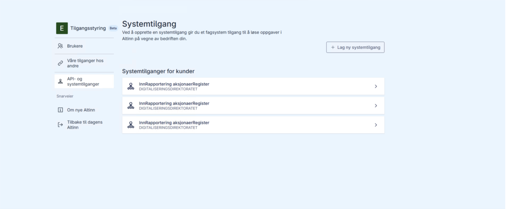
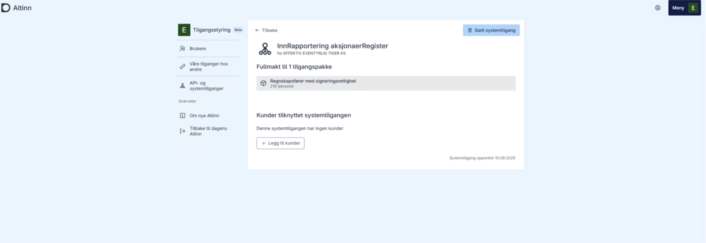
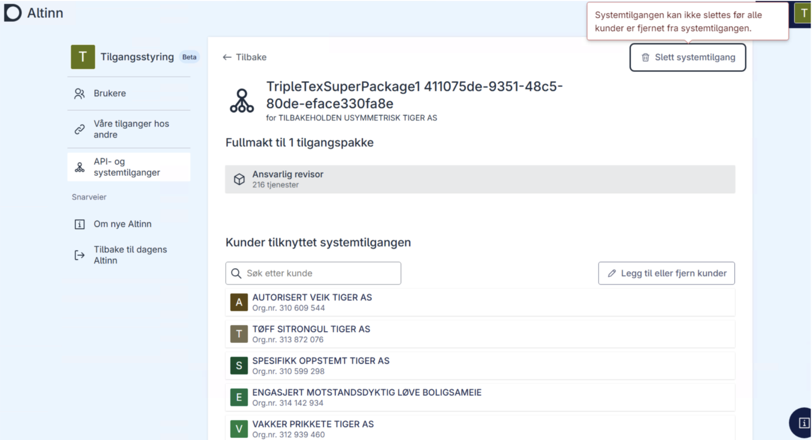

# Deleting a System User

A system user can only be deleted by an end-user system provider. When deleted, all associated delegations are automatically removed. As of today, deleting a system user is only possible via the Altinn portal. The user with the role of access manager in the end-user organization must log in to the Altinn portal to perform the deletion. The provider cannot delete a system user on behalf of the customer.

## How to Delete a System User

1. Log in to the Altinn portal and open the overview of system accesses: https://am.ui.tt02.altinn.no/accessmanagement/ui/systemuser/overview
2. Find and click on the system access to be deleted
   

   

3. Click delete system access
   

**Note:** If the system access contains clients, they must be deleted first.
