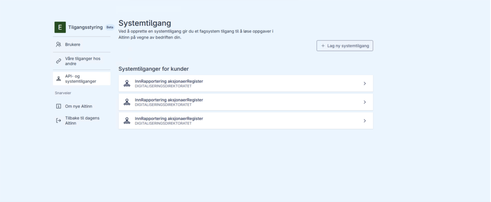
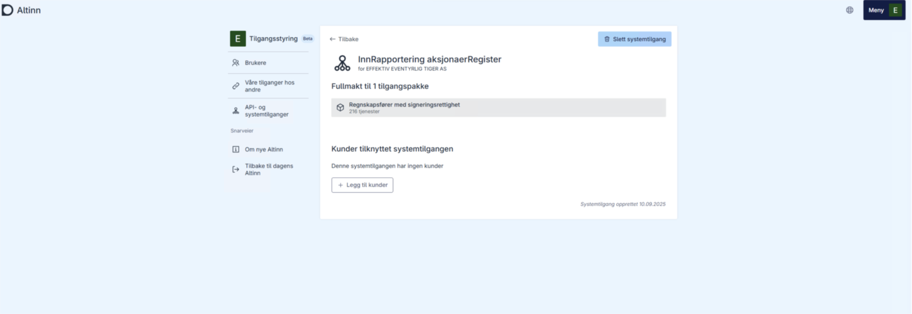
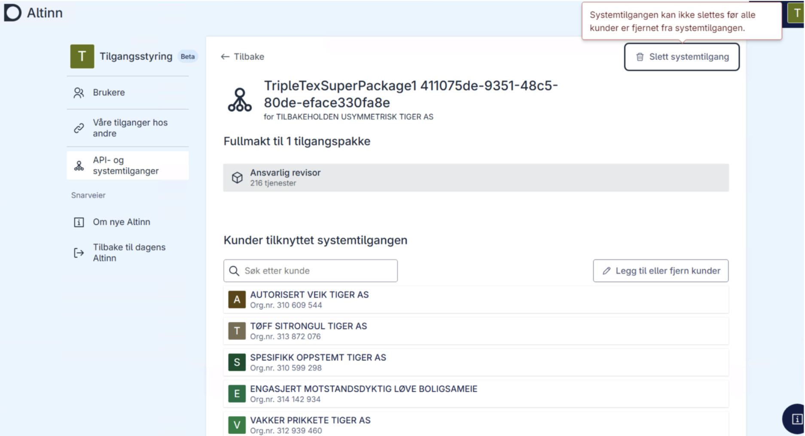

title: Slett Systembruker
description: Veiledning for å slette en Systembruker
linktitle: Slett Systembruker
weight: 40

# Sletting av Systembruker

# Sletting av systembruker

En Systembruker kan kun slettes av en sluttbrukersystemleverandør. Ved sletting fjernes alle tilknyttede delegeringer automatisk. Per i dag er sletting av Systembruker kun mulig via Altinn-portalen. Brukeren med rollen tilgangsstyrer i sluttbrukervirksomheten må logge inn i Altinn-portalen for å gjennomføre slettingen. Leverandør kan ikke slette Systembruker på vegne av kunden.

## Slik sletter du Systembruker

1. Logg inn til Altinn portalen og åpne oversikten over systemtilganger: https://am.ui.tt02.altinn.no/accessmanagement/ui/systemuser/overview
2. Finn og klikk på systemtilgangen som skal slettes
   

   

3. Klikk slett systemtilgang
   

**Merk:** Dersom systemtilgangen inneholder kunder, må disse slettes først.
