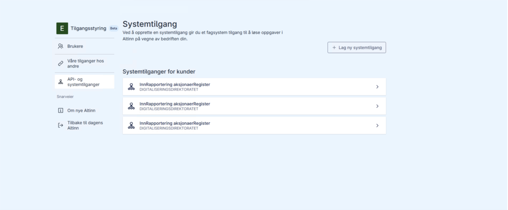
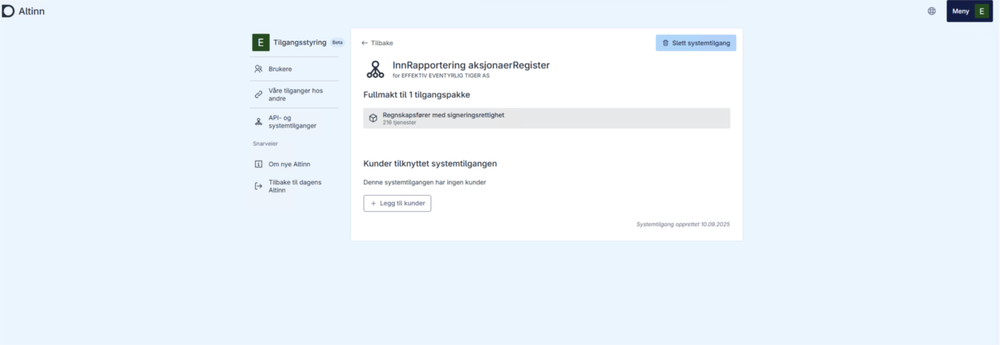
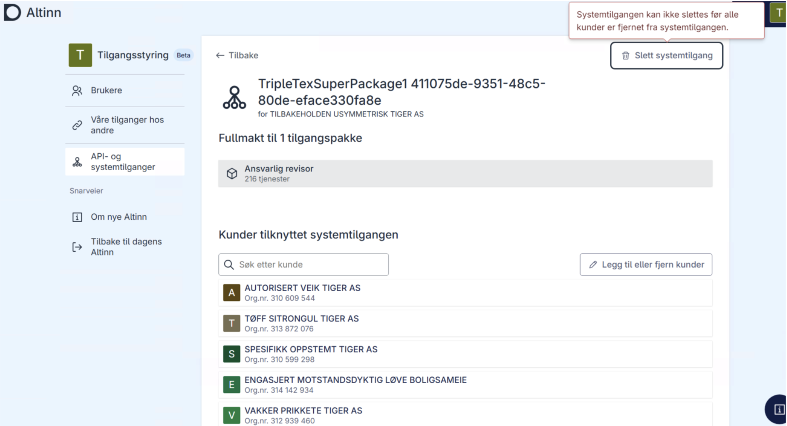

## Sletting av systemtilgang

For å slette en systemtilgang må du kunne administrere fullmakter for virksomheten. Det kan du for eksempel gjøre som daglig leder eller med administratorfullmakten **Tilgangsstyring** eller **Hovedadministrator**. Ved sletting fjernes alle fullmaktene som er knyttet til systemtilgangen, automatisk. Sletting er foreløpig bare mulig i Altinn-portalen.

## Slik sletter du en systemtilgang

1. Logg inn i Altinn-portalen og åpne [oversikten over systemtilganger](https://am.ui.altinn.no/accessmanagement/ui/systemuser/overview).
2. Finn og klikk på systemtilgangen som skal slettes.
   

   

3. Klikk **Slett systemtilgang**.
   

**Merk:** Klienter som er tilordnet systemtilgangen, fjernes også når systemtilgangen slettes.
