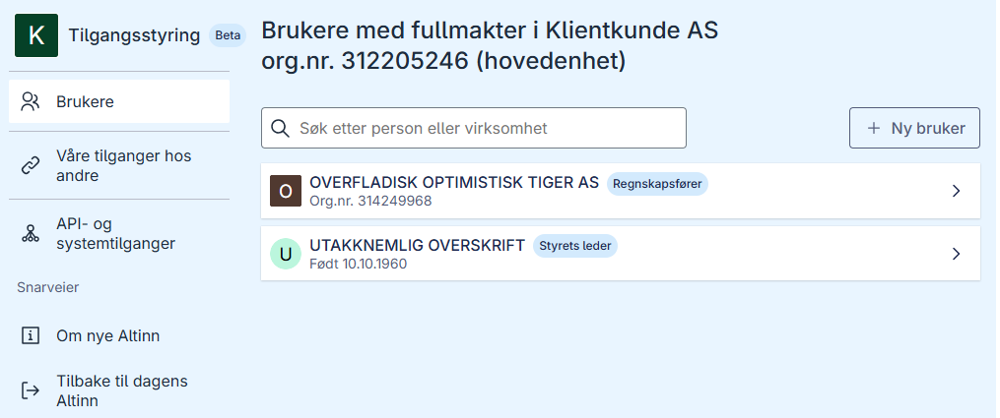
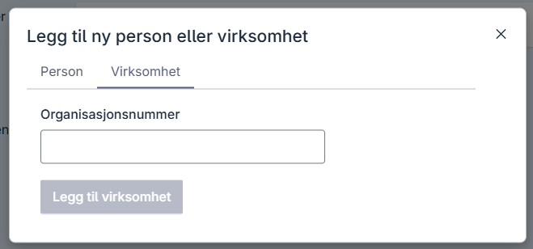
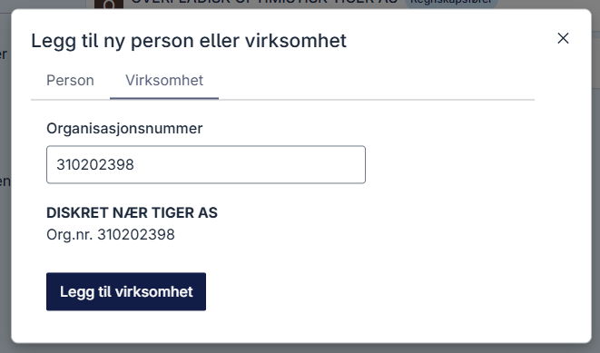
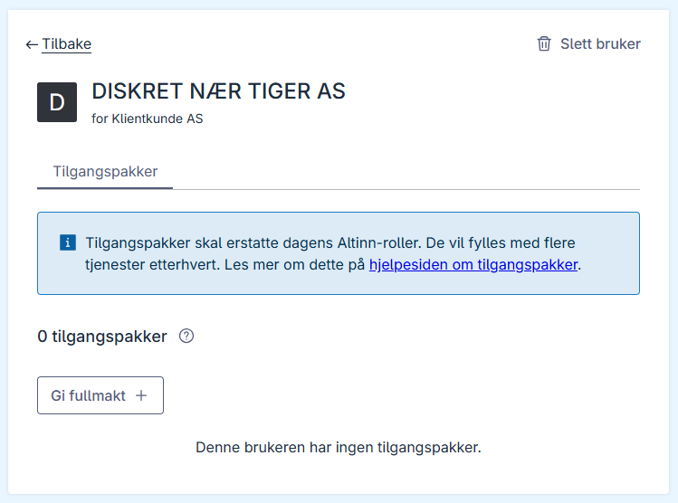
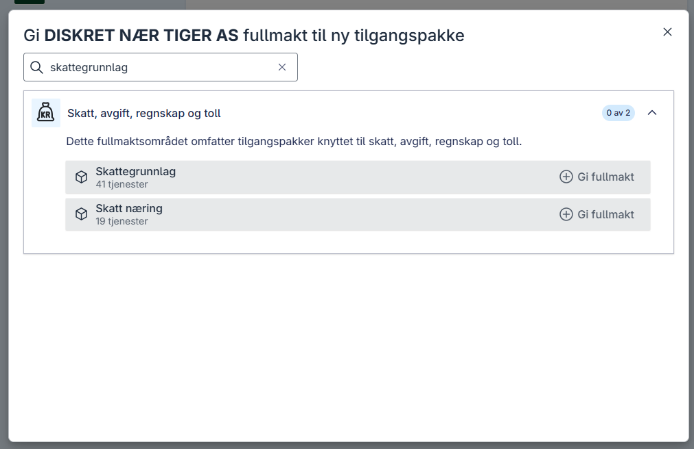
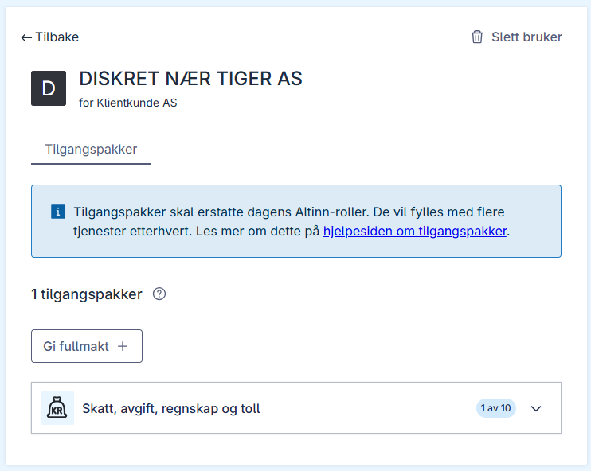

## Client delegation where a client relationship does not already exist

If you need to delegate clients, but there is no existing client relationship, this relationship must be established before the client can be added to a system access for clients.
This applies to cases where there is no established client relationship in the Brønnøysund Registers. It is the clients themselves who grant this authorization to the organization that owns the system access.

### Prerequisites

- You must have access to Altinn as **Client Administrator** or **Managing Director**.

### Process in the Altinn portal

1. Log in as the Managing Director of the organization that is to be added as a client in a system access for clients. In this example, we use "Klientkunde AS" as the client.
2. Go to **Users** in the menu, if you are not already on this page.
   
3. Click **+ New user** to establish a client relationship.
   
4. Enter the organization number of the organization you want to grant authorization to. In this example, we enter the organization number of "DISKRET NÆR TIGER AS", which we used in the example above.
   
5. Click **Add organization**. You have now created a relationship between "Klientkunde AS" and "DISKRET NÆR TIGER AS", but without having granted any authorizations to "DISKRET NÆR TIGER AS" yet.
   
6. Click **Grant authorization +**. In this example, we want to grant authorization to the access package "Skattegrunnlag" to "DISKRET NÆR TIGER AS", so we search for "Skattegrunnlag".
   
7. Click **Grant authorization** on the access package "Skattegrunnlag". "DISKRET NÆR TIGER AS" has now been granted authorization to the access package "Skattegrunnlag". You have now established a client relationship that can be used for the system access.
   
8. After you have established the client relationship through these steps, "Klientkunde AS" can [be added to a system access for clients](/en/authorization/guides/end-user/system-user/delegate-clients/) that is configured with the access package "Skattegrunnlag".

